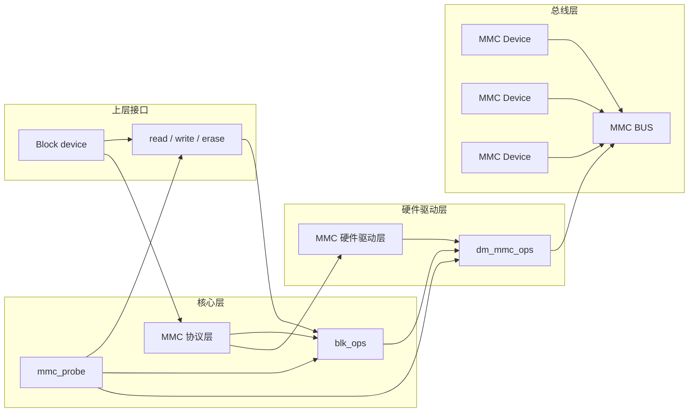

# Rockchip U-Boot 驱动模块

本章详细介绍 Rockchip 平台 U-Boot 中的各外设驱动模块，涵盖 AMP、Charge、Clock、Crypto、Display、DVFS、eFuse/OTP、Ethernet、GPIO、Interrupt、I2C、IO-Domain、Key、LED、MTD、MTD Block、OP-TEE Client、PCIe、Pinctrl、PMIC/Regulator、Reset、RNG、SPI、Storage、Thermal、UART、USB、Vendor Storage、Watchdog 等 29 个驱动模块的框架配置、相关接口、DTS 配置与使用方法。

## 一、AMP

### 1.1 实现思路

U-Boot 框架默认没有 AMP（Asymmetric Multi-Processing）支持，Rockchip 自己实现了一套 AMP 机制：不同 CPU 运行不同的固件。

实现思路：

**（1）固件打包**

所有的 AMP 固件（不含 Linux）通过 its 文件指定 CPU 运行状态、描述固件信息，最后打包成一个 FIT 格式的 `amp.img` 烧写到 amp 分区。

开机时 U-Boot 负责加载 `amp.img` 固件并进行 SHA256 完整性校验，再由 Trust 指定各 CPU 的运行状态并派发到相应入口地址。

**（2）启动顺序**

运行 U-Boot 的 CPU 称为主核，主核在完成其它核的状态切换和固件跳转后，最后对自身进行操作。

**（3）资源管理**

U-Boot 不负责 AMP 方案下各固件之间的资源协调（包括内存和中断等的划分），请开发者自己保证。

**（4）Trust 配合**

AMP 功能需要 Trust 配合。如果用户指定的 CPU 运行状态是默认状态，则 SDK 的 Trust 已支持；如果非默认状态，则需要 Trust 额外支持（但部分平台 SDK 已默认支持）。

上述 CPU 默认状态指的是：

- 32 位芯片默认状态：`arch = "arm", thumb = <0>, hyp = 0`;
- 64 位芯片默认状态：`arch = "arm64", thumb = <0>, hyp = 1`;

**（5）Linux + AMP 组合**

1. 考虑到兼容性，组合方案下的 Linux 相关固件跟传统 SMP 固件保持一致，即组合方案的固件形式为：Linux 相关固件 + `amp.img`。
2. 开发者可以在 amp 的 its 里通过增加 `"linux"` 节点指定 CPU 运行 Linux 的状态（不指定就是默认状态）。
3. 如果主核跑 Linux 或没有指定任何固件，则主核启动完其它 AMP 固件后会按传统的 SMP 启动方式，由 U-Boot 启动 Linux。
4. 如果非主核跑 Linux，则优先启动 Linux、再启动其它 AMP 固件。注意：想要启动的主核不是 CPU0，需要特殊的 Trust 支持。
5. Linux 固件的加载地址只由 U-Boot 配置决定，例如：`rk3568_common.h`。

### 1.2 框架支持

**配置**：

```
CONFIG_AMP=y
CONFIG_ROCKCHIP_AMP=y
```

**框架代码**：

```
./drivers/cpu/rockchip_amp.c
```

**its 模板**：

```
./drivers/cpu/amp.its
```

**打包工具**：

```
./tools/mkimage                        // 完整编译一次 U-Boot 后会自动生成
```

**代码提交点至少**：

```
commit c51cf04095dde2df2dd047e70d2c7fb0866ea916
Author: Joseph Chen <chenjh@rock-chips.com>
Date: Tue Oct 19 03:16:35 2021 +0000

    cpu: amp.its: update amps "arm64" => "arm"

    Signed-off-by: Joseph Chen <chenjh@rock-chips.com>
    Change-Id: I99de02c5b6c62ffdd9b25565acd172801d6e983c
```

### 1.3 功能启用

**1. 制作 `amp.img` 需要一份 its 文件，请基于 `drivers/cpu/amp.its` 修改：**

如下 its：CPU1/2/3 跑 AMP，CPU0 跑 Linux，主核是 CPU3。启动顺序是：CPU0 → CPU1/2 → CPU3。

```
/dts-v1/;
/ {
    description = "FIT source file for rockchip AMP";
    #address-cells = <1>;

    // 所有 AMP 固件（不含 Linux）请在 images 节点下指定；
    images {
        amp1 {
            description = "bare-mental-core1"; // 必选项：描述信息
            data = /incbin/("./amp1.bin");     // 必选项：amp1 固件
            type = "firmware";                 // 必选项：不做改动
            compression = "none";              // 必选项：不做改动
            arch = "arm";                      // 必选项："arm64"：64位，"arm"：32位
            cpu = <0x100>;                     // 必选项：cpu 硬件 id（mpidr）
            thumb = <0>;                       // 必选项：0: arm or thumb2; 1: 纯 thumb
            hyp = <0>;                         // 必选项：0: el1/svc; 1: el2/hyp
            load = <0x01800000>;               // 必选项：固件加载和运行地址
            udelay = <1000000>;                // 可选项：启动完当前 CPU 后做延时后再启动下一个 CPU
            hash {                             // 必选项：不做改动
                algo = "sha256";
            };
        };

        amp2 {
            description = "bare-mental-core2";
            data = /incbin/("./amp2.bin");
            type = "firmware";
            compression = "none";
            arch = "arm";
            cpu = <0x200>;
            thumb = <0>;
            hyp = <0>;
            load = <0x03800000>;
            udelay = <1000000>;
            hash {
                algo = "sha256";
            };
        };

        amp3 {
            description = "bare-mental-core3";
            data = /incbin/("./amp3.bin");
            type = "firmware";
            compression = "none";
            arch = "arm";
            cpu = <0x300>;
            thumb = <0>;
            hyp = <0>;
            load = <0x05800000>;
            udelay = <1000000>;
            hash {
                algo = "sha256";
            };
        };
    };

    configurations {
        default = "conf";
        conf {
            description = "Rockchip AMP images";
            rollback-index = <0x0>;
            // 指定需要被加载的固件及其加载、启动顺序，但是主核不受此顺序限制。
            loadables = "amp1", "amp2", "amp3";

            signature {
                algo = "sha256,rsa2048";
                padding = "pss";
                key-name-hint = "dev";
                sign-images = "loadables";
            };

            // Linux CPU 的运行状态指定：
            // （1）只有 udelay 属性是可选项；
            // （2）启动地址不可配，由 U-Boot 的平台配置文件决定，例如：rk3568_common.h；
            linux {
                description = "linux-os";
                arch = "arm64";
                cpu = <0x000>;              // CPU0 跑 linux
                thumb = <0>;
                hyp = <0>;
                udelay = <1000000>;
            };
        };
    };
};
```

**its 属性说明**：

| 属性 | 说明 |
|------|------|
| `description` | 描述信息 |
| `type` | 默认使用 `"firmware"` |
| `compression` | 默认使用 `"none"` |
| `data` | 固件路径。该路径是基于 amp.its 的相对路径 |
| `arch` | CPU 32/64 模式。ARMv7 只能指定为 `"arm"`；ARMv8 可指定为 `"arm64"` 或 `"arm"`，分别表示 AArch64 或 AArch32 |
| `cpu` | CPU 硬件 ID，即 mpidr（Multiprocessor Affinity Register），取低 32 位即可 |
| `thumb` | CPU 指令模式。如果是纯 thumb 则指定为 1，否则为 0 |
| `hyp` | CPU 虚拟机模式 |
| `load` | 固件加载和运行地址 |
| `udelay` | 启动完成后的延时（可选项），单位 us。启动完当前 CPU 后做相应延时后再启动下一个 CPU |
| `loadables` | 需要加载的 AMP 固件及加载、启动顺序。主 CPU 一定是最后被启动的，不受此处的顺序约束 |
| `linux` 节点 | 用于 Linux+AMP 组合方案。具体请参考本节"实现思路"的内容 |

**mpidr 示例**：

```
cpus {
    #address-cells = <2>;
    #size-cells = <0>;

    cpu0: cpu@0 {
        device_type = "cpu";
        compatible = "arm,cortex-a55";
        reg = <0x0 0x0>;        // mpidr
        ......
    };

    cpu1: cpu@100 {
        device_type = "cpu";
        compatible = "arm,cortex-a55";
        reg = <0x0 0x100>;      // mpidr
        ......
    };
    ......
};
```

**2. 固件打包**：

```
# 0xe00 为固件头大小，不建议改变
./tools/mkimage -f ./drivers/cpu/amp.its -E -p 0xe00 amp.img
```

> 需要完整编译一次 U-Boot 才会自动生成 mkimage 工具。

**3. 分区表增加 amp 分区**

在 `parameter.txt` 分区表文件中增加 `"amp"` 分区，然后烧写 `amp.img`。U-Boot 是直接加载整个 amp 分区的内容到内存，建议 amp 分区大小按实际需要配置。

**4. Bring up**

U-Boot 框架会在合适的时机自动发起所有 AMP 的 bring up，如下是 CPU3 作为主核跑 AMP 固件、CPU0/1/2 跑 Linux 固件的启动信息：

```
......
// 主核加载 amp3 固件
### Loading loadables from FIT Image at 7bdbcf80 ...
    Trying 'amp3' loadables subimage
        Description: rtthread
        Type: Firmware
        Compression: uncompressed
        Data Start: 0x7bdbdd80
        Data Size: 311296 Bytes = 304 KiB
        Architecture: ARM
        Load Address: 0x01800000
        Hash algo: sha256
        Hash value:
d08db937e4d7bd4125056239154bb30d44a2fcca9e70aa8dea448fabda4838d5
    Verifying Hash Integrity ... sha256+ OK
    Loading loadables from 0x7bdbdd80 to 0x01800000
### Booting FIT Image FIT: No fit blob
FIT: No FIT image
ANDROID: reboot reason: "(none)"
optee api revision: 2.0
TEEC: Waring: Could not find security partition
Not AVB images, AVB skip
ANDROID: Hash OK

// 主核加载 Linux 固件
Booting IMAGE kernel at 0x03880000 with fdt at 0x0a100000...

Fdt Ramdisk skip relocation
### Booting Android Image at 0x0387f800 ...
Kernel load addr 0x03880000 size 21655 KiB
### Flattened Device Tree blob at 0x0a100000
    Booting using the fdt blob at 0x0a100000
    XIP Kernel Image from 0x03880000 to 0x03880000 ... OK
    'reserved-memory' ramoops@110000: addr=110000 size=f0000
    Using Device Tree in place at 000000000a100000, end 000000000a12322a
vp1 adjust cursor plane from 0 to 1
vp0, plane_mask:0x2a, primary-id:5, curser-id:1
vp1 adjust cursor plane from 1 to 0
vp1, plane_mask:0x15, primary-id:4, curser-id:0
vp2, plane_mask:0x0, primary-id:0, curser-id:-1
Adding bank(fixed): 0x03880000 - 0x80000000 (size: 0x7c780000)

// 至此，所有的固件都被加载完毕，如下开始按方案的优先级规则去启动各个 CPU。

// 主核启动 CPU0 跑 Linux（CPU1/2 后续通过 Linux 启动）
AMP: Brought up cpu[0] with state 0x12, entry 0x03880000 ...OK
// 主核启动自己（CPU3）跑 AMP 固件
AMP: Brought up cpu[300, self] with state 0x10, entry 0x01800000 ...OK

// Linux 在 CPU0 上运行：
[ 0.000000] Booting Linux on physical CPU 0x0000000000 [0x412fd050]
[ 0.000000] Linux version 4.19.193 (stevenliu@stevenliu) (gcc version 6.3.1
20170404 (Linaro GCC 6.3-2017.05), GNU ld (Linaro_Binutils-2017.05) 2.27.0.20161019) #5 SMP Mon Sep 13 16:22:51 CST 2021
[ 0.000000] Machine model: Rockchip RK3568 EVB1 DDR4 V10 Board
.....
```

> 上述打印信息根据用户的 its 配置会有所不同，以实际为准。

## 二、Charge

### 2.1 框架支持

U-Boot 原生代码不支持充电功能，Rockchip 自己实现了一套。充电涉及的模块较多：Display、PMIC、电量计、充电动画、pwrkey、LED、CPU 低功耗休眠、Timer 等。

**电量计支持**：RK809 / RK816 / RK817 / RK818 / cw201x。

**配置**：

```
// 框架
CONFIG_DM_CHARGE_DISPLAY=y
CONFIG_CHARGE_ANIMATION=y
CONFIG_DM_FUEL_GAUGE=y

// 驱动
CONFIG_POWER_FG_CW201X=y
CONFIG_POWER_FG_RK818=y
CONFIG_POWER_FG_RK817=y
CONFIG_POWER_FG_RK816=y
```

**充电框架**：

```
./drivers/power/charge-display-uclass.c
```

**充电动画驱动**：

```
// 负责管理整个充电过程，它会获取电量、充电类型、按键事件，发起低功耗休眠等。
./drivers/power/charge_animation.c
```

**电量计框架**：

```
./drivers/power/fuel_gauge/fuel_gauge_uclass.c
```

**电量计驱动**：

```
./drivers/power/fuel_gauge/fg_rk818.c
./drivers/power/fuel_gauge/fg_rk817.c    // rk809 复用
./drivers/power/fuel_gauge/fg_rk816.c
......
```

**逻辑流程**：

```
charge-display-uclass.c
    => charge_animation.c
        => fuel_gauge_uclass.c
            => fg_rkxx.c
```

### 2.2 打包图片

充电图片位于 `./tools/images/` 目录，需要打包进 `resource.img` 才能被充电框架显示。

内核编译得到的 `resource.img` 默认没打包充电图片，需要在 U-Boot 里另外单独打包。

```
$ ls tools/images/
battery_0.bmp battery_1.bmp battery_2.bmp battery_3.bmp battery_4.bmp battery_bmp battery_fail.bmp
```

**打包命令**：

```
./pack_resource.sh <input resource.img>
# 或
./scripts/pack_resource.sh <input resource.img>
```

**打包信息**：

```
./pack_resource.sh /home/cjh/3399/kernel/resource.img

Pack ./tools/images/ & /home/guest/3399/kernel/resource.img to resource.img ...
Unpacking old image(/home/guest/3399/kernel/resource.img):
rk-kernel.dtb logo.bmp logo_kernel.bmp
Pack to resource.img successed!
Packed resources:
rk-kernel.dtb battery_1.bmp battery_2.bmp battery_3.bmp battery_4.bmp battery_bmp battery_fail.bmp logo.bmp logo_kernel.bmp battery_0.bmp

resource.img is packed ready
```

成功后会在 U-Boot 根目录下生成包含图片的 `resource.img`，通过 `hd` 命令确认内容：

```
hd resource.img | less
00000000 52 53 43 45 00 00 00 00 01 01 01 00 0a 00 00 00 |RSCE............|
00000010 00 00 00 00 00 00 00 00 00 00 00 00 00 00 00 00 |................|
*
......
*
00000400 45 4e 54 52 62 61 74 74 65 72 79 5f 31 2e 62 6d |ENTRbattery_1.bm|
// 图片1
00000410 70 00 00 00 00 00 00 00 00 00 00 00 00 00 00 00 |p...............|
00000420 00 00 00 00 00 00 00 00 00 00 00 00 00 00 00 00 |................|
*
00000500 00 00 00 00 4d 00 00 00 9c 18 00 00 00 00 00 00 |....M...........|
00000510 00 00 00 00 00 00 00 00 00 00 00 00 00 00 00 00 |................|
*
00000600 45 4e 54 52 62 61 74 74 65 72 79 5f 32 2e 62 6d |ENTRbattery_2.bm|
// 图片2
00000610 70 00 00 00 00 00 00 00 00 00 00 00 00 00 00 00 |p...............|
00000620 00 00 00 00 00 00 00 00 00 00 00 00 00 00 00 00 |................|
......
```

### 2.3 DTS 配置

DTS 充电节点：

```
charge-animation {
    compatible = "rockchip,uboot-charge";
    status = "okay";

    rockchip,uboot-charge-on = <0>;           // 是否开启 U-Boot 充电
    rockchip,android-charge-on = <1>;         // 是否开启 Android 充电

    rockchip,uboot-exit-charge-level = <5>;   // U-Boot 充电时，允许开机的最低电量
    rockchip,uboot-exit-charge-voltage = <3650>; // U-Boot 充电时，允许开机的最低电压
    rockchip,screen-on-voltage = <3400>;      // U-Boot 充电时，允许点亮屏幕的最低电压

    rockchip,uboot-low-power-voltage = <3350>; // U-Boot 无条件强制进入充电模式的最低电压

    rockchip,system-suspend = <1>;            // 是否灭屏时进入 Trust 低功耗待机（要 ATF 支持）
    rockchip,auto-off-screen-interval = <20>; // 自动灭屏超时，单位秒，默认 15s
    rockchip,auto-wakeup-interval = <10>;     // 休眠自动唤醒时间，单位秒。如果值为 0 或没有这个属性，则禁止休眠自动唤醒，一般用于压力测试使用

    rockchip,auto-wakeup-screen-invert = <1>; // 休眠自动唤醒时是否需要亮/灭屏
};
```

### 2.4 系统休眠

**Pwrkey 按键**：

- 短按 pwrkey 可以亮/灭屏，灭屏时系统会进入低功耗模式；
- 长按 pwrkey 可开机进入系统。

**低功耗模式有 2 种**，通过 `rockchip,system-suspend = <VAL>` 选择：

| VAL | 模式 | 说明 |
|:---:|------|------|
| 0 | CPU WFI 模式 | 此时不处理外设，仅仅 CPU 进入低功耗模式 |
| 1 | System Suspend 模式 | 需要 ATF/OP-TEE 支持才有效。类同 Kernel 的系统深度待机，整个 SoC 进入待机 |

> ATF/OP-TEE 支持 U-Boot 低功耗待机的最低版本号请参考"平台定义"章节。

### 2.5 更换图片

**1.** 更换 `./tools/images/` 目录下的图片（采用 8bit 或 24bit BMP），使用命令 `ls | sort` 确认图片排列顺序是低电量到高电量，使用 `pack_resource.sh` 脚本把图片打包进 `resource.img`；

**2.** 修改 `./drivers/power/charge_animation.c` 里的图片和电量关系：

```
/*
 * IF you want to use your own charge images, please:
 *
 * 1. Update the following 'image[]' to point to your own images;
 * 2. You must set the failed image as last one and soc = -1 !!!
 */
static const struct charge_image image[] = {
    { .name = "battery_0.bmp", .soc = 5, .period = 600 },
    { .name = "battery_1.bmp", .soc = 20, .period = 600 },
    { .name = "battery_2.bmp", .soc = 40, .period = 600 },
    { .name = "battery_3.bmp", .soc = 60, .period = 600 },
    { .name = "battery_4.bmp", .soc = 80, .period = 600 },
    { .name = "battery_bmp", .soc = 100, .period = 600 },
    { .name = "battery_fail.bmp", .soc = -1, .period = 1000 },
};

// @name：图片的名字；
// @soc：图片对应的电量；
// @period：图片刷新时间（单位：ms）；
// 注意：最后一张图片必须是 fail 图片，且 "soc=-1" 不可改变 !!
```

### 2.6 充电灯

实际产品中用户对 LED 的控制需求各不相同，因此充电框架仅支持 2 个灯：充电时刻 LED、充满时刻 LED。

- **充电时刻 LED**：充电时，电量有变化的时候，才会翻转 LED 显示；
- **充满时刻 LED**：电量 100% 充满时，才会点亮 LED 灯；

> 上述 2 个 LED 仅是一个 demo，用户请根据自己的需求修改代码。

**配置选项**：

```
CONFIG_LED_CHARGING_NAME
CONFIG_LED_CHARGING_FULL_NAME
```

这两个配置选项用于指定 LED 的 label 属性，请参考"LED"章节。

## 三、Clock

### 3.1 框架支持

Clock 驱动使用 clk-uclass 框架和标准接口。

**配置**：

```
CONFIG_CLK=y
```

**框架代码**：

```
./drivers/clk/clk-uclass.c
```

**平台驱动代码**：

```
./drivers/clk/rockchip/...
```

### 3.2 相关接口

```
// 申请时钟
int clk_get_by_index(struct udevice *dev, int index, struct clk *clk);
int clk_get_by_name(struct udevice *dev, const char *name, struct clk *clk);

// 使能/关闭时钟
int clk_enable(struct clk *clk);
int clk_disable(struct clk *clk);

// 配置/获取频率
ulong (*get_rate)(struct clk *clk);
ulong (*set_rate)(struct clk *clk, ulong rate);

// 配置/获取相位
int (*get_phase)(struct clk *clk);
int (*set_phase)(struct clk *clk, int degrees);
```

### 3.3 时钟初始化

一共有三类接口涉及时钟初始化，如下先列出 cru 节点的信息，方便后续介绍。

```
cru: clock-controller@ff2b0000 {
    compatible = "rockchip,px30-cru";
    ......
    assigned-clocks =
        <&pmucru PLL_GPLL>, <&pmucru PCLK_PMU_PRE>,
        <&pmucru SCLK_WIFI_PMU>, <&cru ARMCLK>,
        <&cru ACLK_BUS_PRE>, <&cru ACLK_PERI_PRE>,
        <&cru HCLK_BUS_PRE>, <&cru HCLK_PERI_PRE>,
        <&cru PCLK_BUS_PRE>, <&cru SCLK_GPU>;
    assigned-clock-rates =
        <1200000000>, <100000000>,
        <26000000>, <600000000>,
        <200000000>, <200000000>,
        <150000000>, <150000000>,
        <100000000>, <200000000>;
    ......
}
```

#### 3.3.1 第一类：平台基础时钟默认初始化 — `rkclk_init()`

各平台 cru 驱动 probe 会调用 `rkclk_init()` 完成 PLL / CPU / Bus 频率初始化，频率定义在 `cru_rkxxx.h`。

例如 RK3399：

```
#define APLL_HZ (600 * MHz)
#define GPLL_HZ (800 * MHz)
#define CPLL_HZ (384 * MHz)
#define NPLL_HZ (600 * MHz)
#define PPLL_HZ (676 * MHz)
#define PMU_PCLK_HZ ( 48 * MHz)
#define ACLKM_CORE_HZ (300 * MHz)
#define ATCLK_CORE_HZ (300 * MHz)
#define PCLK_DBG_HZ (100 * MHz)
#define PERIHP_ACLK_HZ (150 * MHz)
#define PERIHP_HCLK_HZ ( 75 * MHz)
#define PERIHP_PCLK_HZ (37500 * KHz)
#define PERILP0_ACLK_HZ (300 * MHz)
#define PERILP0_HCLK_HZ (100 * MHz)
#define PERILP0_PCLK_HZ ( 50 * MHz)
#define PERILP1_HCLK_HZ (100 * MHz)
#define PERILP1_PCLK_HZ ( 50 * MHz)
......
```

#### 3.3.2 第二类：平台基础时钟二次初始化 — `clk_set_defaults()`

各平台 cru 驱动 probe 可能会调用 `clk_set_defaults()` 解析且配置 cru 节点内 `assigned-clocks` / `assigned-clock-parents` / `assigned-clock-rates` 指定的频率（即重新配置频率），但是不包括 arm 频率。仅当实现 `set_armclk_rate()` 时才会重新配置 arm 频率，具体参考下面的 CPU 提频。

除了 cru 之外，有需求的外设也可以在自己的 probe 里主动调用 `clk_set_defaults()`，例如 vop、gmac。

#### 3.3.3 第三类：各模块时钟初始化 — `clk_set_rate()`

大部分外设模块都是调用 `clk_set_rate()` 配置自己的频率。

### 3.4 CPU 提频

目前各平台 U-Boot 中的 CPU 提频支持情况请参考"平台定义"章节。根据实现机制的不同分为如下三类：

#### 3.4.1 第一类：CPU 使用 APLL

CPU 开机提频的实现流程：

- **步骤 1**：cru 节点的 `assigned-clocks` 里指定 arm 目标频率；
- **步骤 2**：cru 驱动 probe 时调用 `clk_set_defaults()` 获取（但不会配置）步骤 1 的 arm 目标频率；
- **步骤 3**：实现 `set_armclk_rate()`，设置从步骤 2 获取的 arm 目标频率。部分有需求的平台已默认实现，其它平台可参考已有实现按需增加，例如：`arch/arm/mach-rockchip/px30/px30.c`；

```
int set_armclk_rate(void)
{
    struct px30_clk_priv *priv;
    struct clk clk;
    int ret;

    ret = rockchip_get_clk(&clk.dev);
    if (ret) {
        printf("Failed to get clk dev\n");
        return ret;
    }
    clk.id = ARMCLK;
    priv = dev_get_priv(clk.dev);
    ret = clk_set_rate(&clk, priv->armclk_hz);
    if (ret < 0) {
        printf("Failed to set armclk %lu\n", priv->armclk_hz);
        return ret;
    }
    priv->set_armclk_rate = true;

    return 0;
}
```

- **步骤 4**：参考 CPU opp-table 频率电压表，在 arm 的 regulator 节点增加 `regulator-init-microvolt = <...>` 指定 init 电压，保证目标频率和电压能匹配。

#### 3.4.2 第二类：CPU 使用 SCMI CLK

例如 RK356X，开机提频需要使用 SCMI 接口设置 CPU 时钟相关参数。

CPU 开机提频的实现流程：

- **步骤 1**：scmi 节点的 `rockchip,clk-init` 里指定 arm 目标频率；
- **步骤 2**：确认 U-Boot 有打开 SCMI，`CONFIG_CLK_SCMI` 宏；
- **步骤 3**：实现 `set_armclk_rate()`，设置从 scmi 的 dts 节点中获取的 arm 目标频率。部分有需求的平台已默认实现，其它平台可参考已有实现按需增加，例如：`arch/arm/mach-rockchip/rk3568/rk3568.c`；

```
#ifdef CONFIG_CLK_SCMI
#include <dm.h>
/*
 * armclk: 1104M:
 * rockchip,clk-init = <1104000000>,
 * vdd_cpu : regulator-init-microvolt = <825000>;
 * armclk: 1416M(by default):
 * rockchip,clk-init = <1416000000>,
 * vdd_cpu : regulator-init-microvolt = <900000>;
 * armclk: 1608M:
 * rockchip,clk-init = <1608000000>,
 * vdd_cpu : regulator-init-microvolt = <975000>;
 */

int set_armclk_rate(void)
{
    struct clk clk;
    u32 *rates = NULL;
    int ret, size, num_rates;

    ret = rockchip_get_scmi_clk(&clk.dev);
    if (ret) {
        printf("Failed to get scmi clk dev\n");
        return ret;
    }

    size = dev_read_size(clk.dev, "rockchip,clk-init");
    if (size < 0)
        return 0;

    num_rates = size / sizeof(u32);
    rates = calloc(num_rates, sizeof(u32));
    if (!rates)
        return -ENOMEM;

    ret = dev_read_u32_array(clk.dev, "rockchip,clk-init", rates, num_rates);
    if (ret) {
        printf("Cannot get rockchip,clk-init reg\n");
        return -EINVAL;
    }
    clk.id = 0;
    ret = clk_set_rate(&clk, rates[clk.id]);
    if (ret < 0) {
        printf("Failed to set armclk\n");
        return ret;
    }
    return 0;
}
#endif
```

- **步骤 4**：参考 CPU opp-table 频率电压表，在 arm 的 regulator 节点增加 `regulator-init-microvolt = <...>` 指定 init 电压，保证目标频率和电压能匹配。

> SCMI 相关术语请参考"附录"章节。

#### 3.4.3 第三类：CPU 使用 SCMI CLK（自动提频）

跟第二类的区别是：只需要执行步骤 4。CPU 频率会根据电压的提升自动提上去。

### 3.5 时钟树

U-Boot 框架没有提供时钟树管理，各平台增加了 `soc_clk_dump()` 用于简单打印时钟信息。例如：

```
CLK: (sync kernel. arm: enter 1200000 KHz, init 1200000 KHz, kernel 800000 KHz)
    apll 800000 KHz
    dpll 392000 KHz
    cpll 1000000 KHz
    gpll 1188000 KHz
    npll 24000 KHz
    ppll 100000 KHz
    hsclk_bus 297000 KHz
    msclk_bus 198000 KHz
    lsclk_bus 99000 KHz
    msclk_peri 198000 KHz
    lsclk_peri 99000 KHz
```

**第一行打印的含义**：

| 字段 | 含义 |
|------|------|
| `sync kernel` | cru 驱动通过 `clk_set_defaults()` 配置了 Kernel cru 节点内指定的各总线频率（arm 频率除外）；否则显示为 `sync uboot` |
| `enter 1200000 KHz` | 前级 Loader 进入 U-Boot 时的 arm 频率 |
| `init 1200000 KHz` | U-Boot 的 arm 初始化频率，即 `APLL_HZ` 定义的频率 |
| `kernel 800000 KHz` | 实现了 `set_armclk_rate()` 并设置了 Kernel cru 节点里 `assigned-clocks` 指定的 arm 频率；否则显示 `kernel 0N/A` |

## 四、Crypto

Crypto 模块主要用于实现硬件级别的加密和哈希算法，目前有 v1 和 v2 两个 IP 版本。

### 4.1 框架支持

U-Boot 默认没有 crypto 框架支持，Rockchip 自己实现了一套。

**配置**：

```
CONFIG_DM_CRYPTO=y

// 二选一，各平台的 defconfig 已默认使能对应配置
CONFIG_ROCKCHIP_CRYPTO_V1=y
CONFIG_ROCKCHIP_CRYPTO_V2=y
```

**框架代码**：

```
./drivers/crypto/crypto-uclass.c
./cmd/crypto.c
```

**驱动代码**：

```
// crypto v1:
./drivers/crypto/rockchip/crypto_v1.c

// crypto v2:
./drivers/crypto/rockchip/crypto_v2.c
./drivers/crypto/rockchip/crypto_v2_pka.c
./drivers/crypto/rockchip/crypto_v2_util.c
```

### 4.2 相关接口

```
// 获取 crypto：
struct udevice *crypto_get_device(u32 capability);

// SHA 接口：
int crypto_sha_init(struct udevice *dev, sha_context *ctx);
int crypto_sha_update(struct udevice *dev, u32 *input, u32 len);
int crypto_sha_final(struct udevice *dev, sha_context *ctx, u8 *output);
int crypto_sha_csum(struct udevice *dev, sha_context *ctx, char *input, u32 input_len, u8 *output);

// RSA 接口：
int crypto_rsa_verify(struct udevice *dev, rsa_key *ctx, u8 *sign, u8 *output);
```

- 接口使用请参考：`./cmd/crypto.c`；
- v1 和 v2 的 SHA 使用不同：v1 要求 `crypto_sha_init()` 时必须先把要计算的数据总长度赋给 `ctx->length`，v2 不需要。

### 4.3 DTS 配置

Crypto 节点必须定义在 U-Boot DTS，主要原因：

- 各平台旧 SDK 的内核 DTS 没有 crypto 节点，因此需要考虑对旧 SDK 的兼容；
- U-Boot 的 Secure Boot 会用到 crypto，因此由 U-Boot 自己控制 crypto 更为安全合理。

**1. crypto v1 配置（RK3399 为例）**：

```
crypto: crypto@ff8b0000 {
    u-boot,dm-pre-reloc;

    compatible = "rockchip,rk3399-crypto";
    reg = <0x0 0xff8b0000 0x0 0x10000>;
    clock-names = "sclk_crypto0", "sclk_crypto1";
    clocks = <&cru SCLK_CRYPTO0>, <&cru SCLK_CRYPTO1>; // 不需要指定频率，默认 100M
    status = "disabled";
};
```

**2. crypto v2 配置（px30 为例）**：

```
crypto: crypto@ff0b0000 {
    u-boot,dm-pre-reloc;

    compatible = "rockchip,px30-crypto";
    reg = <0x0 0xff0b0000 0x0 0x4000>;
    clock-names = "sclk_crypto", "apkclk_crypto";
    clocks = <&cru SCLK_CRYPTO>, <&cru SCLK_CRYPTO_APK>;
    clock-frequency = <200000000>, <300000000>; // 一般需要指定频率
    status = "disabled";
};
```

> crypto v1 和 v2 的 DTS 配置差异在于 clk 频率指定。

## 五、Display

### 5.1 框架支持

Rockchip U-Boot 目前支持的显示接口包括：RGB、LVDS、EDP、MIPI 和 HDMI，未来还会加入 CVBS、DP 等。U-Boot 显示的 Logo 图片来自 Kernel 根目录下的 `logo.bmp` 和 `logo_kernel.bmp`，它们被打包在 `resource.img` 里。

**对图片的要求**：

- 8bit 或者 24bit BMP 格式；
- `logo.bmp` 和 `logo_kernel.bmp` 的图片分辨率大小一致；
- 对于 rk312x / px30 / rk3308 这种基于 VOP lite 结构的芯片，由于 VOP 不支持镜像，而 24bit 的 BMP 图片是按镜像存储，所以如果发现显示的图片做了 Y 方向的镜像，请在 PC 端提前将图片做好 Y 方向的镜像。

**配置**：

```
CONFIG_DM_VIDEO=y
CONFIG_DISPLAY=y
CONFIG_DRM_ROCKCHIP=y
CONFIG_DRM_ROCKCHIP_PANEL=y
CONFIG_DRM_ROCKCHIP_DW_MIPI_DSI=y
CONFIG_DRM_ROCKCHIP_DW_HDMI=y
CONFIG_DRM_ROCKCHIP_LVDS=y
CONFIG_DRM_ROCKCHIP_RGB=y
CONFIG_DRM_ROCKCHIP_RK618=y
CONFIG_ROCKCHIP_DRM_TVE=y
CONFIG_DRM_ROCKCHIP_ANALOGIX_DP=y
CONFIG_DRM_ROCKCHIP_INNO_VIDEO_COMBO_PHY=y
CONFIG_DRM_ROCKCHIP_INNO_VIDEO_PHY=y
```

**框架代码**：

```
drivers/video/drm/rockchip_display.c
drivers/video/drm/rockchip_display.h
```

**驱动文件**：

| 子模块 | 文件路径 |
|--------|----------|
| VOP | `drivers/video/drm/rockchip_crtc.c`, `rockchip_crtc.h`, `rockchip_vop.c`, `rockchip_vop.h`, `rockchip_vop_reg.c`, `rockchip_vop_reg.h` |
| RGB | `drivers/video/drm/rockchip_rgb.c`, `rockchip_rgb.h` |
| LVDS | `drivers/video/drm/rockchip_lvds.c`, `rockchip_lvds.h` |
| MIPI | `drivers/video/drm/rockchip_mipi_dsi.c`, `rockchip_mipi_dsi.h`, `rockchip-inno-mipi-dphy.c` |
| EDP | `drivers/video/drm/rockchip_analogix_dp.c`, `rockchip_analogix_dp.h`, `rockchip_analogix_dp_reg.c`, `rockchip_analogix_dp_reg.h` |
| HDMI | `drivers/video/drm/dw_hdmi.c`, `dw_hdmi.h`, `rockchip_dw_hdmi.c`, `rockchip_dw_hdmi.h` |
| Panel | `drivers/video/drm/rockchip_panel.c`, `rockchip_panel.h` |

### 5.2 相关接口

```
// 显示 U-Boot logo 和 kernel logo：
void rockchip_show_logo(void);

// 显示 bmp 图片，目前主要用于充电图片显示：
void rockchip_show_bmp(const char *bmp);

// 将 U-Boot 中的一些变量通过 DTB 传给内核。
// 包括 kernel logo 的大小、地址、格式，crtc 输出扫描时序以及过扫描的配置。
// 未来还会加入 BCSH 等相关变量配置。
void rockchip_display_fixup(void *blob);
```

### 5.3 DTS 配置

```
reserved-memory {
    #address-cells = <2>;
    #size-cells = <2>;
    ranges;

    drm_logo: drm-logo@00000000 {
        compatible = "rockchip,drm-logo";
        // 预留 buffer 用于 kernel logo 的存放，具体地址和大小在 U-Boot 中会修改
        reg = <0x0 0x0 0x0 0x0>;
    };
};

&route-edp {
    status = "okay";                          // 使能 U-Boot logo 显示功能
    logo,uboot = "logo.bmp";                  // 指定 U-Boot logo 显示的图片
    logo,kernel = "logo_kernel.bmp";          // 指定 kernel logo 显示的图片
    logo,mode = "center";                     // center：居中显示，fullscreen：全屏显示
    charge_logo,mode = "center";              // center：居中显示，fullscreen：全屏显示
    connect = <&vopb_out_edp>;                // 确定显示通路，vopb -> edp -> panel
};

&edp {
    status = "okay";                          // 使能 edp
};

&vopb {
    status = "okay";                          // 使能 vopb
};

&panel {
    "simple-panel";
    ...
    status = "okay";

    disp_timings: display-timings {
        native-mode = <&timing0>;
        timing0: timing0 {
            ...
        };
    };
};
```

### 5.4 defconfig

目前除了 RK3308 之外的其他平台，U-Boot 的 defconfig 已经默认支持显示，只要在 DTS 中将显示相关的信息配置好即可。RK3308 考虑到启动速度等一些原因默认不支持显示，需要在 defconfig 中加入如下修改：

```
--- a/configs/evb-rk3308_defconfig
+++ b/configs/evb-rk3308_defconfig
@@ -4,7 +4,6 @@ CONFIG_SYS_MALLOC_F_LEN=0x2000
 CONFIG_ROCKCHIP_RK3308=y
 CONFIG_ROCKCHIP_SPL_RESERVE_IRAM=0x0
 CONFIG_RKIMG_BOOTLOADER=y
-# CONFIG_USING_KERNEL_DTB is not set
 CONFIG_TARGET_EVB_RK3308=y
 CONFIG_DEFAULT_DEVICE_TREE="rk3308-evb"
 CONFIG_DEBUG_UART=y
@@ -55,6 +54,11 @@ CONFIG_USB_GADGET_DOWNLOAD=y
 CONFIG_G_DNL_MANUFACTURER="Rockchip"
 CONFIG_G_DNL_VENDOR_NUM=0x2207
 CONFIG_G_DNL_PRODUCT_NUM=0x330d
+CONFIG_DM_VIDEO=y
+CONFIG_DISPLAY=y
+CONFIG_DRM_ROCKCHIP=y
+CONFIG_DRM_ROCKCHIP_RGB=y
+CONFIG_LCD=y
 CONFIG_USE_TINY_PRINTF=y
 CONFIG_SPL_TINY_MEMSET=y
 CONFIG_ERRNO_STR=y
```

### 5.5 关于 Upstream defconfig 配置的说明

Upstream 维护了一套 Rockchip U-Boot 显示驱动，目前主要支持 RK3288 和 RK3399 两个平台：

```
./drivers/video/rockchip/
```

如果要使用这套驱动，可以打开 `CONFIG_VIDEO_ROCKCHIP`，同时关闭 `CONFIG_DRM_ROCKCHIP`。

跟我们目前 SDK 使用的显示驱动对比，后者的优势有：

- 支持的平台和显示接口更全面；
- HDMI、DP 等显示接口可以根据用户的设定输出指定分辨率、过扫描效果、显示效果调节等；
- U-Boot logo 可以平滑过渡到 kernel logo 直到系统起来。

### 5.6 LOGO 分区

用户如果有动态更新开机 LOGO 的需求（一般在应用层发起更新），可以通过独立的 LOGO 分区实现。

**操作步骤**：

- 分区表中增加独立的 LOGO 分区；
- 用户根据需要以某种方式动态更新 LOGO 分区中的图片。更新时，用户直接把原始图片更新到 LOGO 分区中即可，不需要任何打包。当 LOGO 分区的图片无效时，则仍旧使用 resource 文件中默认的图片。

#### 5.6.1 LOGO 分区支持情况

如果代码只包含如下提交，则 LOGO 分区仅支持 1 张图片，只能替换默认的 `logo.bmp`：

```
1d30bcc rockchip: resource: support parse "logo" partition picture
```

如果代码包含如下提交，LOGO 分区支持 2 张图片：图片 1 用于替换 `logo.bmp`，图片 2 用于替换 `logo_kernel.bmp`。两张图片紧挨着，图片之间保持 512 字节对齐，顺序不可更换。

```
commit 07f987d8d495380787203e2bc2accd44100e6051
Author: Joseph Chen <chenjh@rock-chips.com>
Date: Sun Dec 8 18:00:37 2019 +0800

    rockchip: resource: support parse logo_kernel.bmp from logo partition

    "logo" partition layout, not change order:

    |----------------------| 0x00
    | raw logo.bmp         |
    |----------------------| N*512-byte aligned
    | raw logo_kernel.bmp  |
    |----------------------|

    N: the sector count of logo.bmp

    Signed-off-by: Joseph Chen <chenjh@rock-chips.com>
    Change-Id: I2deba013d3963c99664c5bfd69693835a46ba48f
```

假设图片分别为 `logo.bmp` 和 `logo_kernel.bmp`。`logo.img` 打包命令：

```
cat logo.bmp > logo.img && truncate -s %512 logo.img && cat logo_kernel.bmp >> logo.img
```

把生成的 `logo.img` 烧写到 logo 分区即可，开机后看到 `LOGO:` 打印：

```
U-Boot 2017.09-g042c01531e-210512-dirty #cjh (May 14 2021 - 11:25:03 +0800)

Model: Rockchip RK3568 Evaluation Board
PreSerial: 2, raw, 0xfe660000
DRAM: 2 GiB
Sysmem: init
Relocation Offset: 7d34f000, fdt: 7b9f8758
Using default environment

dwmmc@fe2b0000: 1, dwmmc@fe2c0000: 2, sdhci@fe310000: 0
Bootdev(atags): mmc 0
MMC0: HS200, 200Mhz
PartType: EFI
boot mode: normal
FIT: No fdt blob
Android 11.0, Build 2021.4, v2
Found DTB in boot part
// 如下打印说明 logo.img 分区的图片被正确识别到。
LOGO: logo.bmp
LOGO: logo_kernel.bmp
DTB: rk-kernel.dtb
HASH(c): OK
......
```

## 六、DVFS

本节 DVFS 不同于 Kernel，是专门针对宽温芯片的动态调频调压机制。

### 6.1 宽温策略

U-Boot 框架没有支持 DVFS，为了支持某些芯片的宽温功能，Rockchip 实现了一套 DVFS 宽温驱动根据芯片温度调整 CPU / DMC 频率-电压。但有别于内核 DVFS 驱动，这套宽温驱动仅仅在触发最高/低温度阈值时进行控制。

**宽温策略**：

1. 宽温驱动用于调整 CPU / DMC 的频率-电压，控制策略可同时对 CPU 和 DMC 生效，也可只对其中一个生效，由 DTS 配置决定；CPU 和 DMC 的控制策略是一样的；
2. 宽温驱动会解析 CPU / DMC 节点的 opp table、regulator、clock、thermal zone 的 `trip-point-0`，获取频率-电压档位、最高/低温度阈值、允许的最高电压等信息；
3. 若 CPU / DMC 的 opp table 里指定了 `rockchip,low-temp = <...>` 或 `rockchip,high-temp = <...>`，又或者 CPU / DMC 引用了 thermal zone 的 trip 节点，那么 CPU / DMC 宽温控制策略就会生效；
4. 关键属性：
   - `rockchip,low-temp`：最低温度阈值，下述用 `TEMP_min` 表示；
   - `rockchip,high-temp` 和 thermal zone：最高温度阈值，下述用 `TEMP_max` 表示（如果二者都有效，策略上都会拿当前温度与之比较）；
   - `rockchip,max-volt`：允许设置的最高电压值，下述用 `V_max` 表示；
5. 阈值触发的处理：
   - 如果温度高于 `TEMP_max`，把频率和电压都降到最低档位；
   - 如果温度低于 `TEMP_min`，默认抬压 50mV。若抬压 50mV 会导致电压超过 `V_max`，则电压设定为 `V_max`，同时把频率降低 2 档；
6. 目前宽温策略应用在 2 个时刻点：
   - regulator 和 clk 框架初始化完成后，宽温驱动进行初始化并且执行一次宽温策略，具体位置在 `board.c` 文件的 `board_init()` 中调用；
   - preboot 阶段（即加载固件之前）再执行一次宽温策略：如果 DTS 节点中指定了 `"repeat"` 等相关属性（见下文），当执行完本次宽温策略后芯片温度依然不在温度阈值范围内，那就停止系统启动并且不断执行宽温策略，直到芯片温度回归到阈值范围内才继续启动系统。如果没有 `"repeat"` 等相关属性，则执行完本次宽温策略后就直接启动系统，目前一般不需要 repeat 属性。

### 6.2 框架支持

**框架代码**：

```
./drivers/power/dvfs/dvfs-uclass.c
./include/dvfs.h
./cmd/dvfs.c
```

**驱动代码**：

```
./drivers/power/dvfs/rockchip_wtemp_dvfs.c
```

### 6.3 相关接口

```
// 执行一次 dvfs 策略
int dvfs_apply(struct udevice *dev);

// 如果存在 repeat 属性，当温度不在阈值范围内时循环执行 dvfs 策略
int dvfs_repeat_apply(struct udevice *dev);
```

### 6.4 启用宽温

**1. 配置使能**：

```
CONFIG_DM_DVFS=y
CONFIG_ROCKCHIP_WTEMP_DVFS=y

CONFIG_DM_THERMAL=y
CONFIG_ROCKCHIP_THERMAL=y
CONFIG_USING_KERNEL_DTB=y
```

**2. 指定 `CONFIG_PREBOOT`**：

```
#ifdef CONFIG_DM_DVFS
#define CONFIG_PREBOOT "dvfs repeat"
#else
#define CONFIG_PREBOOT
#endif
```

**3. Kernel DTS 配置宽温节点**：

```
uboot-wide-temperature {
    compatible = "rockchip,uboot-wide-temperature";

    // 可选项。表示是否在 U-Boot 阶段触发 CPU 的最高/低温度阈值时让宽温驱动停止启动系统，
    // 且不断执行宽温处理策略，直到芯片温度回归到阈值范围内才继续启动系统。
    cpu,low-temp-repeat;
    cpu,high-temp-repeat;

    // 可选项。表示是否在 U-Boot 阶段触发 DMC 的最高/低温度阈值时让宽温驱动停止启动系统，
    // 且不断执行宽温处理策略，直到芯片温度回归到阈值范围内才继续启动系统。
    dmc,low-temp-repeat;
    dmc,high-temp-repeat;

    status = "okay";
};
```

> 一般情况下不需要配置上述的 repeat 相关属性。

### 6.5 宽温结果

当 CPU 温控启用时有如下打印：

```
// <NULL> 表明没有指定低温阈值
DVFS: cpu: low=<NULL>'c, high=95'c, Vmax=1350000uV, tz_temp=88.0'c, h_repeat=0,
l_repeat=0
```

当 CPU 温控触发高温阈值时会有调整信息：

```
DVFS: 90.352'c
DVFS: cpu(high): 600000000->408000000 Hz, 1050000->950000 uV
```

当 CPU 温控触发低温阈值时会有调整信息：

```
DVFS: 10.352'c
DVFS: cpu(low): 600000000->600000000 Hz, 1050000->1100000 uV
```

同理，当 DMC 触发高低温阈值时，也会有上述信息打印，信息前缀为 `dmc`：

```
DVFS: dmc: ......
DVFS: dmc(high): ......
DVFS: dmc(low): ......
```

## 七、eFuse / OTP

### 7.1 框架支持

eFuse / OTP 驱动使用 misc-uclass 框架和标准接口。通常情况，eFuse / OTP 一般会有 secure 和 non-secure 之分。U-Boot 提供 non-secure 的访问，U-Boot SPL 提供 secure OTP 某些区域的访问。

**Non-secure 配置**：

```
CONFIG_MISC=y

// 二选一，各平台的 defconfig 已默认使能对应配置
CONFIG_ROCKCHIP_EFUSE=y
CONFIG_ROCKCHIP_OTP=y
```

**Secure 配置**：

```
CONFIG_SPL_MISC=y
CONFIG_SPL_ROCKCHIP_SECURE_OTP=y
```

**框架代码**：

```
./drivers/misc/misc-uclass.c
```

**驱动代码**：

```
// non-secure:
./drivers/misc/rockchip-efuse.c
./drivers/misc/rockchip-otp.c

// secure:
./drivers/misc/rockchip-secure-otp.S
```

### 7.2 相关接口

```
// non-secure:
int misc_read(struct udevice *dev, int offset, void *buf, int size);

// secure:
int misc_read(struct udevice *dev, int offset, void *buf, int size);
int misc_write(struct udevice *dev, int offset, void *buf, int size);
```

### 7.3 DTS 配置

以 rk3308 为例：

```
// non-secure
otp: otp@ff210000 {
    compatible = "rockchip,rk3308-otp";
    reg = <0x0 0xff210000 0x0 0x4000>;
};

// secure
secure_otp: secure_otp@0xff2a8000 {
    compatible = "rockchip,rk3308-secure-otp";
    reg = <0x0 0xff2a8000 0x0 0x4000>;
    secure_conf = <0xff2b0004>;
    mask_addr = <0xff540000>;
};
```

### 7.4 调用示例

**Non-secure 示例**：

```
char data[10] = {0};
struct udevice *dev;

/* retrieve the device */
ret = uclass_get_device_by_driver(UCLASS_MISC, DM_GET_DRIVER(rockchip_otp), &dev);
if (ret) {
    printf("no misc-device found\n");
    return 0;
}

misc_read(dev, 0x10, &data, 10);
```

**Secure 示例**：

```
char data[10] = {0};
struct udevice *dev;
int i;

dev = misc_otp_get_device(OTP_S);
if (!dev)
    return -ENODEV;

for (i = 0; i < 10; i++)
    data[i] = i;
misc_otp_write(dev, 0x10, &data, 10);
memset(data, 0, 10);
misc_otp_read(dev, 0x10, &data, 10);
```

### 7.5 开放区域

Secure-OTP 只开放部分区域读写，具体请参考文档：《Rockchip OTP 开发指南》。

## 八、Ethernet

### 8.1 框架支持

**框架代码**：

```
./net/*
./drivers/net/*
./drivers/net/phy/*
```

**驱动代码**：

```
./drivers/net/designware.c
./drivers/net/dwc_eth_qos.c
./drivers/net/gmac_rockchip.c
```

**menuconfig 配置**：

Rockchip 以太网驱动有两套驱动，如果对驱动的选择有疑问，请参考我们对应的 SDK config 配置。

```
// designware:
CONFIG_DM_ETH=y
CONFIG_ETH_DESIGNWARE=y
CONFIG_GMAC_ROCKCHIP=y

// dwc_eth_qos:
CONFIG_DM_ETH=y
CONFIG_DM_ETH_PHY=y
CONFIG_DWC_ETH_QOS=y
CONFIG_GMAC_ROCKCHIP=y
```

另外 dwc_eth_qos 驱动需要配置 nocache memory，参考 RV1126：

```
diff --git a/include/configs/rv1126_common.h b/include/configs/rv1126_common.h
index 933917f3f0..9d70795fb8 100644
--- a/include/configs/rv1126_common.h
+++ b/include/configs/rv1126_common.h
@@ -50,6 +50,7 @@
 #define CONFIG_SYS_SDRAM_BASE 0
 #define SDRAM_MAX_SIZE 0xfd000000

+#define CONFIG_SYS_NONCACHED_MEMORY (1 << 20) /* 1 MiB */
 #ifndef CONFIG_SPL_BUILD
```

**CMD 配置**：需要的功能手动配置上。

```
Command line interface ---> Network commands --->
[*] bootp, tftpboot
[ ] tftp put
[ ] tftp download and bootm
[ ] tftp download and flash
[ ] tftpsrv
[ ] rarpboot
-*- dhcp
-*- pxe
[ ] nfs
-*- mii
-*- ping
[ ] cdp
[ ] sntp
[ ] dns
[ ] linklocal
[ ] ethsw
```

### 8.2 相关接口

**数据结构初始化接口**：

```
void net_init(void);
int eth_register(struct eth_device *dev);
int phy_init(void);
```

**设备注册接口**：

```
int eth_register(struct eth_device *dev);
int phy_register(struct phy_driver *drv);
```

**网络数据读写和 PHY 读写**：

> U-Boot 的数据收发需要主动调用，没有采用中断或轮询方式，具体实现可参照 `NetLoop()`。

```
int eth_send(void *packet, int length);
int eth_rx(void);

int phy_read(struct phy_device *phydev, int devad, int regnum);
int phy_write(struct phy_device *phydev, int devad, int regnum, u16 val);
```

### 8.3 DTS 配置

DTS 节点与 Kernel 一样，需要关注的是以下板级相关的属性配置：

- PHY 接口配置（`phy-mode`）
- PHY 复位脚与复位时间（`snps,reset-gpio`）（`snps,reset-delays-us`）
- 针对主控的时钟输出方向（`clock_in_out`）
- 时钟源选择与频率设定（`assigned-clock-parents`）（`assigned-clock-rates`）
- RGMII Delayline，RGMII 接口需要（`tx_delay`）（`rx_delay`）

```
&gmac {
    phy-mode = "rgmii";
    clock_in_out = "input";

    snps,reset-gpio = <&gpio3 RK_PA0 GPIO_ACTIVE_LOW>;
    snps,reset-active-low;
    /* Reset time is 20ms, 100ms for rtl8211f */
    snps,reset-delays-us = <0 20000 100000>;

    assigned-clocks = <&cru CLK_GMAC_SRC>, <&cru CLK_GMAC_TX_RX>, <&cru CLK_GMAC_ETHERNET_OUT>;
    assigned-clock-parents = <&cru CLK_GMAC_SRC_M1>, <&cru RGMII_MODE_CLK>;
    assigned-clock-rates = <125000000>, <0>, <25000000>;

    pinctrl-names = "default";
    pinctrl-0 = <&rgmiim1_pins &clk_out_ethernetm1_pins>;

    tx_delay = <0x2a>;
    rx_delay = <0x1a>;

    phy-handle = <&phy>;
    status = "okay";
};
```

### 8.4 使用示例

**DHCP**：

```
Usage:
dhcp [loadAddress] [[hostIPaddr:]bootfilename]
```

使用这条命令，就不需要设置 serverip、ipaddr 以及 gateway。当 DHCP 成功从 DHCP 服务器上面拿到 IP 地址后，其就会从 hostIPaddr 地址，以 TFTP 的方式获取文件。

100M 环境：

```
=> dhcp 0x20000000 192.168.0.100:kernel.img
ethernet@ffc40000 Waiting for PHY auto negotiation to complete. done
BOOTP broadcast 1
DHCP client bound to address 192.168.0.106 (2 ms)
Using ethernet@ffc40000 device
TFTP from server 192.168.0.100; our IP address is 192.168.0.106
Filename 'kernel.img'.
Load address: 0x20000000
Loading: ###################################################################################################################################################################################################
    1.5 MiB/s
done
Bytes transferred = 19054084 (122be04 hex)
```

**PING**：

```
=> ping 192.168.0.1
ethernet@ffc40000 Waiting for PHY auto negotiation to complete. done
Using ethernet@ffc40000 device
host 192.168.0.1 is alive
```

**TFTP**（1000M 环境）：

```
Usage:
tftp [loadAddress] [[hostIPaddr:]bootfilename]
```

也可以自己设置 IP 地址：

```
=> setenv ipaddr 192.168.1.101
=> setenv serverip 192.168.1.100

=> tftp kernel.img 0x20000000
ethernet@ffc40000 Waiting for PHY auto negotiation to complete. done
Using ethernet@ffc40000 device
TFTP from server 192.168.1.100; our IP address is 192.168.1.101
Filename 'kernel.img'.
Load address: 0x20000000
Loading: ###################################################################################################################################################################################################
    12.2 MiB/s
done
Bytes transferred = 20275220 (1356014 hex)
```

### 8.5 网络故障排查

**1. 网络环境**，常见的有下面几个方向：

- 电脑端防火墙是否没关；
- 如果是跨网段的，确认网关是否设置；
- TFTP 服务器配置是否正确；
- 某些路由器的 TFTP 功能是否被关闭。

**2. 代码问题**，一般来说，主要确认以下 3 个地方：

- **pinctrl 配置是否正确**：检查相关 pin 的 iomux 和驱动强度是否正确，也可以 dump 相关寄存器与内核比较是否一致。大部分情况下，我们是先调通了内核的网络再调 U-Boot 的。
- **clock 配置是否正确**：时钟配置的检查相对麻烦一些，主要检查分频比、时钟源以及时钟方向，大部分寄存器在 CRU 里面，也存在有的芯片部分寄存器在 GRF，同样可以 dump 相关寄存器与内核的比较是否一致。
- **PHY 复位脚**：主要检测复位脚配置是否正确，以及复位波形是否符合 PHY 的要求。

## 九、GPIO

### 9.1 框架支持

GPIO 驱动使用 gpio-uclass 框架和标准接口。

**配置**：

```
CONFIG_DM_GPIO=y
CONFIG_ROCKCHIP_GPIO=y
```

**框架代码**：

```
./drivers/gpio/gpio-uclass.c
```

**驱动代码**：

```
./drivers/gpio/rk_gpio.c
```

### 9.2 DM 接口

DM 标准接口。用户必须通过 `struct gpio_desc` 才能访问到 GPIO，推荐使用的类型。

```
// 申请/释放 GPIO
int gpio_request_by_name(struct udevice *dev, const char *list_name, int index, struct gpio_desc *desc, int flags);
int gpio_request_by_name_nodev(ofnode node, const char *list_name, int index, struct gpio_desc *desc, int flags);
int gpio_request_list_by_name(struct udevice *dev, const char *list_name, struct gpio_desc *desc_list, int max_count, int flags);
int gpio_request_list_by_name_nodev(ofnode node, const char *list_name, struct gpio_desc *desc_list, int max_count, int flags);
int dm_gpio_free(struct udevice *dev, struct gpio_desc *desc);

// 配置 GPIO 方向。@flags：GPIOD_IS_OUT（输出）和 GPIOD_IS_IN（输入）
int dm_gpio_set_dir_flags(struct gpio_desc *desc, ulong flags);

// 设置/获取 GPIO 电平
int dm_gpio_get_value(const struct gpio_desc *desc);
int dm_gpio_set_value(const struct gpio_desc *desc, int value);
```

### 9.3 注意事项

`dm_gpio_get_value()` 的返回值表示 active 状态，而非电平的高或低。例如：

- `gpios = <&gpio2 RK_PD0 GPIO_ACTIVE_LOW>`，低电平时返回值为 1，高电平为 0。
- `gpios = <&gpio2 RK_PD0 GPIO_ACTIVE_HIGH>`，低电平时返回值为 0，高电平为 1。

`dm_gpio_set_value()` 的参数 value 也是同理，1：active，0：inactive。

### 9.4 Legacy 接口

兼容接口类型。该接口类型主要是兼容旧 U-Boot 的 API，函数内部的实现本质还是走 DM 框架，但对外屏蔽了 `struct gpio_desc`。功能可用，从 DM 代码标准化的角度考虑并不推荐。

```
int gpio_request(unsigned gpio, const char *label);
int gpio_free(unsigned gpio);
int gpio_direction_input(unsigned gpio);
int gpio_direction_output(unsigned gpio, int value);
int gpio_get_value(unsigned gpio);
int gpio_set_value(unsigned gpio, int value);
```

`@gpio` 是根据每组 GPIO 有 32 个 pin、每个 bank 有 8 个 pin 的规律计算得到的。例如：

```
gpio0_a7 = (0 * 32) + (0 * 8) + 7 = 7
gpio1_b6 = (1 * 32) + (1 * 8) + 6 = 46
gpio3_c2 = (3 * 32) + (2 * 8) + 2 = 114
```

`@value`：函数跟上面 dm_gpio_ 类型的接口一致。

## 十、Interrupt

### 10.1 框架支持

U-Boot 原生代码没有中断框架，Rockchip 自己实现了一套用于支持 GICv2 / v3，默认使能。

**目前用到中断的场景**：

- **Pwrkey**：U-Boot 充电时 CPU 会进入低功耗休眠，需要通过 Pwrkey 中断唤醒 CPU；
- **Timer**：U-Boot 充电和测试用例中会用到 Timer 中断；
- **Debug**：使能 `CONFIG_ROCKCHIP_DEBUGGER` 调试功能；

**配置**：

```
CONFIG_IRQ=y
CONFIG_GICV2=y
CONFIG_GICV3=y
```

**框架代码**：

```
./drivers/irq/irq-gpio-switch.c
./drivers/irq/irq-gpio.c
./drivers/irq/irq-generic.c
./drivers/irq/irq-gic.c
./drivers/irq/virq.c
./include/irq-generic.h
```

### 10.2 相关接口

```
// CPU 本地中断开关
void enable_interrupts(void);
int disable_interrupts(void);

// GPIO 转换成中断号
int gpio_to_irq(struct gpio_desc *gpio);
int phandle_gpio_to_irq(u32 gpio_phandle, u32 pin);
int hard_gpio_to_irq(unsigned gpio);

// 注册/释放中断回调
void irq_install_handler(int irq, interrupt_handler_t *handler, void *data);
void irq_free_handler(int irq);

// 使能/关闭中断
int irq_handler_enable(int irq);
int irq_handler_disable(int irq);

// 中断触发类型
int irq_set_irq_type(int irq, unsigned int type);
```

### 10.3 申请 IRQ

- 拥有独立硬件中断号的外设不需要额外转换，例如：PWM、Timer 等。
- GPIO 的 pin 脚没有独立的硬件中断号，需要额外转换申请。

一共有 3 种方式申请 GPIO 的 pin 脚中断号：

**（1）传入 `struct gpio_desc` 结构体**

```
// 此方法可以动态解析 DTS 配置，比较灵活、常用。
int gpio_to_irq(struct gpio_desc *gpio);
```

范例：

```
battery {
    compatible = "battery,rk817";
    ......
    dc_det_gpio = <&gpio2 7 GPIO_ACTIVE_LOW>;
    ......
};
```

```
struct gpio_desc dc_det;
int ret, irq;

ret = gpio_request_by_name_nodev(dev_ofnode(dev), "dc_det_gpio", 0, &dc_det, GPIOD_IS_IN);
// 为了示例简单，省去返回值判断
if (!ret) {
    irq = gpio_to_irq(&dc_det);
    irq_install_handler(irq, ...);
    irq_set_irq_type(irq, IRQ_TYPE_EDGE_FALLING);
    irq_handler_enable(irq);
}
```

**（2）传入 GPIO 的 phandle 和 pin**

```
// 此方法可以动态解析 DTS 配置，比较灵活、常用。
int phandle_gpio_to_irq(u32 gpio_phandle, u32 pin);
```

范例（rk817 的中断引脚为 GPIO0_A7）：

```
rk817: pmic@20 {
    compatible = "rockchip,rk817";
    reg = <0x20>;
    ......
    interrupt-parent = <&gpio0>;             // "&gpio0"：指向 gpio0 节点的 phandle
    interrupts = <7 IRQ_TYPE_LEVEL_LOW>;     // "7"：pin 脚
    ......
};
```

```
u32 interrupt[2], phandle;
int irq, ret;

phandle = dev_read_u32_default(dev->parent, "interrupt-parent", -1);
if (phandle < 0) {
    printf("failed get 'interrupt-parent', ret=%d\n", phandle);
    return phandle;
}

ret = dev_read_u32_array(dev->parent, "interrupts", interrupt, 2);
if (ret) {
    printf("failed get 'interrupt', ret=%d\n", ret);
    return ret;
}

// 为了示例简单，省去返回值判断
irq = phandle_gpio_to_irq(phandle, interrupt[0]);
irq_install_handler(irq, pwrkey_irq_handler, dev);
irq_set_irq_type(irq, IRQ_TYPE_EDGE_FALLING);
irq_handler_enable(irq);
```

**（3）强制指定 GPIO**

```
// 此方法直接强制指定 GPIO，传入的 gpio 必须通过特殊的宏来声明才行，不够灵活，不建议使用。
int hard_gpio_to_irq(unsigned gpio);
```

范例（GPIO0_A0 申请中断）：

```
int gpio0_a0, irq;

// 为了示例简单，省去返回值判断
gpio0_a0 = RK_IRQ_GPIO(RK_GPIO0, RK_PA0);
irq = hard_gpio_to_irq(gpio0_a0);
irq_install_handler(irq, ...);
irq_handler_enable(irq);
```

## 十一、I2C

### 11.1 框架支持

I2C 驱动使用 i2c-uclass 框架和标准接口。

**配置**：

```
CONFIG_DM_I2C=y
CONFIG_SYS_I2C_ROCKCHIP=y
```

**框架代码**：

```
./drivers/i2c/i2c-uclass.c
```

**驱动代码**：

```
./drivers/i2c/rk_i2c.c
./drivers/i2c/i2c-gpio.c        // GPIO 模拟 I2C 通讯，目前用不到
```

### 11.2 相关接口

```
// I2C 读写
int dm_i2c_read(struct udevice *dev, uint offset, uint8_t *buffer, int len);
int dm_i2c_write(struct udevice *dev, uint offset, const uint8_t *buffer, int len);

// 对上面接口的封装
int dm_i2c_reg_read(struct udevice *dev, uint offset);
int dm_i2c_reg_write(struct udevice *dev, uint offset, unsigned int val);
```

## 十二、IO-Domain

### 12.1 框架支持

U-Boot 框架默认没有对 IO-Domain 的支持，Rockchip 自己实现了一套。

**配置**：

```
CONFIG_IO_DOMAIN=y
CONFIG_ROCKCHIP_IO_DOMAIN=y
```

**框架代码**：

```
./drivers/power/io-domain/io-domain-uclass.c
```

**驱动代码**：

```
./drivers/power/io-domain/rockchip-io-domain.c
```

### 12.2 相关接口

```
void io_domain_init(void);
```

用户不需要主动调用 `io_domain_init()`，只需要开启上述配置即可，U-Boot 框架会自动初始化。

## 十三、Key

### 13.1 框架支持

U-Boot 框架默认没有支持按键功能，Rockchip 自己实现了一套按键框架。

**实现规则**：

- 所有按键都通过 Kernel 和 U-Boot 的 DTS 指定，U-Boot 不使用 hard code 的方式定义任何按键；
- U-Boot 优先查找 Kernel DTS 中的按键，找不到再查找 U-Boot DTS 中的按键；
- U-Boot DTS 里仅定义了烧写按键；
- 如果用户要更新烧写按键定义，请同时更新 Kernel 和 U-Boot 的 DTS。

**配置**：

```
CONFIG_DM_KEY=y
CONFIG_RK8XX_PWRKEY=y
CONFIG_ADC_KEY=y
CONFIG_GPIO_KEY=y
CONFIG_RK_KEY=y
```

**框架代码**：

```
./include/dt-bindings/input/linux-event-codes.h
./drivers/input/key-uclass.c
./include/key.h
```

**驱动代码**：

| 驱动 | 说明 |
|------|------|
| `./drivers/input/rk8xx_pwrkey.c` | 支持 PMIC 的 pwrkey（RK805 / RK809 / RK816 / RK817） |
| `./drivers/input/rk_key.c` | 支持 `compatible = "rockchip,key"` |
| `./drivers/input/gpio_key.c` | 支持 `compatible = "gpio-keys"` |
| `./drivers/input/adc_key.c` | 支持 `compatible = "adc-keys"` |

> pwrkey 仅以中断方式被识别，其余 GPIO 按键以轮询方式被识别。

### 13.2 相关接口

```
int key_read(int code);
```

**code 定义**：

```
/include/dt-bindings/input/linux-event-codes.h
```

**返回值**：

| 枚举 | 含义 |
|------|------|
| `KEY_PRESS_NONE` | 非完整的短按（没有释放按键）或非完整长按（按下时间不够长） |
| `KEY_PRESS_DOWN` | 一次完整的短按（按下=>释放） |
| `KEY_PRESS_LONG_DOWN` | 一次完整的长按（可以不释放） |
| `KEY_NOT_EXIST` | 按键不存在 |

`KEY_PRESS_LONG_DOWN` 默认时长 2000ms，目前只用于 U-Boot 充电的 pwrkey 长按事件。

```
#define KEY_LONG_DOWN_MS 200
```

**范例**：

```
int ret;
ret = key_read(KEY_VOLUMEUP);
...
```

## 十四、LED

### 14.1 框架支持

LED 驱动使用 led-uclass 框架和标准接口。

**配置**：

```
CONFIG_LED_GPIO=y
```

**框架代码**：

```
drivers/led/led-uclass           // 默认编译
```

**驱动代码**：

```
drivers/led/led_gpio.c           // 支持 compatible = "gpio-leds"
```

### 14.2 相关接口

```
// 获取 LED device
int led_get_by_label(const char *label, struct udevice **devp);

// 设置/获取 LED 状态
int led_set_state(struct udevice *dev, enum led_state_t state);
enum led_state_t led_get_state(struct udevice *dev);

// 忽略，目前未做底层驱动实现
int led_set_period(struct udevice *dev, int period_ms);
```

### 14.3 DTS 节点

U-Boot 的 `led_gpio.c` 功能相对简单，只解析 LED 节点下的 3 个属性：

- `gpios`：LED 控制引脚和有效状态；
- `label`：LED 名字；
- `default-state`：默认状态，驱动 probe 时会被设置；

```
leds {
    compatible = "gpio-leds";
    status = "okay";
    blue-led {
        gpios = <&gpio2 RK_PA1 GPIO_ACTIVE_LOW>;
        label = "battery_full";
        default-state = "off";
    };
    green-led {
        gpios = <&gpio2 RK_PA0 GPIO_ACTIVE_LOW>;
        label = "greenled";
        default-state = "off";
    };
    ......
};
```

## 十五、MTD

MTD（Memory Technology Device）即内存技术设备，支持并口 NAND、SPI NAND、SPI NOR。

### 15.1 框架支持

```
CONFIG_MTD=y
CONFIG_CMD_MTD=y
```

### 15.2 相关接口

```
struct mtd_info *get_mtd_device_nm(const char *name);
int mtd_read(struct mtd_info *mtd, loff_t from, size_t len, size_t *retlen, u_char *buf);
int mtd_write(struct mtd_info *mtd, loff_t to, size_t len, size_t *retlen, const u_char *buf);
int mtd_erase(struct mtd_info *mtd, struct erase_info *instr);
int mtd_block_isbad(struct mtd_info *mtd, loff_t ofs);
int mtd_block_markbad(struct mtd_info *mtd, loff_t ofs);
```

### 15.3 使用示例

#### 15.3.1 SPI NOR 加载固件示例

以 flash offset 0x400000 byte、0x800 bytes 数据到内存地址 0x4000000 为例：

```
#include <mtd.h>

#define MTD_SPINOR_NAME "nor0"

static int mtd_demo(void)
{
    char *mtd_name = MTD_SPINOR_NAME;
    struct mtd_info *mtd;
    size_t retlen, off, size;
    u_char *des_buf;
    int ret;

    mtd = get_mtd_device_nm(mtd_name);
    if (IS_ERR_OR_NULL(mtd)) {
        printf("MTD device %s not found, ret %ld\n",
               mtd_name, PTR_ERR(mtd));
        return CMD_RET_FAILURE;
    }

    des_buf = (u_char *)0x4000000;

    off = 0x4000000;
    size = 0x800;

    ret = mtd_read(mtd, off, size, &retlen, des_buf);
    if (ret || size != retlen) {
        pr_err("mtd read fail, ret=%d retlen=%ld size=%ld\n", ret, retlen, size);
    }
    return ret;
}
```

#### 15.3.2 NAND 示例

建议：

- 参考 `drivers/mtd/nand/nand_util.c`，使用有坏块识别的读/写/擦除接口；
- 对于数据量较少的一次完整写行为（通常每次上电写数据量少于 2KB），可以考虑使用 MTD_BLK 相关接口，频繁调用该接口会影响 flash 的寿命。

## 十六、MTD Block

Rockchip 设计了基于 MTD 接口的 MTD Block 层，支持并口 NAND、SPI NAND、SPI NOR，注册对应的 MTD Block 设备以支持相应的 block 接口。

**特点**：

- 单位为 sector，即 512B；
- 无论单次写请求的数据量多大都会擦除数据对应的 flash block，所以对于零碎且频繁的写行为如果调用该接口将会影响 flash 的寿命。

### 16.1 框架支持

**U-Boot 配置**：

```
// MTD 驱动
CONFIG_MTD=y
CONFIG_CMD_MTDPARTS=y
CONFIG_MTD_DEVICE=y

// MTD Block 设备驱动
CONFIG_CMD_MTD_BLK=y
CONFIG_MTD_BLK=y

// 其他 NAND 设备驱动 config
......
```

**SPL 配置**：

```
CONFIG_MTD=y
CONFIG_CMD_MTDPARTS=y
CONFIG_MTD_DEVICE=y
CONFIG_SPL_MTD_SUPPORT=y
// 其他 NAND 设备驱动 config
......
```

**框架代码**：

```
drivers/mtd/mtd-uclass.c
drivers/mtd/mtdcore.c
drivers/mtd/mtd_uboot.c
drivers/mtd/mtd_blk.c
```

> 驱动为各个控制器驱动，把读写等接口挂接到 MTD 层。

### 16.2 相关接口

```
unsigned long blk_dread(struct blk_desc *block_dev, lbaint_t start, lbaint_t blkcnt, void *buffer);
unsigned long blk_dwrite(struct blk_desc *block_dev, lbaint_t start, lbaint_t blkcnt, const void *buffer);
```

## 十七、OP-TEE Client

U-Boot 在 ARM TrustZone 里属于 Non-Secure World，需要借助 OP-TEE Client 才能访问安全资源。

### 17.1 框架支持

U-Boot 框架默认没有支持 OP-TEE Client 功能，Rockchip 自己实现了一套。

**配置**：

```
// 总使能
CONFIG_OPTEE_CLIENT=y

// 旧平台使用，如 RK312x、RK322x、RK3288、RK3228H、RK3368、RK3399
CONFIG_OPTEE_V1=y

// 新平台使用，如 RK3326、RK3308
CONFIG_OPTEE_V2=y

// 当 eMMC 的 RPMB 不能用时必须开启此配置，即启用 security 分区
CONFIG_OPTEE_ALWAYS_USE_SECURITY_PARTITION=y
```

**框架和驱动**：

```
lib/optee_clientApi/
```

### 17.2 固件说明

使用的 `trust.img` 必须启用 TA 功能，否则无法跟 OP-TEE Client 交互。

### 17.3 接口说明

OP-TEE Client 驱动在 `lib/optee_client` 目录下，OP-TEE Client API 请参考《TEE_Client_API_Specification-V1.0_c.pdf》。

下载地址为：<https://globalplatform.org/specs-library/tee-client-api-specification/>

基于 OP-TEE 内置 TA 的功能，Rockchip 在 OP-TEE Client 封装了使用内置 TA 功能的接口。接口源码见 `lib/optee_clientApi/OpteeClientInterface.c`，使用时请包含头文件 `include/optee_include/OpteeClientInterface.h`。

#### 17.3.1 适用性

如下接口在各平台上的适用性请参考"平台定义"章节：

```
trusty_read_vbootkey_hash()
trusty_write_vbootkey_hash()
trusty_read_vbootkey_enable_flag()
trusty_write_oem_otp_key()
trusty_oem_otp_key_is_written()
trusty_set_oem_hr_otp_read_lock()
trusty_oem_otp_key_cipher()
```

#### 17.3.2 返回值

若无特殊说明，以下 API 的返回值，见上述文档《TEE_Client_API_Specification-V1.0_c.pdf》的 Return Codes 章节。

#### 17.3.3 `trusty_read_vbootkey_hash`

```
uint32_t trusty_read_vbootkey_hash(uint32_t *buf, uint32_t length);
```

**功能**：读取 OTP 或 eFuse 中的 Secure Boot public key 的 hash 值。

Secure Boot 相关说明，见 *Rockchip_Developer_Guide_Secure_Boot_Application_Note_EN* 文档。

**参数**：

| 方向 | 参数 | 说明 |
|------|------|------|
| [out] | `buf` | 将要读取的 hash buffer |
| [in] | `length` | 哈希长度，具体支持的哈希算法长度以 Secure Boot 文档为准，长度以 word（32bits）为单位 |

#### 17.3.4 `trusty_write_vbootkey_hash`

```
uint32_t trusty_write_vbootkey_hash(uint32_t *buf, uint32_t length);
```

**功能**：写 OTP 或 eFuse 中的 Secure Boot public key 的 hash 值，同时使能 Secure Boot flag，开启 Secure Boot。

Secure Boot 相关说明，见 *Rockchip_Developer_Guide_Secure_Boot_Application_Note_EN* 文档。

**参数**：

| 方向 | 参数 | 说明 |
|------|------|------|
| [in] | `buf` | 将要写入的 hash buffer |
| [in] | `length` | 哈希长度，具体支持的哈希算法长度以 Secure Boot 文档为准，长度以 word（32bits）为单位 |

#### 17.3.5 `trusty_read_vbootkey_enable_flag`

```
uint32_t trusty_read_vbootkey_enable_flag(uint8_t *flag);
```

**功能**：读取 Secure Boot 是否开启的标志。

Secure Boot 相关说明，见 *Rockchip_Developer_Guide_Secure_Boot_Application_Note_EN* 文档。

**参数**：

| 方向 | 参数 | 说明 |
|------|------|------|
| [in] | `flag` | 1 Byte，1 表示开启 Secure Boot，0 表示关闭 |

#### 17.3.6 `trusty_write_oem_otp_key`

```
uint32_t trusty_write_oem_otp_key(enum RK_OEM_OTP_KEYID key_id, uint8_t *byte_buf, uint32_t byte_len);
```

**功能**：把明文密钥写到指定的 OEM OTP 区域。

OEM OTP 的相关特性说明，见 *Rockchip_Developer_Guide_OTP_CN* 文档。

**参数**：

| 方向 | 参数 | 说明 |
|------|------|------|
| [in] | `key_id` | 将要写的 key_id，默认支持 `RK_OEM_OTP_KEY0` ~ `RK_OEM_OTP_KEY3` 共 4 个密钥。对于 rv1126/rv1109，额外支持 key_id 为 `RK_OEM_OTP_KEY_FW` 的密钥。`RK_OEM_OTP_KEY_FW`：Boot ROM 解密 loader 时用的密钥，`trusty_oem_otp_key_cipher` 接口支持用这个密钥去做业务数据加解密或者解密 kernel image |
| [in] | `byte_buf` | 明文密钥 |
| [in] | `byte_len` | 明文密钥长度。对于 `RK_OEM_OTP_KEY_FW`，`byte_len` 仅支持 16；对于其他密钥，`byte_len` 支持 16、24、32 |

#### 17.3.7 `trusty_oem_otp_key_is_written`

```
uint32_t trusty_oem_otp_key_is_written(enum RK_OEM_OTP_KEYID key_id, uint8_t *value);
```

**功能**：判断密钥是否已经写入指定的 OEM OTP 区域。

OEM OTP 的相关特性说明，见 *Rockchip_Developer_Guide_OTP_CN* 文档。

**参数**：

| 方向 | 参数 | 说明 |
|------|------|------|
| [in] | `key_id` | 将要写的 key 区域索引，默认支持 `RK_OEM_OTP_KEY0` ~ `RK_OEM_OTP_KEY3` 共 4 个密钥。对于 rv1126/rv1109，额外支持 key_id 为 `RK_OEM_OTP_KEY_FW` 的密钥 |
| [out] | `value` | 判断是否已经写入密钥，1 表示已写入，0 表示未写入 |

**返回值**：当返回值为 `#define TEEC_SUCCESS 0x00000000` 时，value 值才有意义。

> RK3588 平台还会判断 key_id 是否被 lock，若对应 key_id 被 lock 则会返回 `#define TEEC_ERROR_ACCESS_DENIED 0xFFFF0001` 错误。

#### 17.3.8 `trusty_set_oem_hr_otp_read_lock`

```
uint32_t trusty_set_oem_hr_otp_read_lock(enum RK_OEM_OTP_KEYID key_id);
```

**功能**：设置指定 OEM OTP 区域的 read lock 标志，设置成功后，该区域禁止写数据，并且该区域已有的数据 CPU 软件不可读，可通过 `trusty_oem_otp_key_cipher` 接口使用密钥。

OEM OTP 的相关特性说明，见 *Rockchip_Developer_Guide_OTP_CN* 文档。

> **注意**：当设置的 key_id 为 `RK_OEM_OTP_KEY0` 或者 `RK_OEM_OTP_KEY1` 或者 `RK_OEM_OTP_KEY2` 时，设置成功后，会影响其他 OTP 区域的属性，例如部分 OTP 区域变为不可写，详见 *Rockchip_Developer_Guide_OTP_CN* 文档。

**参数**：

| 方向 | 参数 | 说明 |
|------|------|------|
| [in] | `key_id` | 将要设置的 key_id，支持 `RK_OEM_OTP_KEY0` ~ `RK_OEM_OTP_KEY3` |

#### 17.3.9 `trusty_oem_otp_key_cipher`

```
uint32_t trusty_oem_otp_key_cipher(enum RK_OEM_OTP_KEYID key_id, rk_cipher_config *config,
                                    uint32_t src_phys_addr, uint32_t dst_phys_addr, uint32_t len);
```

**功能**：选择 OEM OTP 区域的密钥，执行 cipher 单次计算。

**参数**：

| 方向 | 参数 | 说明 |
|------|------|------|
| [in] | `key_id` | 将要使用的 key_id，默认支持 `RK_OEM_OTP_KEY0` ~ `RK_OEM_OTP_KEY3`。对于 rv1126/rv1109，额外支持 `RK_OEM_OTP_KEY_FW` |
| [in] | `config` | 算法、模式、密钥、IV 等。算法支持 AES、SM4；模式支持 ECB/CBC/CTS/CTR/CFB/OFB；密钥长度支持 16、24、32 Bytes（rv1109/rv1126 平台仅支持 16、32，当 key_id 为 `RK_OEM_OTP_KEY_FW` 时密钥长度仅支持 16） |
| [in] | `src_phys_addr` | 待计算数据的 buffer 地址，支持与 `dst_phys_addr` 相同，即支持原地加解密 |
| [out] | `dst_phys_addr` | 计算结果的 buffer 地址，支持与 `src_phys_addr` 相同 |
| [in] | `len` | 输入和输出数据 buffer 的 Byte 长度，要求与所用算法的 block 对齐 |

### 17.4 共享内存

U-Boot 与 OP-TEE 通信时的数据需放在共享内存中。用户可通过 `TEEC_AllocateSharedMemory()` 申请共享内存，但建议不超过 1MB。若超过则建议分割数据进行多次传递，使用完需调用 `TEEC_ReleaseSharedMemory()` 释放共享内存。

### 17.5 测试命令

作用：测试安全存储功能。U-Boot 命令行：

```
=> mmc testsecurestorag
```

该测试用例将循环测试安全存储读写功能，当硬件使用 eMMC 时将测试 RPMB 与 Security 分区两种安全存储方式；当硬件使用 NAND 时只测试 Security 分区安全存储。

### 17.6 常见错误打印

| 错误打印 | 原因 |
|----------|------|
| `"TEEC: Could not find device"` | 没有找到 eMMC 或者 NAND 设备。请检查 U-Boot 是否缺少配置，或者硬件是否损坏 |
| `"TEEC: Could not find security partition"` | 没有找到 Security 分区。当没有 RPMB 可用时，需要在 `parameter.txt` 中定义 Security 分区 |
| `"TEEC: verify [%d] fail, cleanning ...."` | 第一次使用 Security 分区进行安全存储或 Security 分区数据被非法篡改时会出现该打印 |
| `"TEEC: Not enough space available in secure storage !"` | 安全存储的空间不足。请检查存储的数据是否过大，或者之前存储过大量的数据但没有删除 |

## 十八、PCIe

### 18.1 开发须知

确认在 U-Boot 启动的哪个阶段应用 PCIe，并依此做相应 DTS 配置：

1. **作为启动设备的 NVMe**：需要尽早初始化，所有后续固件在这个 NVMe 中，所以 PCIe 只能使用 U-Boot 的 DTS 配置；
2. **不作为启动设备**（如支持网卡等设备）：允许较迟初始化，由于 U-Boot 框架支持使用 Kernel DTB，所以使用 `boot.img` 中的 Kernel DTB 中配置；
3. U-Boot 阶段 PCIe RC 只注册 mem 32bits range，不适用 mem 64bits-pref 空间。

### 18.2 框架支持

**框架代码**：

```
./drivers/pci/*
./drivers/phy/*
```

**驱动代码**：

```
drivers/pci/pcie_dw_rockchip.c
drivers/phy/phy-rockchip-snps-pcie3.c
```

**menuconfig 配置**：

Rockchip PCIe 驱动目前支持的平台请查看 `pcie_dw_rockchip.c` 文件中的 compatible 属性，如果对驱动的选择有疑问，请参考我们对应的 SDK config 配置。

```
CONFIG_DM_REGULATOR_GPIO=y
CONFIG_DM_REGULATOR_FIXED=y
CONFIG_PCI=y
CONFIG_DM_PCI=y
CONFIG_DM_PCI_COMPAT=y
CONFIG_PCI_PNP=y
CONFIG_PCIE_DW_ROCKCHIP=y
CONFIG_PHY_ROCKCHIP_SNPS_PCIE3=y
CONFIG_PHY_ROCKCHIP_NANENG_COMBOPHY=y
CONFIG_PHY=y
CONFIG_CMD_PCI=y

// 添加 NVMe 支持
CONFIG_NVME=y
CONFIG_CMD_NVME=y

// 添加 PCIe 转 USB 支持
CONFIG_USB_XHCI_PCI=y

// 添加 Embedded DTB 支持，增加 Embedded DTB 支持后镜像大小会变大
CONFIG_EMBED_KERNEL_DTB_ALWAYS=y
CONFIG_SPL_FIT_IMAGE_KB=2560
```

### 18.3 DTS 配置

**加载方案选择建议**：

- flash + PCIe NVMe 双存储方案：加载 Kernel DTB 之前使用 PCIe；
- AMP 方案中使用 PCIe 支持：加载 Embedded DTB 之后使用 PCIe；
- 通用做法：加载 Kernel DTB 之后使用 PCIe。

#### 18.3.1 加载 Kernel DTB 之前使用 PCIe

建议参考 Kernel DTB 节点配置来设置 U-Boot dtsi 相关节点，并添加 `u-boot,dm-pre-reloc` 属性：

- PHY 供电，如果默认已开启可不加；
- vcc 3v3 供电；
- PHY 节点；
- 控制器节点。

以 RK3588 PCIe3x4 为例：

```
diff --git a/arch/arm/dts/rk3588-u-boot.dtsi b/arch/arm/dts/rk3588-u-boot.dtsi
index 3fe8054aac..a8e2defbad 100644
--- a/arch/arm/dts/rk3588-u-boot.dtsi
+++ b/arch/arm/dts/rk3588-u-boot.dtsi
@@ -22,6 +22,28 @@
         compatible = "rockchip,rk3588-secure-otp";
         reg = <0x0 0xfe3a0000 0x0 0x4000>;
     };
+
+     vcc12v_dcin: vcc12v-dcin {
+         u-boot,dm-pre-reloc;
+         compatible = "regulator-fixed";
+         regulator-name = "vcc12v_dcin";
+         regulator-always-on;
+         regulator-boot-on;
+         regulator-min-microvolt = <12000000>;
+         regulator-max-microvolt = <12000000>;
+     };
+
+     vcc3v3_pcie30: vcc3v3-pcie30 {
+         u-boot,dm-pre-reloc;
+         compatible = "regulator-fixed";
+         regulator-name = "vcc3v3_pcie30";
+         regulator-min-microvolt = <3300000>;
+         regulator-max-microvolt = <3300000>;
+         enable-active-high;
+         gpio = <&gpio3 RK_PC3 GPIO_ACTIVE_HIGH>;
+         startup-delay-us = <5000>;
+         vin-supply = <&vcc12v_dcin>;
+     };
 };

 &firmware {
@@ -117,6 +139,19 @@
     status = "okay";
 };

+&pcie30phy {
+     u-boot,dm-pre-reloc;
+     rockchip,pcie30-phymode = <PHY_MODE_PCIE_AGGREGATION>;
+     status = "okay";
+};
+
+&pcie3x4 {
+     u-boot,dm-pre-reloc;
+     reset-gpios = <&gpio4 RK_PB6 GPIO_ACTIVE_HIGH>;
+     vpcie3v3-supply = <&vcc3v3_pcie30>;
+     status = "okay";
+};
+
 &uart2 {
     u-boot,dm-spl;
     status = "okay";
```

#### 18.3.2 加载 Embedded DTB 之后使用 PCIe

U-Boot 工程支持内嵌 DTB 方案，该方案能避免来自 Kernel DTB 变化所带来的影响，包括没有内核支持的产品方案。通常 Embedded DTB 来源为内核标准 DTB 文件，主要步骤如下：

- 编译 Kernel 固件，生成目标 DTB 文件；
- U-Boot 开启 Embedded DTB 配置：

```
CONFIG_EMBED_KERNEL_DTB=y
CONFIG_EMBED_KERNEL_DTB_ALWAYS=y
// 例如
CONFIG_EMBED_KERNEL_DTB_PATH="dts/rk3588-evb1.dtb"
```

- 编译生成 U-Boot 镜像。

**建议**：部分 AMP 方案，既无 PCIe early init 需求，又无内核，且为了先于 AMP 加载前完成 PCIe 枚举，可参考以下补丁在启动流程中枚举 PCIe：

```
diff --git a/arch/arm/mach-rockchip/board.c b/arch/arm/mach-rockchip/board.c
index 979598ff7b..87d131e118 100644
--- a/arch/arm/mach-rockchip/board.c
+++ b/arch/arm/mach-rockchip/board.c
@@ -537,6 +537,11 @@ int board_init(void)
     io_domain_init();
 #endif
     set_armclk_rate();
+
+#ifdef CONFIG_PCI
+    pci_init();
+#endif
+
 #ifdef CONFIG_DM_DVFS
     dvfs_init(true);
 #endif
```

#### 18.3.3 加载 Kernel DTB 之后使用 PCIe

可考虑将相关调用置于"Rockchip U-Boot using Kernel DTB 阶段"后即可直接复用 Kernel DTB，相关文档请参考内核 PCIe 配置说明。

### 18.4 使用示例

**PCI 命令**：

```
## PCI 枚举，其中 CFG 映射的内存地址为 0x00000000f0000000
=> pci enum
pcie@fe150000: PCIe Linking... LTSSM is 0x1
pcie@fe150000: PCIe Linking... LTSSM is 0x6
pcie@fe150000: PCIe Linking... LTSSM is 0x4
pcie@fe150000: PCIe Linking... LTSSM is 0x210023
pcie@fe150000: PCIe Link up, LTSSM is 0x230011
pcie@fe150000: PCIE-0: Link up (Gen3-x2, Bus0)
pcie@fe150000: invalid flags type!
pcie@fe150000: Config space: [0x00000000f0000000 - 0x00000000f0100000, size 0x100000]

## 扫描所有设备
=> pci
BusDevFun  VendorId  DeviceId  Device                  Class  Sub-Class
_____________________________________________________________
00.00.00   0x1d87    0x3588    Bridge device           0x04
01.00.00   0x144d    0xa809    Mass storage controller 0x08

## 显示 bus 01 设备详细信息
=> pci 01 long
Scanning PCI devices on bus 1

Found PCI device 01.00.00:
    vendor ID = 0x144d
    device ID = 0xa809
    command register ID = 0x0006
    status register = 0x0010
    revision ID = 0x00
    class code = 0x01 (Mass storage controller)
    sub class code = 0x08
    programming interface = 0x02
    cache line = 0x08
    latency time = 0x00
    header type = 0x00
    BIST = 0x00
    base address 0 = 0xf0300004
    base address 1 = 0x00000000
    base address 2 = 0x00000000
    base address 3 = 0x00000000
    base address 4 = 0x00000000
    base address 5 = 0x00000000
    cardBus CIS pointer = 0x00000000
    sub system vendor ID = 0x144d
    sub system ID = 0xa801
    expansion ROM base address = 0x00000000
    interrupt line = 0xff
    interrupt pin = 0x01
    min Grant = 0x00
    max Latency = 0x00

## 显示 bdf 01.00.00 设备 bar 映射地址，示例代码显示 bar0 映射内存地址 0xf0300000，size 0x4000
=> pci bar 01.00.00
ID  Base                Size                Width  Type
----------------------------------------------------------
0   0x00000000f0300000  0x0000000000004000  64     MEM

## 读取 bdf 01.00.00 设备 CFG 空间信息
=> pci d.w 01.00.00 0
00000000: 144d a809 0006 0010 0200 0108 0008 0000
00000010: 0004 f030 0000 0000 0000 0000 0000 0000
00000020: 0000 0000 0000 0000 0000 0000 144d a801
00000030: 0000 0000 0040 0000 0000 0000 01ff 0000
```

**NVMe 命令**：

```
## 发起 nvme 扫描
=> nvme scan

## 罗列 nvme 设备详细信息
=> nvme details
    Blk device 0: Optional Admin Command Support:
        Namespace Management/Attachment: no
        Firmware Commit/Image download: yes
        Format NVM: yes
        Security Send/Receive: no
    Blk device 0: Optional NVM Command Support:
        Reservation: yes
        Save/Select field in the Set/Get features: yes
        Write Zeroes: yes
        Dataset Management: yes
        Write Uncorrectable: yes
    Blk device 0: Format NVM Attributes:
        Support Cryptographic Erase: No
        Support erase a particular namespace: Yes
        Support format a particular namespace: Yes
    Blk device 0: LBA Format Support:
    Blk device 0: End-to-End DataProtect Capabilities:
        As last eight bytes: No
        As first eight bytes: No
        Support Type3: No
        Support Type2: No
        Support Type1: No
    Blk device 0: Metadata capabilities:
        As part of a separate buffer: No
        As part of an extended data LBA: No

## 看到一个 256GB 的 NVMe，如果看不到容量，需要拔出设备确保完全掉电，重来。
=> nvme info
    Device 0: Vendor: 0x144d Rev: EXD7201Q Prod: S444NA0M384608
        Type: Hard Disk
        Capacity: 244198.3 MB = 238.4 GB (500118192 x 512)

## 选择 ID 为 0 的 nvme 设备
=> nvme device 0

Device 0: Vendor: 0x144d Rev: EXD7201Q Prod: S444NA0M384608
    Type: Hard Disk
    Capacity: 244198.3 MB = 238.4 GB (500118192 x 512)
... is now current device

## 将 0x40000000 内存设置位 0x55aa55aa
=> md.l 0x40000000 1
    40000000: d08ec033 3...
=> mw.l 0x40000000 0x55aa55aa
=> md.l 0x40000000 1
    40000000: 55aa55aa .U.U

## 从 0x40000000 内存开始取 1 个 block 数据，写入 NVMe 的 LBA 0 地址
=> nvme write 0x40000000 0x0 0x1

    nvme write: device 0 block # 0, count 1 ... 1 blocks written: OK

## 检查下 0x44000000 内存，确认原始数据
=> md.l 0x44000000 1
    44000000: ffffffff ....

## 从 NVMe 的 LBA 0 地址，读取 1 个 block 数据，写入内存 0x44000000
=> nvme read 0x44000000 0x0 0x1

    nvme read: device 0 block # 0, count 1 ... 1 blocks read: OK

## 确认 0x44000000 内存数据是从 NVMe 读回来的
=> md.l 0x44000000 1
    44000000: 55aa55aa
```

## 十九、Pinctrl

### 19.1 框架支持

Pinctrl 驱动使用 pinctrl-uclass 框架和标准接口。

**配置**：

```
CONFIG_PINCTRL_GENERIC=y
CONFIG_PINCTRL_ROCKCHIP=y
```

**框架代码**：

```
./drivers/pinctrl/pinctrl-uclass.c
```

**驱动代码**：

```
./drivers/pinctrl/pinctrl-rockchip.c
```

### 19.2 相关接口

```
int pinctrl_select_state(struct udevice *dev, const char *statename); // 设置状态
int pinctrl_get_gpio_mux(struct udevice *dev, int banknum, int index); // 获取状态
```

Pinctrl 框架会在各个 driver probe 时由框架自动为其设置 `"default"` 状态，用户一般不需要调用 pinctrl 接口。

## 二十、PMIC / Regulator

### 20.1 框架支持

PMIC / Regulator 驱动使用 pmic-uclass、regulator-uclass 框架和标准接口。

**PMIC 支持**：rk805 / rk808 / rk809 / rk816 / rk817 / rk818。

**Regulator 支持**：rk805 / rk808 / rk809 / rk816 / rk817 / rk818 / syr82x / tcs452x / fan53555 / pwm / gpio / fixed。

**配置**：

```
CONFIG_DM_PMIC=y
CONFIG_PMIC_CHILDREN=y
CONFIG_PMIC_RK8XX=y              // 适用于目前所有 RK8XX 系列芯片
CONFIG_DM_REGULATOR=y
CONFIG_REGULATOR_PWM=y
CONFIG_REGULATOR_RK8XX=y         // 适用于目前所有 RK8XX 系列芯片
CONFIG_REGULATOR_FAN53555=y
```

**框架代码**：

```
./drivers/power/pmic/pmic-uclass.c
./drivers/power/regulator/regulator-uclass.c
```

**驱动文件**：

```
./drivers/power/pmic/rk8xx.c
./drivers/power/regulator/rk8xx.c
./drivers/power/regulator/fixed.c
./drivers/power/regulator/gpio-regulator.c
./drivers/power/regulator/pwm_regulator.c
./drivers/power/regulator/fan53555_regulator.c
```

**相关接口**：

```
// 获取 regulator。@platname："regulator-name" 指定的名字，如：vdd_arm、vdd_logic
int regulator_get_by_platname(const char *platname, struct udevice **devp);

// 使能/关闭
int regulator_get_enable(struct udevice *dev);
int regulator_set_enable(struct udevice *dev, bool enable);
int regulator_set_suspend_enable(struct udevice *dev, bool enable);
int regulator_get_suspend_enable(struct udevice *dev);

// 配置/获取电压
int regulator_get_value(struct udevice *dev);
int regulator_set_value(struct udevice *dev, int uV);
int regulator_set_suspend_value(struct udevice *dev, int uV);
int regulator_get_suspend_value(struct udevice *dev);
```

### 20.2 Init 电压

目前有两种方式为某路 regulator 设置初始化电压输出，前提是必须配置 `regulator-boot-on`：

- 配置 `regulator-min-microvolt` 和 `regulator-min-microvolt` 为相同值；
- 配置 `regulator-init-microvolt = <...>`;

```
vdd_arm: DCDC_REG1 {
    regulator-name = "vdd_arm";
    regulator-boot-on;                        // 必须配置
    regulator-min-microvolt = <712500>;
    regulator-max-microvolt = <1450000>;
    regulator-init-microvolt = <1100000>;     // 设置初始化电压为 1.1v
    ......
};
```

### 20.3 跳过初始化

如果想跳过某路 regulator 的初始化，可增加 `regulator-loader-ignore`：

```
vdd_arm: DCDC_REG1 {
    regulator-name = "vdd_arm";
    regulator-loader-ignore;                  // 仅对 U-Boot 阶段的 regulator 初始化有效，Kernel 无效
    ......
};
```

## 二十一、Reset

### 21.1 框架支持

Reset 驱动使用 reset-uclass 框架和标准接口。Rockchip 平台上 Reset 的实质是进行 CRU 软复位。

**配置**：

```
CONFIG_DM_RESET=y
CONFIG_RESET_ROCKCHIP=y
```

**框架代码**：

```
./drivers/reset/reset-uclass.c
```

**驱动代码**：

```
./drivers/reset/reset-rockchip.c
```

### 21.2 相关接口

```
// 获取 reset 句柄
int reset_get_by_index(struct udevice *dev, int index, struct reset_ctl *reset_ctl);
int reset_get_by_name(struct udevice *dev, const char *name, struct reset_ctl *reset_ctl);

// 释放 reset
int reset_free(struct reset_ctl *reset_ctl);

// 请求 reset
int reset_request(struct reset_ctl *reset_ctl);

// 触发 reset、释放 reset
int reset_assert(struct reset_ctl *reset_ctl);
int reset_deassert(struct reset_ctl *reset_ctl);
```

**范例**：

```
struct reset_ctl reset_ctl;

ret = reset_get_by_name(dev, "mac-phy", &reset_ctl);
if (ret) {
    debug("reset_get_by_name() failed: %d\n", ret);
    return ret;
}

ret = reset_request(&reset_ctl);
if (ret)
    return ret;

ret = reset_assert(&reset_ctl);
if (ret)
    return ret;
......
ret = reset_deassert(&reset_ctl);
if (ret)
    return ret;
......
ret = reset_free(&reset_ctl);
if (ret)
    return ret;
```

### 21.3 DTS 配置

U-Boot 默认启用 Reset 功能，用户只需在外设节点里指定要操作的 reset 对象即可：

```
// 格式：
reset-names = <name-string-list>
resets = <cru-phandle-list>
```

例如 gmac2phy：

```
gmac2phy: ethernet@ff550000 {
    compatible = "rockchip,rk3328-gmac";
    ......
    // 指定 reset 属性
    reset-names = "stmmaceth", "mac-phy";
    resets = <&cru SRST_GMAC2PHY_A>, <&cru SRST_MACPHY>;
};
```

## 二十二、RNG

### 22.1 框架支持

RNG 用于实现硬件随机数功能。

**配置**：

```
CONFIG_DM_RNG=y
CONFIG_RNG_ROCKCHIP=y
```

**框架代码**：

```
./drivers/rng/rng-uclass.c
```

**驱动代码**：

```
./drivers/rng/rockchip_rng.c
```

### 22.2 相关接口

```
// @buffer: 保存随机数输出
// @size: 随机数长度，单位：byte
int dm_rng_read(struct udevice *dev, void *buffer, size_t size);
```

### 22.3 DTS 配置

因为 RNG 是 Crypto 硬件模块的功能之一，所以 RNG 节点跟 Crypto 节点一样有 V1 / V2 之分。RNG 节点的 compatible 字段有两种：

```
compatible = "rockchip,cryptov1-rng";
compatible = "rockchip,cryptov2-rng";
```

完整的节点配置请参考 `rv1126.dtsi`、`rk3568.dtsi`、`rk3399.dtsi` 等文件。

## 二十三、SPI

### 23.1 框架支持

**框架代码**：

```
./drivers/spi/spi-uclass.c
```

**驱动代码**：

```
./drivers/spi/rk_spi.c
```

**menuconfig 配置**：

```
CONFIG_ROCKCHIP_SPI=y
CONFIG_CMD_SPI=y
```

### 23.2 相关接口

```
// 初始化对应 SPI 总线
struct spi_slave *spi_setup_slave(unsigned int bus, unsigned int cs, unsigned int max_hz, unsigned int mode);

// 获取/释放总线
int spi_claim_bus(struct spi_slave *slave);
void spi_release_bus(struct spi_slave *slave);

// 常用读写接口
int spi_xfer(struct spi_slave *slave, unsigned int bitlen, const void *dout, void *din, unsigned long flags);
int spi_write_then_read(struct spi_slave *slave, const u8 *opcode, size_t n_opcode, const u8 *txbuf, u8 *rxbuf, size_t n_buf);
```

### 23.3 DTS 配置

```
&spi0 {
    u-boot,dm-pre-reloc;
    status = "okay";
};
```

### 23.4 调用示例

建议参考 `drivers/power/power_spi.c`。

### 23.5 测试命令

使用 cmd_spi 相关命令：

```
sspi 3:0.0 24 AAA        # bus3:cs0:mode0 传输长度为 24bits 传输数据为 "AAA"
```

### 23.6 常见问题分析

| 问题 | 分析 |
|------|------|
| Q1：没有信号？ | 请确认对应的 iomux 和 clock 是否配置合理 |
| Q2：RK3399 cmd_spi 异常？ | CMD 阶段默认使用 Kernel DTB，请确认 Kernel `rk3399.dtsi` aliases 是否有相应 SPI 指定 |

## 二十四、Storage

存储驱动使用标准的存储框架，访问接口对接到 BLK 层用于支持文件系统。目前支持的存储设备包括：eMMC、NAND Flash、SPI NAND Flash、SPI NOR Flash。

Flash 相关的框架如下：

| 方案 | 主要支持的颗粒类型 | 主控驱动 | Flash 框架 | 注册设备类型 | 主要支持文件系统 |
|------|-------------------|----------|------------|-------------|------------------|
| rknand 方案 | MLC / TLC NAND | `drivers/rknand` | `drivers/rknand` | Block 设备 | FAT、EXT、SquashFS |
| rkflash 方案 | SLC NAND、SPI NAND | `drivers/rkflash` | `drivers/rkflash` | Block 设备 | FAT、EXT、SquashFS |
| rkflash 方案（SPI NOR 支持） | SPI NOR | `drivers/rkflash` | `drivers/rkflash` | Block 或 MTD 设备 | SquashFS、JFFS2 |
| SLC NAND 开源方案 | SLC NAND | `drivers/mtd/nand/raw` | `drivers/mtd/nand/raw` | MTD 设备 | UBI |
| SPI NAND 开源方案 | SPI NAND | `drivers/spi/rockchip_sfc.c` | `drivers/mtd/nand/raw` | MTD 设备 | UBI |
| SPI NOR 开源方案 | SPI NOR | `drivers/spi/rockchip_sfc.c` | `drivers/mtd/spi` | MTD 或 MTD Block 设备 | SquashFS、JFFS2 |

> **说明**：rkflash 与开源方案中关于 NAND Flash 的支持主要区别在于：rkflash 集成 RK FTL（Flash Transfer Layer）在存储驱动中，而开源方案 FTL 部分则依赖于文件系统自身的 flash 管理，例如 UBI 文件系统支持坏块管理、磨损均衡等适合 NAND Flash 的文件系统特性。

### 24.1 框架支持

#### 24.1.1 rknand

rknand 是针对大容量 NAND Flash 设备所设计的存储驱动，通过 Nandc host 与 NAND Flash device 通信，具体适用颗粒选型参考《RKNandFlashSupportList》，适用以下颗粒：

- SLC、MLC、TLC NAND Flash

**配置**：

```
CONFIG_RKNAND=y
```

**驱动文件**：

```
./drivers/rknand/
```

#### 24.1.2 rkflash

rkflash 是针对选用小容量存储的设备所设计的存储驱动，其中 NAND Flash 的支持是通过 Nandc host 与 NAND Flash device 通信完成，SPI Flash 的支持是通过 SFC host 与 SPI Flash devices 通信完成，具体适用颗粒选型参考《RK SpiNor and SLC Nand SupportList》，适用以下颗粒：

- 128MB、256MB 和 512MB 的 SLC NAND Flash；
- 部分 SPI NAND Flash；
- 部分 SPI NOR Flash 颗粒。

**配置**：

```
CONFIG_RKFLASH=y
CONFIG_RKNANDC_NAND=y          /* 小容量并口 NAND Flash */
CONFIG_RKSFC_NOR=y              /* SPI NOR Flash */
CONFIG_RKSFC_NAND=y             /* SPI NAND Flash */
```

**驱动文件**：

```
./drivers/rkflash/
```

> **注意**：
> 1. SFC（Serial Flash Controller）是 Rockchip 为简便支持 SPI Flash 所设计的专用模块；
> 2. 由于 rknand 驱动与 rkflash 驱动 NAND 代码中 FTL 部分不兼容，所以：
>    - `CONFIG_RKNAND` 与 `CONFIG_RKNANDC_NAND` 不能同时配置；
>    - `CONFIG_RKNAND` 与 `CONFIG_RKSFC_NAND` 不能同时配置。

#### 24.1.3 MMC & SD

MMC 为多媒体卡，比如 eMMC；SD 是一种基于半导体快闪记忆器的新一代记忆设备。在 Rockchip 平台，它们共用一个 dw_mmc 控制器（除了 rk3399、rk3399pro）。

**配置**：

```
CONFIG_MMC_DW=y
CONFIG_MMC_DW_ROCKCHIP=y
CONFIG_CMD_MMC=y
```

**驱动文件**：

```
./drivers/mmc/
```

#### 24.1.4 SLC NAND & SPI NAND & SPI NOR 开源方案

由于开源社区的不断完善及 UBI 文件系统的可行性，Rockchip 也完善了 Flash 结合较多开源代码的方案，且开源方案默认选用 Pre-loader 为 SPL 的启动方案，所以大部分配置都是结合 SPL 相关配置来完成。

**配置**：

```
// MTD 驱动支持
CONFIG_MTD=y
CONFIG_CMD_MTD_BLK=y
CONFIG_SPL_MTD_SUPPORT=y
CONFIG_MTD_BLK=y
CONFIG_MTD_DEVICE=y

// SPI NAND 驱动支持
CONFIG_MTD_SPI_NAND=y
CONFIG_ROCKCHIP_SFC=y
CONFIG_SPL_SPI_FLASH_SUPPORT=y
CONFIG_SPL_SPI_SUPPORT=y

// NAND 驱动支持
CONFIG_NAND=y
CONFIG_CMD_NAND=y
CONFIG_NAND_ROCKCHIP=y        /* NandC v6，可根据 TRM NANDC->NANDC_NANDC_VER 寄存器确认，0x00000801 */
// CONFIG_NAND_ROCKCHIP_V9=y  /* NandC v9，可根据 TRM NANDC->NANDC_NANDC_VER 寄存器确认，0x56393030, 例如：RK3326/PX30 为此版本 */
CONFIG_SPL_NAND_SUPPORT=y
CONFIG_SYS_NAND_U_BOOT_LOCATIONS=y
// NAND page size 需要按真实大小定义，如果使用容量大于等于 512MB 的 NAND，一般需要配置为 4096
#define CONFIG_SYS_NAND_PAGE_SIZE 2048

// SPI NOR 驱动支持
CONFIG_CMD_SF=y
CONFIG_CMD_SPI=y
CONFIG_SPI_FLASH=y
CONFIG_SF_DEFAULT_MODE=0x1
CONFIG_SF_DEFAULT_SPEED=50000000
CONFIG_SPI_FLASH_GIGADEVICE=y
CONFIG_SPI_FLASH_MACRONIX=y
CONFIG_SPI_FLASH_WINBOND=y
CONFIG_SPI_FLASH_MTD=y
CONFIG_ROCKCHIP_SFC=y
CONFIG_SPL_SPI_SUPPORT=y
CONFIG_SPL_MTD_SUPPORT=y
CONFIG_SPL_SPI_FLASH_SUPPORT=y
```

**去除 rkflash / rknand 宏配置**：

```
CONFIG_RKFLASH=n
CONFIG_RKNAND=n
```

**驱动文件**：

```
./drivers/mtd/nand/raw          // SLC NAND 主控驱动及协议层
./drivers/mtd/nand/spi          // SPI NAND 协议层
./drivers/spi/rockchip_sfc.c    // SPI Flash 主控驱动
./drivers/mtd/spi               // SPI NOR 协议层
```

### 24.2 相关接口

存储驱动的访问接口都对接到 BLK 层，所以无论何种存储都通过如下接口访问：

```
// 获取存储句柄
struct blk_desc *rockchip_get_bootdev(void);

// 访问接口
unsigned long blk_dread(struct blk_desc *block_dev, lbaint_t start, lbaint_t blkcnt, void *buffer);
unsigned long blk_dwrite(struct blk_desc *block_dev, lbaint_t start, lbaint_t blkcnt, const void *buffer);
unsigned long blk_derase(struct blk_desc *block_dev, lbaint_t start, lbaint_t blkcnt);
```

### 24.3 类型区分

U-Boot 当前启动存储类型有两种方式进行区分：

- 通过环境变量 `devtype` 和 `devnum` 对应的字符串；
- 通过当前 `struct blk_desc` 结构体（句柄）内的 `if_type` 和 `devnum` 成员变量。

| `devtype` | `if_type` | `devnum` | 存储类型 | 说明 |
|-----------|-----------|----------|----------|------|
| `mmc` | `IF_TYPE_MMC` | 0 | eMMC | - |
| `mmc` | `IF_TYPE_MMC` | 1 | SD Card | - |
| `mtd` | `IF_TYPE_MTD` | 0 | NAND | MTD 开源方案 |
| `mtd` | `IF_TYPE_MTD` | 1 | SPI NAND | MTD 开源方案 |
| `mtd` | `IF_TYPE_MTD` | 2 | SPI NOR | MTD 开源方案 |
| `rknand` | `IF_TYPE_RKNAND` | 0 | NAND | rkflash 方案 |
| `spinand` | `IF_TYPE_SPINAND` | 0 | SPI NAND | rkflash 方案 |
| `spinor` | `IF_TYPE_SPINOR` | 1 | SPI NOR | rkflash 方案 |
| `nvme` | `IF_TYPE_NVME` | 0 | SSD | - |
| `scsi` | `IF_TYPE_SCSI` | 0 | SATA | - |

### 24.4 DTS 配置

**eMMC 配置**：

```
// rkxxxx.dtsi 配置
emmc: dwmmc@ff390000 {
    compatible = "rockchip,px30-dw-mshc", "rockchip,rk3288-dw-mshc";
    reg = <0x0 0xff390000 0x0 0x4000>;  // 控制器寄存器 base address 及长度
    max-frequency = <150000000>;          // eMMC 普通模式时钟为 50MHz，当配置为 eMMC
                                          // HS200 模式，该 max-frequency 生效
    clocks = <&cru HCLK_EMMC>, <&cru SCLK_EMMC>, <&cru SCLK_EMMC_DRV>, <&cru SCLK_EMMC_SAMPLE>;
    clock-names = "biu", "ciu", "ciu-drv", "ciu-sample";
    fifo-depth = <0x100>;                // fifo 深度，默认配置
    interrupts = <GIC_SPI 53 IRQ_TYPE_LEVEL_HIGH>;
    status = "disabled";
};

// rkxxxx-u-boot.dtsi
&emmc {
    u-boot,dm-pre-reloc;
    status = "okay";
};

// rkxxxx.dts
&emmc {
    bus-width = <8>;                     // 设备总线位宽
    cap-mmc-highspeed;                   // 标识此卡槽支持 highspeed mmc
    mmc-hs200-1_8v;                      // 支持 HS200
    supports-emmc;                       // 标识此插槽为 eMMC 功能，必须添加，否则无法初始化外设
    disable-wp;                          // 对于无物理 WP 管脚，需要配置
    non-removable;                       // 此项表示该插槽为不可移动设备。此项为必须添加项
    num-slots = <1>;                     // 标识为第几插槽
    status = "okay";
};
```

**Nandc 配置**：

```
&nandc0 {
    u-boot,dm-pre-reloc;
    status = "okay";
    #address-cells = <1>;
    #size-cells = <0>;

    nand@0 {
        u-boot,dm-pre-reloc;
        reg = <0>;
        nand-ecc-mode = "hw_syndrome";
        nand-ecc-strength = <16>;
        nand-ecc-step-size = <1024>;
    };
};
```

**SFC 配置**：

```
&sfc {
    u-boot,dm-pre-reloc;
    status = "okay";
    spi_nand: flash@0 {
        u-boot,dm-spl;
        compatible = "spi-nand";
        reg = <0>;
        spi-tx-bus-width = <1>;
        spi-rx-bus-width = <4>;
        spi-max-frequency = <96000000>;
    };
    spi_nor: flash@1 {
        u-boot,dm-spl;
        compatible = "jedec,spi-nor";
        reg = <0>;
        spi-tx-bus-width = <1>;
        spi-rx-bus-width = <4>;
        spi-max-frequency = <96000000>;
    };
};
```

> **注意**：考虑到软件的兼容性，U-Boot 下仅支持 `spi-tx-bus-width = <1>` 的一线 SPI Flash 传输。

### 24.5 MMC 初始化流程

Rockchip 在 `arch/arm/mach-rockchip/board.c` 中调用 `mmc_initialize(gd->bd)` 完成硬件驱动的 probe 过程。该函数位于 `drivers/mmc/mmc.c`：

```c
int mmc_initialize(bd_t *bis)
{
    static int initialized = 0;
    int ret;
    if (initialized) /* Avoid initializing mmc multiple times */
        return 0;
    initialized = 1;

#if !CONFIG_IS_ENABLED(BLK)
#if !CONFIG_IS_ENABLED(MMC_TINY)
    mmc_list_init();
#endif
#endif
    ret = mmc_probe(bis);
    if (ret)
        return ret;

#ifndef CONFIG_SPL_BUILD
    print_mmc_devices(',');
#endif

    mmc_do_preinit();
    return 0;
}
```

**流程说明**：

1. **`mmc_probe(bis)`** — 完成 MMC 控制器的初始化及设备配置获取、时钟初始化、GPIO 初始化（目前 Rockchip 平台使用 Pre-loader 的 GPIO 配置，不做额外初始化）。
   - 控制器公用代码：`drivers/mmc/dw_mmc.c`
   - 平台代码：`drivers/mmc/rockchip_dw_mmc.c`
   - 时钟框架代码：`drivers/clk/rockchip/clk_xxx.c`（每个平台独立的时钟框架）

2. **`mmc_do_preinit()`** — 完成 `static struct mmc mmc_static` 的初始化及 MMC 设备注册。

**CONFIG_OF_SPL_REMOVE_PROPS 说明**：`defconfig` 中可通过 `CONFIG_OF_SPL_REMOVE_PROPS` 指定需要在 DTS 编译阶段移除的配置项，被移除的配置在驱动 probe 时不会被初始化。使用 MMC HS200 模式时，需要将 `clock-names` 加入 remove 列表；高速模式、SDR52、DDR52 无需 remove `clock-names`。

控制器初始化完成后，调用 `mmc_init` 对 MMC 卡做初始化，使其运行到相应的工作模式：

| 函数 | 作用 |
|------|------|
| `mmc_start_init(mmc)` | 查询当前设备的 MMC 类型（MMC / SD / SDIO） |
| `mmc_complete_init(mmc)` | 初始化设备，获取设备信息（容量、版本、模式等） |

### 24.6 MMC 驱动层次结构

MMC 挂载在 Block 设备层之下，整体框架如下：



| 层次 | 说明 | 关键接口 |
|------|------|----------|
| **上层接口** | Block Device 抽象层，提供统一的读写擦除接口 | `blk_dread` / `blk_dwrite` / `blk_derase` |
| **核心层** | MMC 协议处理层，管理 MMC 设备的探测和配置 | `mmc_probe` / `mmc_init` |
| **硬件驱动层** | 平台相关的 MMC 控制器驱动 | `dm_mmc_ops` |
| **总线层** | MMC 总线，挂载多个 MMC 设备 | MMC BUS |

### 24.7 MMC 常见问题排查

#### 24.7.1 设备初始化失败

MMC 设备 probe 或 init 阶段失败时，排查方向：

1. **电压检查**：确认 MMC Device 端电压是否正常，控制器 Logic 电压是否在 1.0V 以上；
2. **寄存器配置**：核对 MMC 控制器寄存器配置是否正确；
3. **时钟配置**：在 Clock 模块内打印出当前的时钟配置，确认频率和相位是否正确。

#### 24.7.2 初始化成功但读取固件失败

1. **电压检查**：同上，确认 MMC Device 端电压和控制器 Logic 电压是否正常；
2. **时钟频率**：HS200 模式下检查 `max-frequency` 是否设置过高；
3. **时钟配置**：打印 Clock 模块时序配置，确认读取时序匹配；
4. **硬件检查**：排查是否存在虚焊或其他硬件连接问题。

#### 24.7.3 Pre-loader / usbplug 场景下 eMMC 初始化卡在 CMD8

当 U-Boot 作为 Pre-loader 或 usbplug 使用时，eMMC 初始化失败，命令停留在 CMD8。

**原因分析**：Rockchip 平台 SDRAM 的前 1MB 位置为安全区域，Pre-loader 或 usbplug 在此区域运行。而 eMMC 是非安全 IP，默认无法访问该区域。

**解决方法**：需要配置允许 eMMC 读数据到该安全区域，才能完成初始化。

> **相关源码路径**：
> - `drivers/mmc/mmc.c` — MMC 核心协议与初始化
> - `drivers/mmc/dw_mmc.c` — DesignWare MMC 控制器公用代码
> - `drivers/mmc/rockchip_dw_mmc.c` — Rockchip 平台 MMC 驱动
> - `drivers/clk/rockchip/clk_xxx.c` — 各平台时钟框架
> - `arch/arm/mach-rockchip/board.c` — 板级 MMC 初始化入口

## 二十五、Thermal

### 25.1 框架支持

Thermal 模块用于获取 TSADC 采集到的芯片温度，默认获取的是 CPU 温度。

**配置**：

```
CONFIG_DM_THERMAL=y
CONFIG_ROCKCHIP_THERMAL=y
```

**框架代码**：

```
./drivers/thermal/thermal-uclass.c
```

**驱动代码**：

```
./drivers/thermal/rockchip_thermal.c
```

**相关接口**：

```
// @temp: 保存获取到的温度
int thermal_get_temp(struct udevice *dev, int *temp);
```

### 25.2 DTS 配置

内核的 DTS 一般默认都有完整配置和使能。

## 二十六、UART

Serial 使用 serial-uclass 框架和标准接口，目前主要是 UART Debug 在使用。

**配置**：

```
// 使能配置
CONFIG_DEBUG_UART=y
CONFIG_SYS_NS16550=y

// 参数配置
CONFIG_DEBUG_UART_BASE
CONFIG_DEBUG_UART_CLOCK
CONFIG_BAUDRATE
```

**框架代码**：

```
./drivers/serial/serial-uclass.c
```

**驱动代码**：

```
./drivers/serial/ns16550.c
```

### 26.1 单独更换

单独更换 U-Boot 阶段的 UART Debug 流程如下（以 uart2 为例）：

- `CONFIG_ROCKCHIP_PRELOADER_SERIAL` 禁用；
- `board_debug_uart_init()` 里配置 uart iomux（注意：某些平台有 m0、m1...模式要配置）；
- `board_debug_uart_init()` 里配置 uart clock，保证时钟源是 24MHz；
- defconfig 更新 `CONFIG_BAUDRATE`；
- defconfig 更新 `CONFIG_DEBUG_UART_BASE`；
- U-Boot uart 节点中增加 2 个必要属性并且使能：

```
&uart2 {
    u-boot,dm-pre-reloc;
    clock-frequency = <24000000>;
    status = "okay";
};
```

- U-Boot chosen 节点中指定 stdout-path：

```
chosen {
    stdout-path = &uart2;
};
```

### 26.2 全局更换

Pre-loader Serial 是实现前级固件共享 UART Debug 配置的机制，这些固件包括：DDR、Miniloader、BL31、OP-TEE、U-Boot。原理：由最早阶段的 DDR Bin 配置好 UART Debug 并且通过 ATAGS 传参机制逐级传递下去，各级固件获取 UART Debug 配置进行使用（不包括 Kernel）。

用户可以通过修改 DDR Bin 里的串口配置实现 UART Debug 的全局替换，步骤：

#### 26.2.1 DDR Bin 配置

rkbin 仓库里提供了工具给用户配置不同的参数，包括串口更换：

```
tools/ddrbin_tool
tools/ddrbin_param.txt
tools/ddrbin_tool_user_guide.txt
```

#### 26.2.2 U-Boot 配置

**1. 使能配置**：

```
CONFIG_ROCKCHIP_PRELOADER_SERIAL=y     // 已经默认使能
```

**2.** `rkxx-u-boot.dtsi` 中把使用到的 uart 节点加上属性 `u-boot,dm-pre-reloc;`；

**3.** aliases 建立 serial 别名，因为 U-Boot 是通过 aliases 找到目标节点并初始化它的。

例如 `./arch/arm/dts/rk1808-u-boot.dtsi` 里为了方便，为所有 uart 都建立别名：

```
aliases {
    mmc0 = &emmc;
    mmc1 = &sdmmc;
    // 必须创建别名
    serial0 = &uart0;
    serial1 = &uart1;
    serial2 = &uart2;
    serial3 = &uart3;
    serial4 = &uart4;
    serial5 = &uart5;
    serial6 = &uart6;
    serial7 = &uart7;
};
.....

// 必须增加 u-boot,dm-pre-reloc 属性
&uart0 {
    u-boot,dm-pre-reloc;
};
&uart1 {
    u-boot,dm-pre-reloc;
};
&uart2 {
    u-boot,dm-pre-reloc;
    clock-frequency = <24000000>;
    status = "okay";
};
&uart3 {
    u-boot,dm-pre-reloc;
};
&uart4 {
    u-boot,dm-pre-reloc;
};
```

### 26.3 关闭打印

```
CONFIG_DISABLE_CONSOLE=y
```

### 26.4 相关接口

```
// UART Debug 接口
void putc(const char c);
void puts(const char *s);
int printf(const char *fmt, ...);
void flushc(void);

// 跟外设通信功能的普通 UART 接口
int serial_dev_getc(struct udevice *dev);
int serial_dev_tstc(struct udevice *dev);
void serial_dev_putc(struct udevice *dev, char ch);
void serial_dev_puts(struct udevice *dev, const char *str);
void serial_dev_setbrg(struct udevice *dev, int baudrate);
void serial_dev_clear(struct udevice *dev);
```

## 二十七、USB

U-Boot USB 主要包括 Device、Host、PHY 和 USB 外设驱动几部分。

### 27.1 框架支持

#### 27.1.1 Device

Device 基于 Gadget 框架（不使用 DM_USB），一般配置为 rockusb 或 fastboot 模式，用于固件升级、固件校验等。rockusb 协议基于 UMS 协议，其状态机是以 HOOK 的方式嵌入到 UMS 框架中，具体可参考 rockusb 驱动的实现。

目前，USB Device 控制器有 DWC2 和 DWC3 两种，通常一款芯片只会集成其中一种 OTG 控制器，所以 CONFIG 中只需使能一种控制器相关配置即可，具体是哪款控制器需要参阅芯片 TRM 或 Rockchip USB 开发指南。

**配置**：

```
CONFIG_USB=y

// gadget 配置
CONFIG_USB_GADGET=y
CONFIG_USB_GADGET_MANUFACTURER="Rockchip"
CONFIG_USB_GADGET_VENDOR_NUM=0x2207
CONFIG_USB_GADGET_PRODUCT_NUM=0x330a         // 根据芯片 ID 配置
CONFIG_USB_GADGET_VBUS_DRAW=2
CONFIG_USB_GADGET_DUALSPEED=y

// rockusb 配置
#define CONFIG_USB_FUNCTION_MASS_STORAGE       // 位于 include/configs/rkxxx_common.h 中
CONFIG_USB_GADGET_DOWNLOAD=y
CONFIG_CMD_ROCKUSB=y

// DWC3 控制器配置
CONFIG_USB_DWC3=y
CONFIG_USB_DWC3_GADGET=y

// DWC2 控制器配置
CONFIG_USB_GADGET_DWC2_OTG=y
```

**框架代码**：

```
// gadget 框架
drivers/usb/gadget/g_dnl.c
drivers/usb/gadget/config.c
drivers/usb/gadget/epautoconf.c
drivers/usb/gadget/usbstring.c
drivers/usb/gadget/f_mass_storage.c
```

**驱动代码**：

```
// rockusb
cmd/rockusb.c
drivers/usb/gadget/f_rockusb.c

// controller
drivers/usb/gadget/dwc2_udc_otg*           // DWC2 OTG 控制器
drivers/usb/dwc3                            // DWC3 OTG 控制器
```

#### 27.1.2 Host

Host 控制器包括 OHCI、EHCI 和 xHCI，其中 xHCI 可支持 USB3 设备，但并不是所有的芯片都有集成 xHCI 控制器，具体集成情况需要参阅芯片 TRM 或 Rockchip USB 开发指南。Host 控制器驱动全部使用 Upstream 代码并开启 DM_USB 配置，因此 Host 开发主要是控制器对应 DTS 的适配工作。

**配置**：

```
CONFIG_USB=y
CONFIG_DM_USB=y

// xHCI
CONFIG_USB_HOST=y
CONFIG_USB_XHCI_HCD=y
CONFIG_USB_XHCI_DWC3=y
CONFIG_USB_DWC3_GENERIC=y

// EHCI
CONFIG_USB_EHCI_HCD=y
CONFIG_USB_EHCI_GENERIC=y

// OHCI
#define CONFIG_USB_OHCI_NEW                     // 位于 include/configs/rkxxx_common.h 中
#define CONFIG_SYS_USB_OHCI_MAX_ROOT_PORTS 1
CONFIG_USB_OHCI_HCD=y
CONFIG_USB_OHCI_GENERIC=y
```

**框架代码**：

```
// 框架代码
cmd/usb.c
drivers/usb/host/usb-uclass.c

// EHCI
drivers/usb/host/ehci-generic.c
drivers/usb/host/ehci-hcd.c

// OHCI
drivers/usb/host/ohci-generic.c
drivers/usb/host/ohci-hcd.c

// xHCI
drivers/usb/host/xhci.c
drivers/usb/host/xhci-dwc3.c
drivers/usb/host/xhci-mem.c
drivers/usb/host/xhci-ring.c
```

#### 27.1.3 PHY

U-Boot USB PHY 主要包括 USB2 和 USB3 PHY 驱动，使用 DM_USB 配置，兼容 Linux 内核 DTB。具体 PHY IP 的集成情况需要参阅芯片 TRM 或 Rockchip USB PHY 开发指南。

**配置**：

```
CONFIG_PHY=y

// INNO USB2
CONFIG_PHY_ROCKCHIP_INNO_USB2=y
// INNO USB3
CONFIG_PHY_ROCKCHIP_INNO_USB3=y
// NANENG USB2
CONFIG_PHY_ROCKCHIP_NANENG_USB2=y
// NANENG COMBOPHY
CONFIG_PHY_ROCKCHIP_NANENG_COMBOPHY=y
// RK3399 USBDP PHY
CONFIG_PHY_ROCKCHIP_TYPEC=y
```

**框架代码**：

```
drivers/phy/phy-uclass.c
```

**驱动代码**：

```
// INNO USB2
drivers/phy/phy-rockchip-inno-usb2.c
// INNO USB3
drivers/phy/phy-rockchip-inno-usb3.c
// NANENG USB2
drivers/phy/phy-rockchip-naneng-usb2.c
// NANENG COMBOPHY
drivers/phy/phy-rockchip-naneng-combphy.c
// RK3399 USBDP PHY
drivers/phy/phy-rockchip-typec.c
```

#### 27.1.4 其它外设

U-Boot USB 外设支持主要为 USB HUB、USB 键盘和 UMS 设备。

**配置**：

```
// USB 键盘
CONFIG_USB_KEYBOARD=y
CONFIG_USB_KEYBOARD_FN_KEYS=y            // 支持 F1-F12, INS, HOME 等快捷键

// USB 存储设备
CONFIG_USB_STORAGE=y
```

**框架代码**：

```
// 框架代码
common/usb.c
drivers/usb/host/usb-uclass.c

// USB 键盘
drivers/input/usb_kbd.c
drivers/input/keyboard-uclass.c

// USB 存储设备
common/usb/usb_storage.c
```

### 27.2 板级配置

#### 27.2.1 Device

因为 USB Device 不使用 DM_USB 方式，所以需要在 Board 文件中配置对应控制器的 Properties，比如 USB 控制器的地址、TX FIFO 的大小等。

```
// DWC3 控制器配置
// board/rockchip/evb_rk3399/evb_rk3399.c
#ifdef CONFIG_USB_DWC3
static struct dwc3_device dwc3_device_data = {
    .maximum_speed = USB_SPEED_HIGH,
    .base = 0xfe800000,                  // 根据不同芯片 USB OTG 控制器基地址进行修改
    .dr_mode = USB_DR_MODE_PERIPHERAL,
    .index = 0,
    .dis_u2_susphy_quirk = 1,
    .usb2_phyif_utmi_width = 16,
};

int usb_gadget_handle_interrupts(void)
{
    dwc3_uboot_handle_interrupt(0);
    return 0;
}

int board_usb_init(int index, enum usb_init_type init)
{
    return dwc3_uboot_init(&dwc3_device_data);
}
#endif

// DWC2 控制器配置已在 Rockchip 通用 board.c 文件实现，一般不需要修改。
// arch/arm/mach-rockchip/board.c
```

#### 27.2.2 USB 键盘

如果使用 USB 键盘作为 U-Boot 标准输入设备，需要在 stdin 环境变量中添加 `usbkbd`，参考代码如下：

```
// 环境变量配置位于各板级头文件中
// include/configs/evb_rk3568.h

#define ROCKCHIP_DEVICE_SETTINGS \
    "stdin=serial,usbkbd\0" \
```

### 27.3 DTS 配置

如前文所述，USB Device 不使用 DM_USB 方式，所以不需要相关 DTS 节点的配置；USB Host 和 USB PHY 驱动兼容 Linux 内核 DTB，因此可以直接使用 Linux 内核 DTB。如果要配置使用 U-Boot DTB 可参考 Linux 内核相关节点的实现。

### 27.4 相关命令

#### 27.4.1 rockusb

```
rockusb - Use the rockusb Protocol

Usage:
rockusb <USB_controller> <devtype> <dev[:part]> e.g. rockusb 0 mmc 0
```

有如下三种方法进入 U-Boot Loader 升级模式：

- 通过 reset + recovery 按键方式进入；
- 进入 U-Boot 命令行，执行上述命令开启 rockusb，进入升级模式；
- 进入系统后，命令行执行 `reboot loader` 软重启进入升级模式。

#### 27.4.2 usb

```
usb - USB sub-system

Usage:
usb start - start (scan) USB controller
usb reset - reset (rescan) USB controller
usb stop [f] - stop USB [f]=force stop
usb tree - show USB device tree
usb info [dev] - show available USB devices
usb test [dev] [port] [mode] - set USB 2.0 test mode (specify port 0 to indicate the device's upstream port)
                               Available modes: J, K, S[E0_NAK], P[acket], F[orce_Enable]
usb storage - show details of USB storage devices
usb dev [dev] - show or set current USB storage device
usb part [dev] - print partition table of one or all USB storage devices
usb read addr blk# cnt - read `cnt' blocks starting at block `blk#' to memory address `addr'
usb write addr blk# cnt - write `cnt' blocks starting at block `blk#' from memory address `addr'
```

U-Boot USB 不支持设备热拔插，因此需要执行 USB 命令枚举和断开设备。

- 通过 `usb start` 或 `usb reset` 命令，解析控制器节点并扫描所有 port 上接入的设备；
- 通过 `usb stop` 命令断开所有设备，析构控制器设备；
- `usb info` 和 `usb tree` 命令可以查看控制器信息和当前连接的设备信息；
- `usb storage` 及其下面的命令用于 UMS 功能，具体使用方法参考命令说明。

#### 27.4.3 fastboot

> Fastboot 配置及使用请参考"系统模块"章节的 Fastboot 部分。

## 二十八、Vendor Storage

Vendor Storage 用于存放 SN、MAC 等不需要加密的小数据。数据存放在 NVM（eMMC、NAND 等）的保留分区中，有多个备份，更新数据时数据不丢失，可靠性高。

> 详细的资料参考文档《appnote rk vendor storage》。

### 28.1 原理概述

一共把 Vendor 的存储块分成 4 个分区：vendor0、vendor1、vendor2、vendor3。每个 vendorX（X=0、1、2、3）的 hdr 里都有一个单调递增的 version 字段用于表明 vendorX 被更新的时刻点。每次读操作只读取最新的 vendorX（即 version 最大），写操作的时候会更新 version 并且把整个原有信息和新增信息搬移到 vendorX+1 分区里。例如当前从 vendor2 读取到信息，经过修改后再回写，此时写入的是 vendor3。这样做只是为了起到一个简单的安全防护作用。

### 28.2 框架支持

U-Boot 框架没有支持 Vendor Storage 功能，Rockchip 自己实现了一套 Vendor Storage 驱动。

**配置**：

```
CONFIG_ROCKCHIP_VENDOR_PARTITION=y
```

**驱动文件**：

```
./arch/arm/mach-rockchip/vendor.c
./arch/arm/include/asm/arch-rockchip/vendor.h
```

### 28.3 相关接口

```
int vendor_storage_read(u16 id, void *pbuf, u16 size);
int vendor_storage_write(u16 id, void *pbuf, u16 size);
```

关于 id 的定义和使用，请参考《appnote rk vendor storage》。

### 28.4 功能自测

U-Boot 串口命令行下使用 `rktest vendor` 命令可以进行 Vendor Storage 功能自测。

## 二十九、Watchdog

### 29.1 框架支持

Watchdog 驱动使用 wdt-uclass 框架和标准接口。

**配置**：

```
CONFIG_WDT=y
CONFIG_ROCKCHIP_WATCHDOG=y
```

**框架代码**：

```
./drivers/watchdog/wdt-uclass.c
```

**驱动代码**：

```
./drivers/watchdog/rockchip_wdt.c
```

### 29.2 相关接口

```
// 设置喂狗超时时间且启动 WDT（@flags 默认填 0）
int wdt_start(struct udevice *dev, u64 timeout_ms, ulong flags);

// 关闭 WDT
int wdt_stop(struct udevice *dev);

// 喂狗
int wdt_reset(struct udevice *dev);

// 忽略，目前未做底层驱动实现
int wdt_expire_now(struct udevice *dev, ulong flags);
```

> 目前 U-Boot 的默认流程里不启用、也不使用 WDT 功能，用户可根据自己的产品需求进行启用。
