# Rockchip U-Boot 进阶原理

本章深入介绍 Rockchip U-Boot 中的进阶原理与机制，涵盖 Kernel DTB 与 Live Device Tree、内核传参机制、Android AB 系统的数据格式与启动流程、AVB 安全启动的签名验证与解锁流程、SD 卡启动与升级机制等核心内容。

> 本章涉及的部分配置和概念需要结合其他章节阅读：
> - Kernel DTB 的基础用法参考"平台架构"章节
> - Cmdline 参数含义参考"系统模块"章节
> - AB 系统的配置项和分区表参考"系统模块"章节
> - AVB 安全启动的配置选型参考"系统模块"章节
> - SD 卡 / U 盘的使用方法参考"系统模块"章节

## 一、Kernel DTB 机制

### 1.1 设计背景

U-Boot 的原生架构要求一块板子必须对应一份 U-Boot DTS，并且生成的 DTB 打包到 U-Boot 自己的镜像中。这会导致各 SoC 平台上 N 块板子需要 N 份 U-Boot 镜像。

实际上，一个 SoC 平台不同板子之间的差异主要是外设差异，SoC 核心部分是一致的。RK 平台为了实现 **一个 SoC 平台仅需要一份 U-Boot 镜像**，增加了 Kernel DTB 机制——本质是在较早的阶段切换到 Kernel DTB，用它的配置信息初始化外设。

通过支持 Kernel DTB，RK 平台可以兼容板子差异，如：Display、PMIC/Regulator、Pinctrl、Clock 等。

Kernel DTB 的启用需要依赖 **OF_LIVE**（Live Device Tree，简称 live-dt）：

```
config USING_KERNEL_DTB
    bool "Using dtb from Kernel/resource for U-Boot"
    depends on RKIMG_BOOTLOADER && OF_LIVE
    default y
    help
        This enable support to read dtb from resource and use it for U-Boot,
        the uart and emmc will still using U-Boot dtb, but other devices like
        regulator/pmic, display, usb will use dts node from kernel.
```

### 1.2 Live Device Tree

#### 1.2.1 背景与原理

引入 Kernel DTB 后，U-Boot 阶段存在**两份 DTB**，其中：

| 模块归属 | 关联的 DTB |
|----------|-----------|
| 存储、串口、Crypto 等模块 | U-Boot DTB |
| 其余模块（Display、PMIC、Clock 等） | Kernel DTB |

这两类模块隶属于不同的 DTB，而 `gd->fdt_blob` 只能指向其中一份且不方便随意切换。同时，Kernel DTS 最终要传递给 Kernel 使用，也不能把 U-Boot DTS 中的节点直接 overlay 到 Kernel DTS 上。

**Live DT 可以解决这个问题**。其原理是：

1. 初始化阶段 U-Boot 直接扫描整个 DTB，把所有 DTB 节点转换成 `struct device_node` 节点链表
2. 每个节点与具体的 device-driver 绑定
3. 之后 device-driver 访问 DTB 节点时直接访问自己的 `device_node`，不再需要访问原有 DTB 文件

因此，U-Boot 和 Kernel 的 DTB 分别绑定了各自的 device-driver 群组，且不再需要直接访问 DTB 文件，解决了访问两份 DTB 引起的冲突。

> 更多参考：`./doc/driver-model/livetree.txt`

#### 1.2.2 FDT 与 Live DT 转换

`ofnode` 类型（`include/dm/ofnode.h`）是两种 DT 都支持的一种封装格式：

| 使用场景 | 访问方式 |
|----------|----------|
| Live DT | 用 `device_node` 来访问 DT 节点 |
| FDT | 用 `offset` 访问 DT 节点 |

当需要同时支持两种类型的驱动时，请使用 `ofnode` 类型。

`ofnode` 结构：

```
/*
 * @np: Pointer to device node, used for live tree
 * @of_offset: Pointer into flat device tree, used for flat tree. Note that this
 *     is not a really a pointer to a node: it is an offset value. See above.
 */
typedef union ofnode_union {
    const struct device_node *np; /* will be used for future live tree */
    long of_offset;
} ofnode;
```

**函数命名规则**：

| 前缀 | 支持的 DT 访问方式 |
|------|-------------------|
| `dev_`、`ofnode_` | 同时支持 FDT 和 Live DT |
| `of_` | 仅支持 Live DT |
| `fdtdec_`、`fdt_` | 仅支持 FDT |

### 1.3 机制实现

Kernel DTB 切换是在 `./arch/arm/mach-rockchip/board.c` 的 `init_kernel_dtb()` 里实现的。此时 U-Boot 的 DTS 已经扫描完成，MMC / NAND / NOR 等存储驱动可正常工作。

流程如下：
1. 从固件中读取 Kernel DTB
2. 进行 Live DT 建表并 bind 所有 device-driver
3. 更新 `gd->fdt_blob` 指针指向 Kernel DTB

### 1.4 U-Boot DTB 编译

U-Boot 编译完成后会在 `./dts/` 目录下生成两个 DTB：

| 文件 | 说明 |
|------|------|
| `dt.dtb` | 由 defconfig 中 `CONFIG_DEFAULT_DEVICE_TREE` 指定的 DTS 编译得到 |
| `dt-spl.dtb` | 把 `dt.dtb` 中带 `u-boot,dm-pre-reloc` 属性的节点全部抽取，再去掉 defconfig 中 `CONFIG_OF_SPL_REMOVE_PROPS` 指定的 property。一般仅包含串口、DDR、存储等驱动必须依赖的节点：DMC、UART、MMC、NAND、GRF、CRU 等 |

**使用规则**：

| 是否启用 Kernel DTB | 使用的 DTB |
|:-------------------:|-----------|
| 不启用 `CONFIG_USING_KERNEL_DTB` | `dt.dtb` |
| 启用 `CONFIG_USING_KERNEL_DTB` | `dt-spl.dtb` |

`dt.dtb` 或 `dt-spl.dtb` 在 U-Boot 编译结束后都被命名为 `u-boot.dtb`，然后追加到 `u-boot.bin` 的末尾。用户可以通过 `fdtdump` 命令检查 `u-boot.dtb` 的内容：

```
fdtdump ./u-boot.dtb | less
```

## 二、内核传参机制

本章介绍 U-Boot 如何向 Kernel 传递参数。

### 2.1 Cmdline 传参

U-Boot 将 Kernel DTB 里的 `/chosen/bootargs` 读取出来，修改 / 追加上新内容后重新写回 `/chosen/bootargs` 节点，达到传递 cmdline 的目的。

> Cmdline 参数的数据来源和常用参数含义请参考"系统模块"章节。

### 2.2 内存容量

U-Boot 修改 Kernel DTB 里的 `/memory` 节点，把可用的内存容量信息填写进去。开机信息有相关打印：

```
......
## Booting Android Image at 0x0027f800 ...
Kernel load addr 0x00280000 size 23387 KiB
RAM disk load addr 0x0a200000 size 782 KiB
## Flattened Device Tree blob at 08300000
    Booting using the fdt blob at 0x8300000
    XIP Kernel Image ... OK
    'reserved-memory' ramoops@110000: addr=110000 size=f0000
    Using Device Tree in place at 0000000008300000, end 0000000008314648

// Kernel 可用的内存空间
Adding bank: 0x00200000 - 0x08400000 (size: 0x08200000)
Adding bank: 0x0a200000 - 0x80000000 (size: 0x75e00000)
Total: 473.217 ms
Starting kernel ...
```

### 2.3 其他传参方式

其他传参方式本质也都是修改 Kernel DTB：

| 节点/属性 | 操作 | 作用 |
|-----------|------|------|
| `/serial-number` | 创建 | 序列号 |
| `/memory` | 修改 | Kernel 可见内存 |
| `/display-subsystem/route/route-edp/` | 追加 | 显示相关参数（以 EDP 为例） |
| `/chosen/linux,initrd-start` | 创建 | Ramdisk 起始地址 |
| `/chosen/linux,initrd-end` | 创建 | Ramdisk 结束地址 |
| `/chosen/bootargs` | 修改 | Kernel 可见 cmdline |
| GMAC 节点内的 `mac-address` 或 `local-mac-address` | 修改 | MAC 地址 |
| `arch/arm/mach-rockchip/board.c: board_fdt_fixup()` | 修改 | 板级的 FDT Fixup |

## 三、AB 系统

### 3.1 AB 数据格式

A/B 的数据结构位于 **misc 分区偏移 2KB** 位置。

```
/* Magic for the A/B struct when serialized. */
#define AVB_AB_MAGIC "\0AB0"
#define AVB_AB_MAGIC_LEN 4

/* Versioning for the on-disk A/B metadata - keep in sync with avbtool. */
#define AVB_AB_MAJOR_VERSION 1
#define AVB_AB_MINOR_VERSION 0

/* Size of AvbABData struct. */
#define AVB_AB_DATA_SIZE 32

/* Maximum values for slot data */
#define AVB_AB_MAX_PRIORITY 15
#define AVB_AB_MAX_TRIES_REMAINING 7

typedef struct AvbABSlotData {
    /* Slot priority. Valid values range from 0 to AVB_AB_MAX_PRIORITY,
     * both inclusive with 1 being the lowest and AVB_AB_MAX_PRIORITY
     * being the highest. The special value 0 is used to indicate the
     * slot is unbootable.
     */
    uint8_t priority;

    /* Number of times left attempting to boot this slot ranging from 0
     * to AVB_AB_MAX_TRIES_REMAINING.
     */
    uint8_t tries_remaining;

    /* Non-zero if this slot has booted successfully, 0 otherwise. */
    uint8_t successful_boot;

    /* Reserved for future use. */
    uint8_t reserved[1];
} AVB_ATTR_PACKED AvbABSlotData;

/* Struct used for recording A/B metadata.
 *
 * When serialized, data is stored in network byte-order.
 */
typedef struct AvbABData {
    /* Magic number used for identification - see AVB_AB_MAGIC. */
    uint8_t magic[AVB_AB_MAGIC_LEN];

    /* Version of on-disk struct - see AVB_AB_{MAJOR,MINOR}_VERSION. */
    uint8_t version_major;
    uint8_t version_minor;

    /* Padding to ensure |slots| field start eight bytes in. */
    uint8_t reserved1[2];

    /* Per-slot metadata. */
    AvbABSlotData slots[2];

    /* Reserved for future use. */
    uint8_t reserved2[12];

    /* CRC32 of all 28 bytes preceding this field. */
    uint32_t crc32;
} AVB_ATTR_PACKED AvbABData;
```

对于小容量存储，没有 misc 分区但有 vendor 分区，可以考虑存储到 vendor。

在此基础上增加 `last_boot`，标记最后一个可启动固件。主要应用于低电情况或工厂生产测试时 retry 次数用完而还没有进入系统调用 `boot_ctrl` 服务。参考如下：

```
typedef struct AvbABData {
    /* Magic number used for identification - see AVB_AB_MAGIC. */
    uint8_t magic[AVB_AB_MAGIC_LEN];

    /* Version of on-disk struct - see AVB_AB_{MAJOR,MINOR}_VERSION. */
    uint8_t version_major;
    uint8_t version_minor;

    /* Padding to ensure |slots| field start eight bytes in. */
    uint8_t reserved1[2];

    /* Per-slot metadata. */
    AvbABSlotData slots[2];

    /* mark last boot slot */
    uint8_t last_boot;
    /* Reserved for future use. */
    uint8_t reserved2[11];

    /* CRC32 of all 28 bytes preceding this field. */
    uint32_t crc32;
} AVB_ATTR_PACKED AvbABData;
```

同时在 `AvbABSlotData` 中增加 `is_update` 标志位，标志系统升级的状态，更改如下：

```
typedef struct AvbABSlotData {
    /*
     * Slot priority. Valid values range from 0 to AVB_AB_MAX_PRIORITY,
     * both inclusive with 1 being the lowest and AVB_AB_MAX_PRIORITY
     * being the highest. The special value 0 is used to indicate the
     * slot is unbootable.
     */
    uint8_t priority;

    /*
     * Number of times left attempting to boot this slot ranging from 0
     * to AVB_AB_MAX_TRIES_REMAINING.
     */
    uint8_t tries_remaining;

    /* Non-zero if this slot has booted successfully, 0 otherwise. */
    uint8_t successful_boot;

    /* Mark update state, mark 1 if the slot is in update state, 0 otherwise. */
    uint8_t is_update : 1;

    /* Reserved for future use. */
    uint8_t reserved : 7;
} AVB_ATTR_PACKED AvbABSlotData;
```

**AvbABData 参数说明**：

| 参数 | 含义 |
|------|------|
| `magic` | 结构体头部信息：`\0AB0` |
| `version_major` | 主版本信息 |
| `version_minor` | 次版本信息 |
| `slots` | Slot 引导信息，参见 AvbABSlotData |
| `last_boot` | 上一次成功启动的 Slot：0 = Slot A，1 = Slot B |
| `crc32` | 数据校验 |

**AvbABSlotData（Slot 内）参数说明**：

| 参数 | 含义 |
|------|------|
| `priority` | 标志 Slot 优先级，0 为不可启动，15 为最高优先级 |
| `tries_remaining` | 尝试启动次数，设置为 7 次 |
| `successful_boot` | 系统启动成功后会配置该参数。1：该 Slot 成功启动；0：该 Slot 未成功启动 |
| `is_update` | 标记该 Slot 的升级状态。1：该 Slot 正在升级；0：该 Slot 未升级或升级成功 |

### 3.2 AB 启动模式

目前 System Bootctrl 设计两套控制模式，Bootloader 支持这两种模式启动。

#### 3.2.1 Successful-Boot 模式

**正常进入系统后**，boot_ctrl 依据 `androidboot.slot_suffix`，设置当前 Slot 的变量：

```
successful_boot = 1;
priority = 15;
tries_remaining = 0;
is_update = 0;
last_boot = 0 or 1;  // refer to androidboot.slot_suffix
```

**升级系统中**，boot_ctrl 设置：

```
// 升级的 Slot 设置：
successful_boot = 0;
priority = 14;
tries_remaining = 7;
is_update = 1;
last_boot = 0 or 1;

// 当前 Slot 设置：
successful_boot = 1;
priority = 15;
tries_remaining = 0;
is_update = 0;
last_boot = 0 or 1;
```

**升级系统完成后**，boot_ctrl 设置：

```
// 升级的 Slot 设置：
successful_boot = 0;
priority = 15;
tries_remaining = 7;
is_update = 0;
last_boot = 0 or 1;

// 当前 Slot 设置：
successful_boot = 1;
priority = 14;
tries_remaining = 0;
is_update = 0;
last_boot = 0 or 1;
```

#### 3.2.2 Reset-Retry 模式

**正常进入系统后**，boot_ctrl 依据 `androidboot.slot_suffix`，设置当前 Slot 的变量：

```
successful_boot = 0;
priority = 15;
tries_remaining = 7;
is_update = 0;
last_boot = 0 or 1;
```

**升级系统中**，boot_ctrl 设置：

```
// 升级的 Slot 设置：
successful_boot = 0;
priority = 14;
tries_remaining = 7;
is_update = 1;
last_boot = 0 or 1;

// 当前 Slot 设置：
successful_boot = 0;
priority = 15;
tries_remaining = 7;
is_update = 0;
last_boot = 0 or 1;
```

**升级系统完成后**，boot_ctrl 设置：

```
// 升级的 Slot 设置：
successful_boot = 0;
priority = 15;
tries_remaining = 7;
is_update = 0;
last_boot = 0 or 1;

// 当前 Slot 设置：
successful_boot = 0;
priority = 14;
tries_remaining = 7;
is_update = 0;
last_boot = 0 or 1;
```

#### 3.2.3 模式对比

| 对比维度 | Successful-Boot 模式 | Reset-Retry 模式 |
|----------|---------------------|-------------------|
| **优点** | 只要正常启动系统，不会回退到旧版本固件（除非 System Bootctrl 配置） | 始终保持 retry 机制，可以应对存储异常问题 |
| **缺点** | 设备长时间工作后，如果存储某些颗粒异常，会导致系统一直重启 | 会回退到旧版本固件 |

### 3.3 启动流程

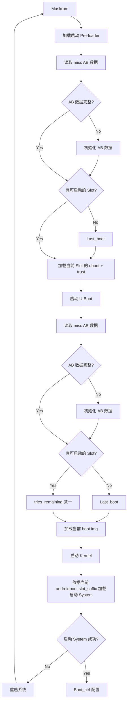

#### 3.3.1 AB Successful-Boot 模式数据流程

以设备首次上电、从 Slot A 正常启动、升级 Slot B、再切换到 Slot B 启动为例，AB 数据在各阶段的变化如下：

| 阶段 | Slot A | 启动 Slot | Slot B |
|:--:|:--|:--:|:--|
| 1. 初始状态 | **`P=15`** `T=7` `S=0` `U=0` | **Slot A**<br>Last_boot=0 | `P=14` `T=7` `S=0` `U=0` |
| ↓ | | ↓ | |
| 2. Bootloader | `P=15` **`T=6`** `S=0` `U=0` | **Slot A**<br>Last_boot=0 | `P=14` `T=7` `S=0` `U=0` |
| ↓ | | ↓ | |
| 3. System 启动成功 | `P=15` `T=0` **`S=1`** `U=0` | **Slot A**<br>Last_boot=0 | `P=14` `T=7` `S=0` `U=0` |
| ↓ (升级) | | ↓ | |
| 4. System 升级 Slot B 中 | `P=15` `T=0` `S=1` `U=0` | **Slot A**<br>Last_boot=0 | `P=14` `T=7` `S=0` **`U=1`** |
| ↓ (升级) | | ↓ | |
| 5. System 升级完成 | **`P=14`** `T=0` `S=1` `U=0` | **Slot A**<br>Last_boot=0 | **`P=15`** `T=7` `S=0` **`U=0`** |
| ↓ | | ↓ | |
| 6. Bootloader | `P=14` `T=0` `S=1` `U=0` | **Slot B**<br>Last_boot=0 | `P=15` `T=7` `S=0` `U=0` |
| ↓ | | ↓ | |
| 7. System 启动成功 | `P=14` `T=0` `S=1` `U=0` | **Slot B**<br>Last_boot=**1** | `P=15` `T=0` **`S=1`** `U=0` |

> **图例**：`P`=priority，`T`=tries_remaining，`S`=successful_boot，`U`=is_update。**粗体** = 本阶段发生变化的值。
>
> **启动 Slot 流向**：`A1 → A2 → A3 → A4 → A5 → B6 → B7`（第 6 阶段从 Slot A 切换到 Slot B）

#### 3.3.2 AB Reset-Retry 模式数据流程

以设备首次上电、从 Slot A 正常启动、升级 Slot B、再切换到 Slot B 启动为例：

| 阶段 | Slot A | 启动 Slot | Slot B |
|:--:|:--|:--:|:--|
| 1. 初始状态 | **`P=15`** `T=7` `S=0` `U=0` | **Slot A**<br>Last_boot=0 | `P=14` `T=7` `S=0` `U=0` |
| ↓ | | ↓ | |
| 2. Bootloader | `P=15` **`T=6`** `S=0` `U=0` | **Slot A**<br>Last_boot=0 | `P=14` `T=7` `S=0` `U=0` |
| ↓ | | ↓ | |
| 3. System 启动 | `P=15` **`T=7`** `S=0` `U=0` | **Slot A**<br>Last_boot=0 | `P=14` `T=7` `S=0` `U=0` |
| ↓ (升级) | | ↓ | |
| 4. System 升级 Slot B 中 | `P=15` `T=7` `S=0` `U=0` | **Slot A**<br>Last_boot=0 | `P=14` `T=7` `S=0` **`U=1`** |
| ↓ (升级) | | ↓ | |
| 5. System 升级完成 | **`P=14`** `T=7` `S=0` `U=0` | **Slot A**<br>Last_boot=0<br>reboot | **`P=15`** `T=7` `S=0` **`U=0`** |
| ↓ | | ↓ | |
| 6. Bootloader | `P=14` `T=7` `S=0` `U=0` | **Slot B**<br>Last_boot=0 | `P=15` `T=7` `S=0` `U=0` |
| ↓ | | ↓ | |
| 7. System 启动 | `P=14` `T=7` `S=0` `U=0` | **Slot B**<br>Last_boot=**1** | `P=15` `T=7` `S=0` `U=0` |

> **图例**：`P`=priority，`T`=tries_remaining，`S`=successful_boot，`U`=is_update。**粗体** = 本阶段发生变化的值。
>
> **启动 Slot 流向**：`A1 → A2 → A3 → A4 → A5 → B6 → B7`（第 6 阶段从 Slot A 切换到 Slot B）
>
> **注意**：Reset-Retry 模式下 `successful_boot` 始终为 0，`tries_remaining` 始终由 boot_ctrl 重置为 7，不会标记启动成功。

### 3.4 升级与异常处理

- **系统升级**：参考《Rockchip Linux 升级方案开发指南》
- **Recovery 升级**：AB System 不考虑支持 Recovery 升级

### 3.5 验证方法

#### 3.5.1 Successful-Boot 模式验证

| 步骤 | 操作 | 预期结果 |
|:----:|------|----------|
| 1 | 只烧写 Slot A，系统从 Slot A 启动。设置从 Slot B 启动 | 系统从 Slot A 启动。测试完成后清空 misc 分区 |
| 2 | 烧写 Slot A 与 Slot B，启动系统（当前为 Slot A）。设置从 Slot B 启动，reboot | 当前系统为 Slot B。测试完成后清空 misc 分区 |
| 3 | 烧写 Slot A 与 Slot B，迅速 reset 系统 14 次（retry counter 用完） | 还能从 last_boot 指定的系统启动，即正常从 Slot A 启动。测试完成后清空 misc 分区 |
| 4 | 烧写 Slot A 与 Slot B，启动系统（当前为 Slot A）。设置 Slot B → reboot → 设置 Slot A → reboot | 当前系统为 Slot A。测试完成后清空 misc 分区 |

#### 3.5.2 Reset-Retry 模式验证

| 步骤 | 操作 | 预期结果 |
|:----:|------|----------|
| 1 | 只烧写 Slot A，系统从 Slot A 启动。设置从 Slot B 启动 | 系统从 Slot A 启动。测试完成后清空 misc 分区 |
| 2 | 烧写 Slot A 与 Slot B，启动系统（当前为 Slot A）。设置从 Slot B 启动，reboot | 当前系统为 Slot B。测试完成后清空 misc 分区 |
| 3 | 烧写 Slot A 与 Slot B，迅速 reset 系统 14 次（retry counter 用完） | 还能从 last_boot 指定的系统启动，即正常从 Slot A 启动。测试完成后清空 misc 分区 |
| 4 | 烧写 Slot A 与 Slot B，其中 Slot B 的 boot.img 损坏。启动系统（当前为 Slot A）。设置从 Slot B 启动，reboot | 系统重启 7 次后，从 Slot A 正常启动。测试完成后清空 misc 分区 |
| 5 | 烧写 Slot A 与 Slot B，启动系统（当前为 Slot A）。设置 Slot B → reboot → 设置 Slot A → reboot | 当前系统为 Slot A。测试完成后清空 misc 分区 |

### 3.6 引用参考

- 《Rockchip-Secure-Boot2.0.md》
- 《Rockchip-Secure-Boot-Application-Note.md》
- 《Android Verified Boot 2.0》

## 四、AVB 安全启动

### 4.1 术语

| 术语 | 全称 / 说明 |
|------|------------|
| **AVB** | Android Verified Boot |
| **OTP / eFuse** | One Time Programmable（一次性可编程存储器） |
| **PRK**（Product Root Key） | AVB 的 Root Key，由签名 Loader、U-Boot & Trust 的 Root Key 校验 |
| **PIK**（Product Intermediate Key） | 中间 Key，起中介作用 |
| **PSK**（Product Signing Key） | 用于签名固件的 Key |
| **PUK**（Product Unlock Key） | 用于解锁设备 |

各种 Key 分离，职责明确，可以降低 Key 被泄露的风险。

### 4.2 简介

Rockchip 安全验证引导流程分为**安全性校验**与**完整性校验**：

- **安全性校验**：加密公钥的校验。从安全存储（OTP / eFuse）中读取公钥 Hash，与计算的公钥 Hash 对比是否一致，然后公钥用于解密固件 Hash。
- **完整性校验**：校验固件的完整性。从存储里加载固件，计算固件的 Hash 与解密出来的 Hash 对比是否一致。

### 4.3 加密示例

设备的安全验证启动流程与通信中的数据加密校验流程类似，通过该例子可以加速对 AVB 校验流程的理解。

假设 Alice 向 Bob 传送数字信息，为了保证信息传送的保密性、真实性、完整性和不可否认性，需要对传送的信息进行数字加密和签名，其传送过程为：

1. Alice 准备好要传送的数字信息（明文）
2. Alice 对数字信息进行哈希运算，得到一个信息摘要
3. Alice 用自己的私钥对信息摘要进行加密得到 Alice 的数字签名，并将其附在数字信息上
4. Alice 随机产生一个加密密钥，并用此密码对要发送的信息进行加密，形成密文
5. Alice 用 Bob 的公钥对刚才随机产生的加密密钥进行加密，将加密后的密钥连同密文一起传送给 Bob
6. Bob 收到密文和加密过的密钥，先用自己的私钥对加密的密钥进行解密，得到 Alice 随机产生的加密密钥
7. Bob 用随机密钥对收到的密文进行解密，得到明文的数字信息，然后将随机密钥抛弃
8. Bob 用 Alice 的公钥对 Alice 的数字签名进行解密，得到信息摘要
9. Bob 用相同的哈希算法对收到的明文再进行一次哈希运算，得到一个新的信息摘要
10. Bob 将收到的信息摘要和新产生的信息摘要进行比较，如果一致，说明收到的信息没有被修改过

> 上述提及的 DES 算法可以更换为其他算法（如 AES），公私钥算法可以采用 RSA 算法。

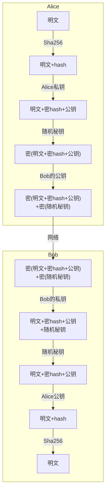

### 4.4 AVB 特性

Rockchip Secure Boot 参考通信中的校验方式及 AVB，实现一套完整的 Secure Boot 校验方案。

**Feature 列表**：

- 安全校验
- 完整性校验
- 防回滚保护
- Persistent Partition 支持
- Chained Partitions 支持：可以与 boot、system 签名私钥一致，也可以由 OEM 自己保存私钥，但必须由 PRK 签名

### 4.5 Key + 签名 + 证书

#### 4.5.1 生成 Key 与证书

```
#!/bin/sh
touch temp.bin
openssl genpkey -algorithm RSA -pkeyopt rsa_keygen_bits:4096 -outform PEM -out testkey_prk.pem
openssl genpkey -algorithm RSA -pkeyopt rsa_keygen_bits:4096 -outform PEM -out testkey_psk.pem
openssl genpkey -algorithm RSA -pkeyopt rsa_keygen_bits:4096 -outform PEM -out testkey_pik.pem
python avbtool make_atx_certificate --output=pik_certificate.bin --subject=temp.bin \
    --subject_key=testkey_pik.pem --subject_is_intermediate_authority \
    --subject_key_version 42 --authority_key=testkey_prk.pem
python avbtool make_atx_certificate --output=psk_certificate.bin --subject=product_id.bin \
    --subject_key=testkey_psk.pem --subject_key_version 42 --authority_key=testkey_pik.pem
python avbtool make_atx_metadata --output=metadata.bin \
    --intermediate_key_certificate=pik_certificate.bin \
    --product_key_certificate=psk_certificate.bin
```

#### 4.5.2 生成 permanent_attributes.bin

```
python avbtool make_atx_permanent_attributes --output=permanent_attributes.bin \
    --product_id=product_id.bin --root_authority_key=testkey_prk.pem
```

其中 `product_id.bin` 需要自己定义，占 16 字节，可作为产品 ID 定义。

#### 4.5.3 签名 boot.img

```
avbtool add_hash_footer --image boot.img --partition_size 33554432 --partition_name boot \
    --key testkey_psk.pem --algorithm SHA256_RSA4096
```

> **注意**：`partition_size` 要至少比原固件大 64K，大小还要 4K 对齐，且不大于 `parameter.txt` 定义的分区大小。

#### 4.5.4 签名 system.img

```
avbtool add_hashtree_footer --partition_size 536870912 --partition_name system \
    --image system.img --algorithm SHA256_RSA4096 --key testkey_psk.pem
```

#### 4.5.5 生成 vbmeta

```
python avbtool make_vbmeta_image --public_key_metadata metadata.bin \
    --include_descriptors_from_image boot.img \
    --include_descriptors_from_image system.img \
    --generate_dm_verity_cmdline_from_hashtree system.img \
    --algorithm SHA256_RSA4096 --key testkey_psk.pem --output vbmeta.img
```

最终把生成的 `vbmeta.img` 烧写到对应的分区（如 vbmeta 分区）。

通过 SecureBootTool 生成 `PrivateKey.pem` 和 `PublicKey.pem`：


对 `permanent_attributes.bin` 进行签名：

```
openssl dgst -sha256 -out permanent_attributes_cer.bin -sign PrivateKey.pem permanent_attributes.bin
```

`permanent_attributes.bin` 是整个系统的安全认证数据，需要将其 Hash 烧写到 eFuse 或 OTP，或由前级的安全认证（Pre-loader）验证。由于 Rockchip 平台规划的 eFuse 不足，所以 `permanent_attributes.bin` 的验证由前级的公钥加 `permanent_attributes.bin` 的证书进行认证。对于有 OTP 的平台，安全数据空间足够，会直接烧写 `permanent_attributes.bin` 的 Hash 到 OTP。

> 各平台 eFuse 与 OTP 支持情况请参考"驱动模块"章节。

**eFuse 平台 pub_key 烧写**：

```
fastboot stage permanent_attributes.bin
fastboot oem fuse at-perm-attr
fastboot stage permanent_attributes_cer.bin
fastboot oem fuse at-rsa-perm-attr
```

**OTP 平台 pub_key 烧写**：

```
fastboot stage permanent_attributes.bin
fastboot oem fuse at-perm-attr
```

#### 4.5.6 签名流程总览

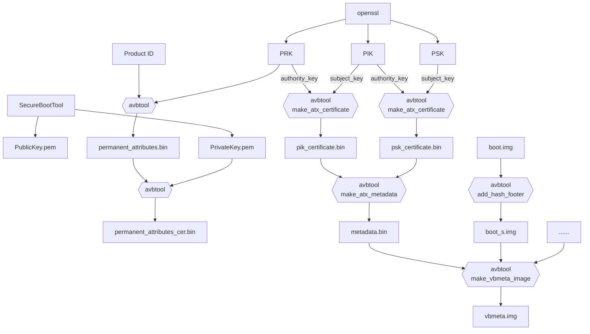

### 4.6 AVB Lock（锁定设备）

```
fastboot oem at-lock-vboot
```

> 如何进入 Fastboot 模式请参考"系统模块"章节的 Fastboot 部分。

### 4.7 AVB Unlock（解锁设备）

目前 Rockchip 采用严格安全校验，需要在对应的 defconfig 内添加：

```
CONFIG_RK_AVB_LIBAVB_ENABLE_ATH_UNLOCK=y
```

否则输入 `fastboot oem at-unlock-vboot` 就可以解锁设备，启动校验 `vbmeta.img`、`boot.img` 失败也会成功启动设备。

#### 4.7.1 生成 PUK

```
openssl genpkey -algorithm RSA -pkeyopt rsa_keygen_bits:4096 -outform PEM -out testkey_puk.pem
```

#### 4.7.2 生成 unlock_credential.bin

`unlock_credential.bin` 为需要下载到设备解锁的证书，其生成过程如下：

```
python avbtool make_atx_certificate --output=puk_certificate.bin --subject=product_id.bin \
    --subject_key=testkey_puk.pem --usage=com.google.android.things.vboot.unlock \
    --subject_key_version 42 --authority_key=testkey_pik.pem
```

从设备获取 `unlock_credential.bin` 后，执行下列命令获取 `unlock_credential.bin`：

```
python avbtool make_atx_unlock_credential --output=unlock_credential.bin \
    --intermediate_key_certificate=pik_certificate.bin \
    --unlock_key_certificate=puk_certificate.bin \
    --challenge=unlock_challenge.bin --unlock_key=testkey_puk.pem
```

最终可以把证书通过 Fastboot 命令下载到设备并解锁：

```
fastboot stage unlock_credential.bin
fastboot oem at-unlock-vboot
```

#### 4.7.3 OTP 设备解锁流程

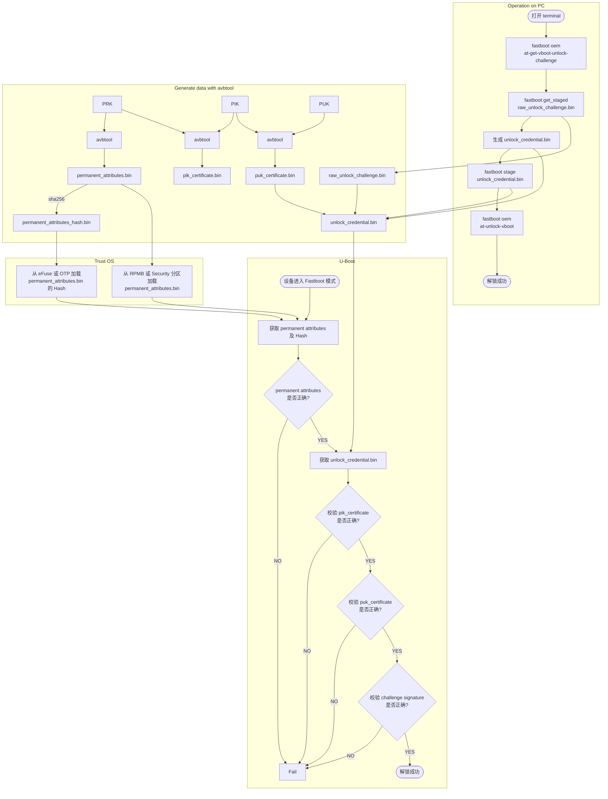

#### 4.7.4 eFuse 设备解锁流程

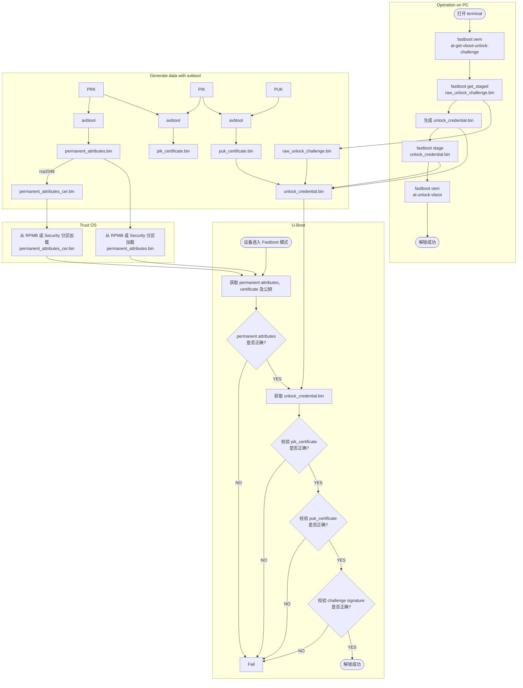

#### 4.7.5 解锁操作步骤

1. 设备进入 Fastboot 模式，电脑端输入：

```
fastboot oem at-get-vboot-unlock-challenge
fastboot get_staged raw_unlock_challenge.bin
```

获得带版本、Product ID 与 16 字节随机数的数据，取出随机数作为 `unlock_challenge.bin`。

2. 使用 avbtool 生成 `unlock_credential.bin`，参考 `make_unlock.sh`。

3. 电脑端输入：

```
fastboot stage unlock_credential.bin
fastboot oem at-unlock-vboot
```

> **注意**：此时设备状态一直处于第一次进入 Fastboot 模式状态，在此期间不能断电、关机、重启。因为步骤 1 做完后，设备存储着生成的随机数，如果断电、关机、重启，会导致随机数丢失，后续校验 challenge signature 会因为随机数不匹配而失败。

如果开启以下配置：

```
CONFIG_MISC=y
CONFIG_ROCKCHIP_EFUSE=y
CONFIG_ROCKCHIP_OTP=y
```

就会使用 CPUID 作为 Challenge Number，而 CPUID 是与机器匹配的，数据不会因为关机而丢失，生成的 `unlock_credential.bin` 可以重复使用。省去重复生成 `unlock_challenge.bin`、制作 `unlock_credential.bin` 的步骤。再次解锁步骤变为：

```
fastboot oem at-get-vboot-unlock-challenge
fastboot stage unlock_credential.bin
fastboot oem at-unlock-vboot
```

**make_unlock.sh 参考**：

```
#!/bin/sh
python avb-challenge-verify.py raw_unlock_challenge.bin product_id.bin
python avbtool make_unlock_credential --output=unlock_credential.bin \
    --intermediate_key_certificate=pik_certificate.bin \
    --unlock_key_certificate=puk_certificate.bin \
    --challenge=unlock_challenge.bin --unlock_key=testkey_puk.pem
```

**avb-challenge-verify.py 源码**：

```
#/user/bin/env python
"This is a test module for getting unlock_challenge.bin"
import sys
import os
from hashlib import sha256

def challenge_verify():
    if (len(sys.argv) != 3) :
        print "Usage: rkpublickey.py [challenge_file] [product_id_file]"
        return
    if ((sys.argv[1] == "-h") or (sys.argv[1] == "--h")):
        print "Usage: rkpublickey.py [challenge_file] [product_id_file]"
        return
    try:
        challenge_file = open(sys.argv[1], 'rb')
        product_id_file = open(sys.argv[2], 'rb')
        challenge_random_file = open('unlock_challenge.bin', 'wb')
        challenge_data = challenge_file.read(52)
        product_id_data = product_id_file.read(16)
        product_id_hash = sha256(product_id_data).digest()
        print("The challege version is %d" %ord(challenge_data[0]))
        if (product_id_hash != challenge_data[4:36]) :
            print("Product id verify error!")
            return
        challenge_random_file.write(challenge_data[36:52])
        print("Success!")

    finally:
        if challenge_file:
            challenge_file.close()
        if product_id_file:
            product_id_file.close()
        if challenge_random_file:
            challenge_random_file.close()

if __name__ == '__main__':
    challenge_verify()
```

### 4.8 U-Boot 使能配置

开启 AVB 需要 Trust 支持，U-Boot 需在 defconfig 中配置：

```
CONFIG_OPTEE_CLIENT=y
CONFIG_OPTEE_V1=y
CONFIG_OPTEE_ALWAYS_USE_SECURITY_PARTITION=y   // 安全数据存储到 Security 分区
```

| 配置项 | 说明 |
|--------|------|
| `CONFIG_OPTEE_V1` | 适用平台：312x、322x、3288、3228H、3368、3399 |
| `CONFIG_OPTEE_V2` | 适用平台：3326、3308 |
| `CONFIG_OPTEE_ALWAYS_USE_SECURITY_PARTITION` | eMMC 的 RPMB 不能用时才开这个宏，默认不开 |

AVB 功能开启需要在 defconfig 中配置：

```
CONFIG_AVB_LIBAVB=y
CONFIG_AVB_LIBAVB_AB=y
CONFIG_AVB_LIBAVB_ATX=y
CONFIG_AVB_LIBAVB_USER=y
CONFIG_RK_AVB_LIBAVB_USER=y

// 上面几个为必选，下面选择为支持 AVB 与 A/B 特性，两个特性可以分开使用
CONFIG_ANDROID_AB=y        // 支持 A/B
CONFIG_ANDROID_AVB=y       // 支持 AVB

// 仅有 eFuse 的平台使用
CONFIG_ROCKCHIP_PRELOADER_PUB_KEY=y

// 需要严格 Unlock 校验时打开
CONFIG_RK_AVB_LIBAVB_ENABLE_ATH_UNLOCK=y

// 安全校验开启
CONFIG_AVB_VBMETA_PUBLIC_KEY_VALIDATE=y

// 如果需要 CPUID 作为 Challenge Number，开启以下宏
CONFIG_MISC=y
CONFIG_ROCKCHIP_EFUSE=y
CONFIG_ROCKCHIP_OTP=y
```

### 4.9 Kernel 配置

System、vendor、oem 等分区的校验由 Kernel 的 dm-verify 模块加载校验，所以需要使能该模块。

**使能 AVB** 需要在 Kernel DTS 上配置参数 avb，参考如下：

```
&firmware_android {
    compatible = "android,firmware";
    boot_devices = "fe330000.sdhci";
    vbmeta {
        compatible = "android,vbmeta";
        parts = "vbmeta,boot,system,vendor,dtbo";
    };
    fstab {
        compatible = "android,fstab";
        vendor {
            compatible = "android,vendor";
            dev = "/dev/block/by-name/vendor";
            type = "ext4";
            mnt_flags = "ro,barrier=1,inode_readahead_blks=8";
            fsmgr_flags = "wait,avb";
        };
    };
};
```

**使能 A/B System** 需要配置 `slotselect` 参数，参考如下：

```
firmware {
    android {
        compatible = "android,firmware";
        fstab {
            compatible = "android,fstab";
            system {
                compatible = "android,system";
                dev = "/dev/block/by-name/system";
                type = "ext4";
                mnt_flags = "ro,barrier=1,inode_readahead_blks=8";
                fsmgr_flags = "wait,verify,slotselect";
            };
            vendor {
                compatible = "android,vendor";
                dev = "/dev/block/by-name/vendor";
                type = "ext4";
                mnt_flags = "ro,barrier=1,inode_readahead_blks=8";
                fsmgr_flags = "wait,verify,slotselect";
            };
        };
    };
};
```

### 4.10 Android SDK 配置

#### 4.10.1 AVB Enable

使能 `BOARD_AVB_ENABLE`。

#### 4.10.2 A/B System 变量

这些变量主要有三类：

**必须定义的变量**：

```
AB_OTA_UPDATER := true
AB_OTA_PARTITIONS := boot system vendor
BOARD_BUILD_SYSTEM_ROOT_IMAGE := true
TARGET_NO_RECOVERY := true
BOARD_USES_RECOVERY_AS_BOOT := true
PRODUCT_PACKAGES += update_engine update_verifier
```

**可选定义的变量**：

```
PRODUCT_PACKAGES_DEBUG += update_engine_client
```

**不能定义的变量**：

```
BOARD_RECOVERYIMAGE_PARTITION_SIZE
BOARD_CACHEIMAGE_PARTITION_SIZE
BOARD_CACHEIMAGE_FILE_SYSTEM_TYPE
```

### 4.11 Cmdline 新增内容

```
Kernel command line: androidboot.verifiedbootstate=green androidboot.slot_suffix=_a \
    dm="1 vroot none ro 1,0 1031864 verity 1 PARTUUID=b2110000-0000-455a-8000-44780000706f \
    PARTUUID=b2110000-0000-455a-8000-44780000706f 4096 4096 128983 128983 sha1 \
    90d1d406caac04b7e3fbf48b9a4dcd6992cc628e4172683f0d6b6085c09f6ce165cf152fe3523c89 \
    10 restart_on_corruption ignore_zero_blocks use_fec_from_device \
    PARTUUID=b2110000-0000-455a-8000-44780000706f fec_roots 2 fec_blocks 130000 \
    fec_start 130000" root=/dev/dm-0 \
    androidboot.vbmeta.device=PARTUUID=f24f0000-0000-4e1b-8000-791700006a98 \
    androidboot.vbmeta.avb_version=1.1 androidboot.vbmeta.device_state=unlocked \
    androidboot.vbmeta.hash_alg=sha512 androidboot.vbmeta.size=6528 \
    androidboot.vbmeta.digest=41991c02c82ea1191545c645e2ac9cc7ca08b3da0a2e3115aff479d2df61feaccdd35b6360cfa936f6f4381e4557ef18e381f4b236000e6ecc9ada401eda4cae \
    androidboot.vbmeta.invalidate_on_error=yes androidboot.veritymode=enforcing
```

关键参数说明：

| 参数 | 作用 |
|------|------|
| `androidboot.vbmeta.device=PARTUUID=...` | 确保后续使用 vbmeta hash-tree 的合法性，需要 Kernel 再校验一遍 vbmeta，digest 为 `androidboot.vbmeta.digest` |
| `skip_initramfs` | Boot ramdisk 是否打包到 boot.img。在 A/B System 中，ramdisk 没有打包到 boot.img，cmdline 需要传递此参数 |
| `root=/dev/dm-0` | 开启 dm-verify，指定 system |
| `androidboot.vbmeta.device_state` | Android Verify 状态 |
| `androidboot.verifiedbootstate` | 校验结果 |

**`androidboot.verifiedbootstate`** 的三种状态：

| 状态 | 颜色 | 含义 |
|------|------|------|
| **Green** | 绿 | 处于 LOCKED 状态，且用于验证的密钥非最终用户设置 |
| **Yellow** | 黄 | 处于 LOCKED 状态，且用于验证的密钥由最终用户设置 |
| **Orange** | 橙 | 处于 UNLOCKED 状态 |

> 关于 `dm="1 vroot none ro……"` 参数生成：avbtool 生成 vbmeta 时，对 system 固件加 `--generate_dm_verity_cmdline_from_hashtree` 即可。这些信息会保存到 vbmeta。这部分安卓专用，如果分区只校验到 boot.img，无需增加该参数。Android SDK 开启 `BOARD_AVB_ENABLE` 会把这些信息加到 vbmeta 内。

### 4.12 分区参考

新增 vbmeta 分区与 security 分区：

- **vbmeta 分区**：存储固件校验信息
- **security 分区**：存储加密过的安全数据

```
FIRMWARE_VER:8.0
MACHINE_MODEL:RK3326
MACHINE_ID:007
MANUFACTURER: RK3326
MAGIC: 0x5041524B
ATAG: 0x00200800
MACHINE: 3326
CHECK_MASK: 0x80
PWR_HLD: 0,0,A,0,1
TYPE: GPT
CMDLINE:mtdparts=rk29xxnand:0x00002000@0x00004000(uboot),0x00002000@0x00006000(trust),0x00002000@0x00008000(misc),0x00008000@0x0000a000(resource),0x00010000@0x00012000(kernel),0x00002000@0x00022000(dtb),0x00002000@0x00024000(dtbo),0x00000800@0x00026000(vbmeta),0x00010000@0x00026800(boot),0x00020000@0x00036800(recovery),0x00038000@0x00056800(backup),0x00002000@0x0008e800(security),0x000c0000@0x00090800(cache),0x00514000@0x00150800(system),0x00008000@0x00664800(metadata),0x000c0000@0x0066c800(vendor),0x00040000@0x0072c800(oem),0x00000400@0x0076c800(frp),-@0x0076cc00(userdata:grow)
uuid:system=af01642c-9b84-11e8-9b2a-234eb5e198a0
```

**A/B System 分区定义参考**：

```
FIRMWARE_VER:8.1
MACHINE_MODEL:RK3326
MACHINE_ID:007
MANUFACTURER: RK3326
MAGIC: 0x5041524B
ATAG: 0x00200800
MACHINE: 3326
CHECK_MASK: 0x80
PWR_HLD: 0,0,A,0,1
TYPE: GPT
CMDLINE:
mtdparts=rk29xxnand:0x00002000@0x00004000(uboot_a),0x00002000@0x00006000(uboot_b),0x00002000@0x00008000(trust_a),0x00002000@0x0000a000(trust_b),0x00001000@0x0000c000(misc),0x00001000@0x0000d000(vbmeta_a),0x00001000@0x0000e000(vbmeta_b),0x00020000@0x0000e000(boot_a),0x00020000@0x0002e000(boot_b),0x00100000@0x0004e000(system_a),0x00300000@0x0032e000(system_b),0x00100000@0x0062e000(vendor_a),0x00100000@0x0072e000(vendor_b),0x00002000@0x0082e000(oem_a),0x00002000@0x00830000(oem_b),0x0010000@0x00832000(factory),0x00008000@0x842000(factory_bootloader),0x00080000@0x008ca000(oem),-@0x0094a000(userdata)
```

### 4.13 Fastboot 命令详解

> 基础 Fastboot 命令（flash、erase、getvar、set_active、reboot 等）的完整列表、参数说明及使用示例请参考"系统模块"章节的 Fastboot 部分。U-Boot 下可通过 `fastboot usb 0` 命令进入 Fastboot 模式。

### 4.14 Pre-loader Verified

参见《Rockchip-Secure-Boot-Application-Note.md》。

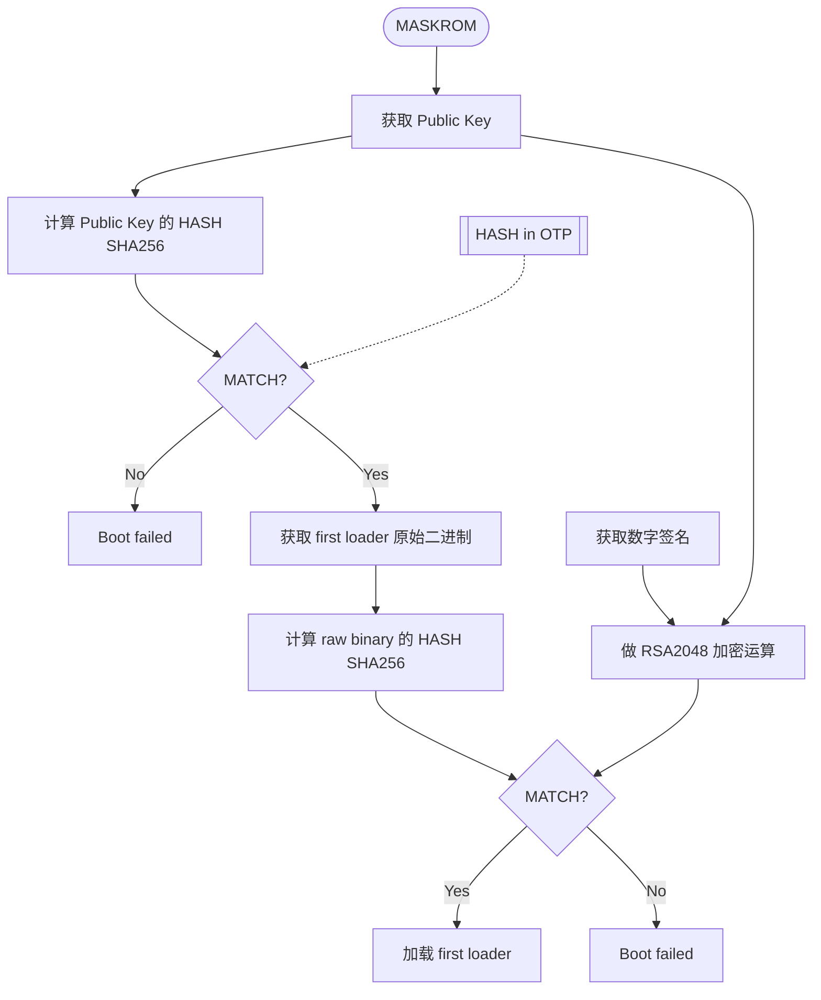

### 4.15 U-Boot Verified

#### 4.15.1 OTP 设备校验流程

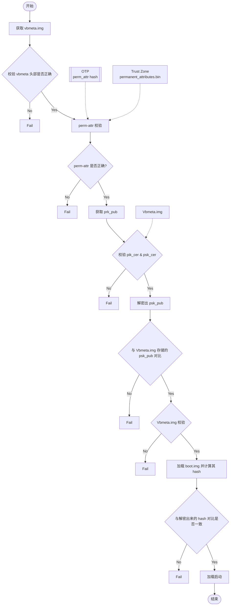

#### 4.15.2 eFuse 设备校验流程

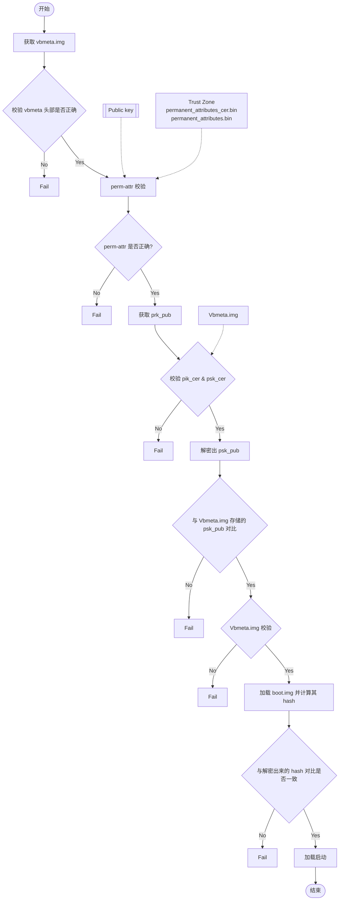

### 4.16 系统校验启动

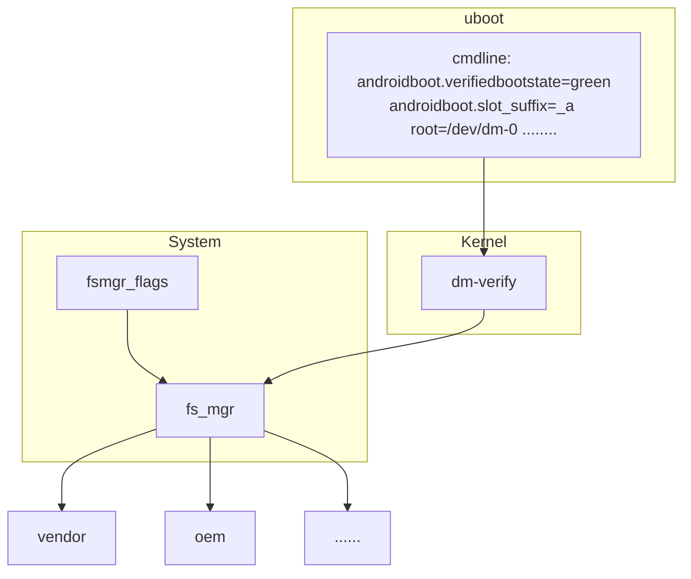

系统启动到 Kernel，Kernel 首先解析 U-Boot 传递的 cmdline 参数，确认系统启动是否使用 dm-verify。然后加载启用 system 的 `fs_mgr` 服务。`fs_mgr` 依据 `fsmgr_flags` 的参数来校验加载固件，固件 Hash & Hash Tree 存放于 `vbmeta.img`。

主要参数：

| 参数 | 作用 |
|------|------|
| `avb` | 使用 AVB 的方式加载校验分区 |
| `slotselect` | 该分区分 A/B，加载时会使用到 cmdline 的 `androidboot.slot_suffix=_a` 参数 |

### 4.17 Linux AVB

#### 4.17.1 操作流程

1. 生成整套固件

2. 使用 SecureBootConsole 生成 `PrivateKey.pem` 与 `PublicKey.pem`，工具为 `rk_sign_tool`：

```
rk_sign_tool cc --chip 3399
rk_sign_tool kk --out .
```

3. Load Key：

```
rk_sign_tool lk --key privateKey.pem --pubkey publicKey.pem
```

4. 签名 Loader：

```
rk_sign_tool sl --loader loader.bin
```

5. 签名 uboot.img & trust.img：

```
rk_sign_tool si --img uboot.img
rk_sign_tool si --img trust.img
```

6. AVB 签名固件准备（准备空的 `temp.bin`、16 字节的 `product_id.bin`、待签名的 `boot.img`）：

```
#!/bin/bash
touch temp.bin
openssl genpkey -algorithm RSA -pkeyopt rsa_keygen_bits:4096 -outform PEM -out testkey_prk.pem
openssl genpkey -algorithm RSA -pkeyopt rsa_keygen_bits:4096 -outform PEM -out testkey_psk.pem
openssl genpkey -algorithm RSA -pkeyopt rsa_keygen_bits:4096 -outform PEM -out testkey_pik.pem
python avbtool make_atx_certificate --output=pik_certificate.bin --subject=temp.bin \
    --subject_key=testkey_pik.pem --subject_is_intermediate_authority \
    --subject_key_version 42 --authority_key=testkey_prk.pem
python avbtool make_atx_certificate --output=psk_certificate.bin --subject=product_id.bin \
    --subject_key=testkey_psk.pem --subject_key_version 42 --authority_key=testkey_pik.pem
python avbtool make_atx_metadata --output=metadata.bin \
    --intermediate_key_certificate=pik_certificate.bin \
    --product_key_certificate=psk_certificate.bin
python avbtool make_atx_permanent_attributes --output=permanent_attributes.bin \
    --product_id=product_id.bin --root_authority_key=testkey_prk.pem
python avbtool add_hash_footer --image boot.img --partition_size 33554432 \
    --partition_name boot --key testkey_psk.pem --algorithm SHA256_RSA4096
python avbtool make_vbmeta_image --public_key_metadata metadata.bin \
    --include_descriptors_from_image boot.img --algorithm SHA256_RSA4096 \
    --key testkey_psk.pem --output vbmeta.img
openssl dgst -sha256 -out permanent_attributes_cer.bin -sign PrivateKey.pem permanent_attributes.bin
```

生成 `vbmeta.img`、`permanent_attributes_cer.bin`、`permanent_attributes.bin`。

7. 固件烧写：

```
rkdeveloptool db loader.bin
rkdeveloptool ul loader.bin
rkdeveloptool gpt parameter.txt
rkdeveloptool wlx uboot uboot.img
rkdeveloptool wlx trust trust.img
rkdeveloptool wlx boot boot.img
rkdeveloptool wlx system system.img
```

> `rkdeveloptool` 参考：<https://github.com/rockchip-linux/rkdeveloptool>

8. 烧写 `permanent_attributes_cer.bin`、`permanent_attributes.bin`：

**有 OTP 平台**：

```
fastboot stage permanent_attributes.bin
fastboot oem fuse at-perm-attr
```

**有 eFuse 平台**：

```
fastboot stage permanent_attributes.bin
fastboot oem fuse at-perm-attr
fastboot stage permanent_attributes_cer.bin
fastboot oem fuse at-rsa-perm-attr
```

9. eFuse 烧写（eFuse 工具目前只有 Windows 版本），选择特定的 Loader，选择对应的设备，点击启动烧写：


10. OTP 平台 Loader Public Key 烧写：参考《Rockchip-Secure-Boot-Application-Note.md》。

#### 4.17.2 验证流程

[TODO]

## 五、SD 卡启动与升级

### 5.1 简介

Rockchip 将 SD 卡划分为常规 SD 卡、SD 升级卡、SD 启动卡、SD 修复卡。可以通过瑞芯微创建升级磁盘工具将 `update.img` 下载到 SD 卡内，制作不同的卡类型。

| 卡类型 | 功能 |
|--------|------|
| **常规 SD 卡** | 普通的存储设备 |
| **SD 升级卡** | 设备从 SD 卡内启动到 Recovery，由 Recovery 负责把 SD 内固件更新到设备存储 |
| **SD 启动卡** | 设备直接从 SD 卡启动 |
| **SD 修复卡** | 从 Pre-loader 开始拷贝 SD 卡内的固件到设备存储 |

> SD 卡 / U 盘启动与升级的使用方法请参考"系统模块"章节。

### 5.2 分类

#### 5.2.1 常规卡

普通 SD 卡与 PC 使用完全一样，可以在 U-Boot 和 Kernel 系统中作为普通的存储空间使用，无需工具对 SD 卡做任何操作。

#### 5.2.2 升级卡

SD 升级卡是通过 RK 的工具制作，实现 SD 卡对本地存储（如 eMMC、NAND Flash）固件的升级。SD 卡升级可以脱离 PC 机或网络，具体是将 SD 卡启动代码写到 SD 卡的保留区，然后将固件拷贝到 SD 卡可见分区上。主控从 SD 卡启动时，SD 卡启动代码和升级代码将固件烧写到本地主存储中。同时 SD 升级卡支持 PCBA 测试和 Demo 文件的拷贝。

已经制作好的升级用 SD 卡，如果只需要更新固件和 Demo 文件时，可以按下面步骤完成：

1. 拷贝固件到 SD 卡根目录，并重命名为 `sdupdate.img`
2. 拷贝 Demo 文件到 SD 卡根目录下的 Demo 目录中

**SD 引导升级卡格式（非 GPT）**：

| 偏移 | 数据段 |
|------|--------|
| 扇区 0 | MBR |
| 扇区 64 ~ 4M | IDBLOCK（启动标志置 0） |
| 4M ~ 8M | Parameter |
| 12M ~ 16M | uboot |
| 16M ~ 20M | trust |
| …… | misc |
| …… | resource |
| …… | kernel |
| …… | recovery |
| 剩下空间 | FAT32 存放 update.img |

**SD 引导升级卡格式（GPT）**：

| 偏移 | 数据段 |
|------|--------|
| 扇区 0 | MBR |
| 扇区 1 ~ 34 | GPT 分区表 |
| 扇区 64 ~ 4M | IDBLOCK（启动标志置 0） |
| 4M ~ 8M | Parameter |
| …… | uboot |
| …… | trust |
| …… | misc |
| …… | resource |
| …… | kernel |
| …… | recovery |
| 剩下空间 | FAT32 存放 update.img |

#### 5.2.3 启动卡

SD 启动卡是通过 RK 的工具制作，实现直接从 SD 卡启动，极大的方便用户更新启动新固件而不用重新烧写固件到设备存储内。具体实现是将固件烧写到 SD 卡中，把 SD 卡当作主存储使用。主控从 SD 卡启动时，固件以及临时文件都存放在 SD 卡上，有没有本地主存储都可以正常工作。

> **注意**：PCBA 测试只是 Recovery 下面的一个功能项，可用于升级卡与启动卡。

**SD 引导启动卡格式（非 GPT）**：

| 偏移 | 数据段 |
|------|--------|
| 扇区 0 | MBR |
| 扇区 64 ~ 4M | IDBLOCK（启动标志置 0） |
| 4M ~ 8M | Parameter |
| 8M ~ 12M | uboot |
| 12M ~ 16M | trust |
| …… | misc |
| …… | resource |
| …… | boot |
| …… | kernel |
| …… | recovery |
| …… | system |
| …… | user |

**SD 引导启动卡格式（GPT）**：

| 偏移 | 数据段 |
|------|--------|
| 扇区 0 | MBR |
| 扇区 1 ~ 34 | GPT 分区表 |
| 扇区 64 ~ 4M | IDBLOCK（启动标志置 0） |
| …… | uboot |
| …… | boot |
| …… | trust |
| …… | resource |
| …… | kernel |
| …… | recovery |
| …… | system |
| …… | vendor |
| …… | oem |
| …… | user |
| 最后 33 扇区 | 备份 GPT |

#### 5.2.4 修复卡

SD 修复卡类似于 SD 卡升级功能，但固件升级工作由 Miniloader 完成。首先工具会将启动代码写到 SD 卡的保留区，然后将固件拷贝到 SD 卡可见分区上，主控从 SD 卡启动时，SD 卡升级代码将固件升级到本地主存储中。主要用于设备固件损坏时，SD 卡可以修复设备。

**SD 修复卡格式（非 GPT）**：

| 偏移 | 数据段 |
|------|--------|
| 扇区 0 | MBR |
| 扇区 64 ~ 4M | IDBLOCK（启动标志置 0） |
| 4M ~ 8M | Parameter |
| 8M ~ 12M | uboot |
| 12M ~ 16M | trust |
| …… | misc |
| …… | resource |
| …… | boot |
| …… | kernel |
| …… | recovery |
| …… | system |
| …… | user |

**SD 修复卡格式（GPT）**：

| 偏移 | 数据段 |
|------|--------|
| 扇区 0 | MBR |
| 扇区 1 ~ 34 | GPT 分区表 |
| 扇区 64 ~ 4M | IDBLOCK（启动标志置 0） |
| …… | uboot |
| …… | boot |
| …… | trust |
| …… | resource |
| …… | kernel |
| …… | recovery |
| …… | system |
| …… | vendor |
| …… | oem |
| …… | user |
| 最后 33 扇区 | 备份 GPT |

### 5.3 固件标志

SD 卡作为各种不同功能的卡，会在 SD 卡内做一些标志。

在 SD 卡的第 **64 扇区**处，起始标志（Magic Number）若为 `0xFCDC8C3B`，则为特殊卡，会从 SD 卡内读取固件启动设备。如果不是，则作为普通 SD 卡看待。

在第 **（64 扇区 + 616 bytes）** 处，存放各种卡的标志。目前有三种类型：

| 标志 | 卡类型 |
|:----:|--------|
| 0 | 升级卡或 PCBA 测试卡 |
| 1 | 启动卡 |
| 2 | 修复卡 |

### 5.4 启动流程

SD 卡的 Boot 流程可分为 Pre-loader 启动流程与 U-Boot 启动流程，这两个流程都需要加载检测 SD 卡及 SD 卡内 IDB Block 内 Startup Flag 标志，并且会依据这些标志执行不同的功能。

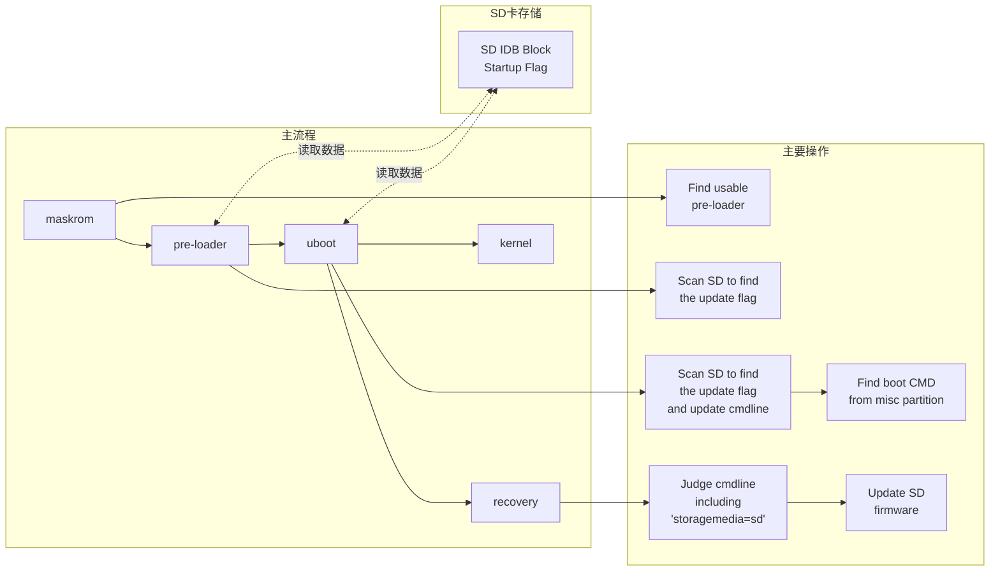

#### 5.4.1 Pre-loader 启动

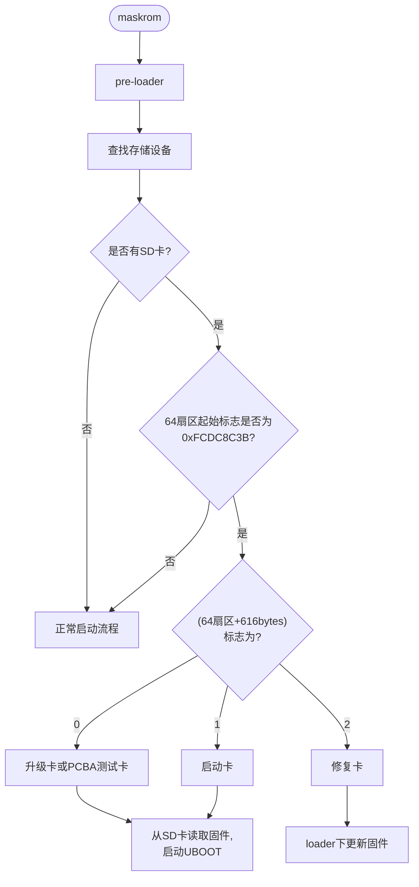

Maskrom 首先找到一份可用的 Miniloader 固件（可从 TRM 确定 Maskrom 支持的启动存储介质和优先顺序，Maskrom 会依次扫描可用存储里的固件），然后跳转到 Miniloader。Miniloader 重新查找存储设备，如果检测到 SD 卡，检测 SD 卡是否包含 IDB 格式固件。如果是，再判断卡标志：

- 标志为 `0` 或 `1`：从 SD 卡内读取 U-Boot 固件，加载启动 U-Boot
- 标志为 `2`：进入修复卡流程，在 Loader 下更新固件

正常启动流程为扫描其他存储，加载启动下级 Loader。

#### 5.4.2 U-Boot 启动

**升级卡**：U-Boot 重新查找存储设备，如果检测到 SD 卡，检测 SD 卡是否包含 IDB 格式固件。如果是，再判断卡标志是否为 0，传递给 Kernel 的 cmdline 添加 `sdfwupdate`。最后读取 SD 卡的 misc 分区，读取卡启动模式，若为 Recovery 模式，加载启动 Recovery。

**启动卡**：U-Boot 重新查找存储设备，如果检测到 SD 卡，检测 SD 卡是否包含 IDB 格式固件。如果是，再判断卡标志是否为 1。最后读取 SD 卡的 misc 分区，读取卡启动模式，如果为 Recovery，加载启动 Recovery；如果是 Normal 模式，加载启动 Kernel。

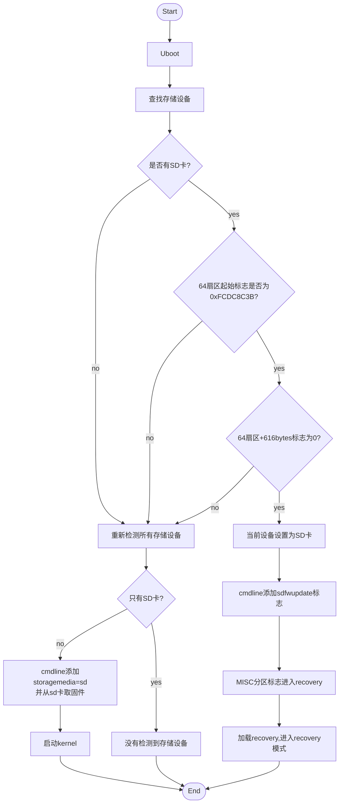

#### 5.4.3 Recovery 与 PCBA

> 具体可参考《Rockchip Recovery 用户操作指南 V1.03.pdf》。

### 5.5 注意事项

- 制作非 GPT 格式固件时，U-Boot 需要配置 `CONFIG_RKPARM_PARTITION`
- 制作 SD 升级卡时，`update.img` 必须包含 `MiniloaderAll.bin`、`parameter.txt`、`uboot.img`、`trust.img`、`misc.img`、`resource.img`、`recovery.img` 这些固件，否则烧写 `update.img` 会出现写入 MBR 失败的提示

## 六、相关参考

| 参考主题 | 相关章节 |
|----------|----------|
| Kernel DTB 基础用法 | 平台架构 |
| Cmdline 参数含义 | 系统模块 |
| AB 系统配置项与分区表 | 系统模块 |
| AVB 安全启动配置 | 系统模块 |
| SD 卡 / U 盘使用方法 | 系统模块 |
| Fastboot 命令详解 | 系统模块 |
| eFuse / OTP 平台支持 | 驱动模块 |
| 分区表与存储布局 | 平台架构 |
| ATAGS 固件通信机制 | 平台架构 |